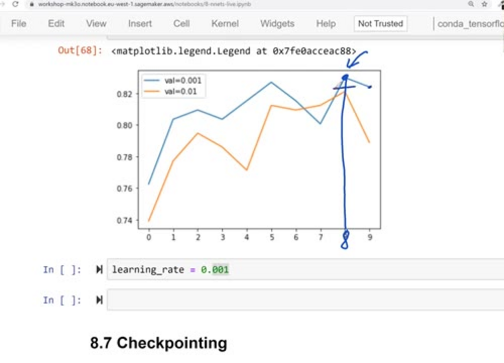
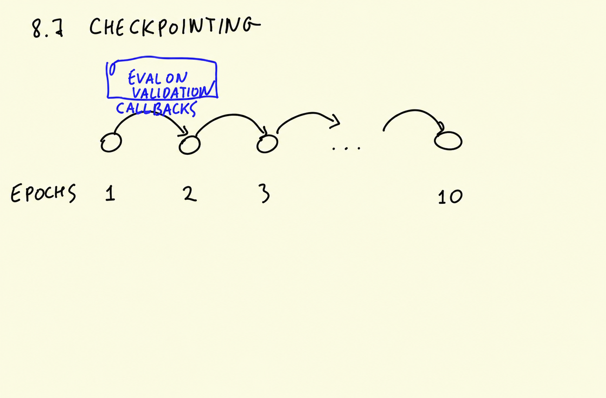
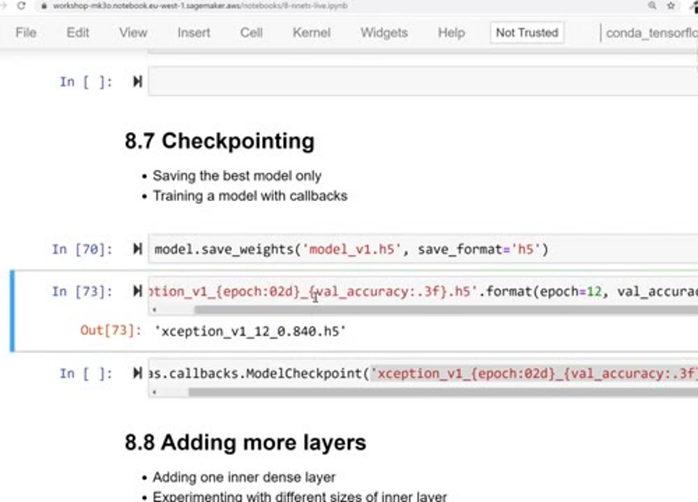
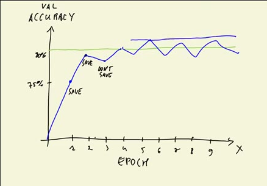
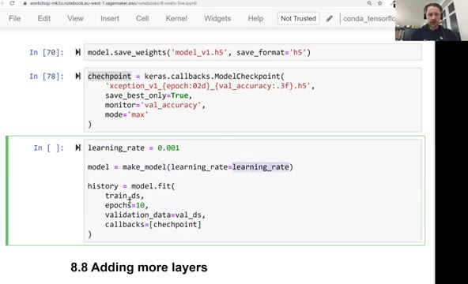
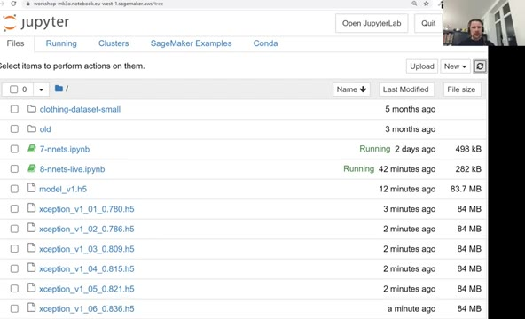
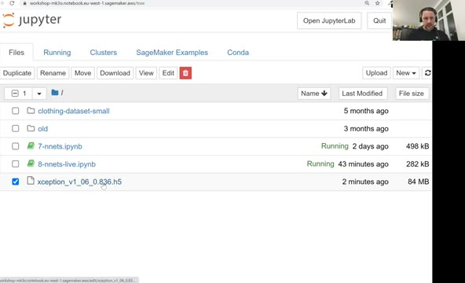

# Checkpointing

When we tuned the learning rate in the previous unit, we saw that the
validation accuracy oscillates: it goes up, then down again. The model
we end up with after the last epoch is not necessarily the best one. In
this unit we add checkpointing: saving the model during training, after
each iteration or when certain conditions are met - for example, when
the model achieves the best performance so far.

## Why checkpointing

Look at the validation accuracy plot from the previous unit: the model
goes up to about 82.5% around epoch 8, then drops, and after training
for 10 epochs we end up with a model that's a bit worse - around 82%.



The model at epoch 8 is sweeter - it can identify some of the pictures
more correctly than the final one. But if we just train for 10 epochs
and save the last model, this worse model is what we save. Ideally we
want to save the better one, and this is what we can do with
checkpointing.

## Callbacks

Let's think about what happens when we train our model for 10 epochs.
At the end of each epoch we evaluate the performance of the model on
the validation dataset - we see that in the training log, after each
epoch line. After this evaluation we can invoke a callback: some code
that runs when an epoch finishes.

Evaluation on validation is itself a sort of callback, and the history
object with all the training information is also implemented via this
mechanism. We can add more things using the same mechanism. Callbacks
live in `keras.callbacks`, and the interesting one for us is
`ModelCheckpoint`.



## Saving a model

Before we look at the callback, let's see how we can save a model at
all. A Keras model has the `save_weights` method:

```python
model.save_weights('model_v1.h5', save_format='h5')
```

We give the file a name and specify the format: h5. This is a binary
format for saving Keras models. The checkpoint callback will save the
model using this format as well.

## ModelCheckpoint

The callback gets multiple arguments. The first one is the name of the
file - not a fixed name, but a template:

```python
checkpoint = keras.callbacks.ModelCheckpoint(
    'xception_v1_{epoch:02d}_{val_accuracy:.3f}.h5',
    save_best_only=True,
    monitor='val_accuracy',
    mode='max'
)
```

The template has two placeholders, and Keras fills them in using
Python's `format` notation:

- `{epoch:02d}` - the epoch number as a digit, with a leading zero: the
  first epoch is saved as `01`, and if we have 12 epochs, epoch 12 is
  just `12` without a zero.
- `{val_accuracy:.3f}` - the validation accuracy with three decimal
  digits. Usually it's some long number like 0.8361818..., and we're
  only interested in the first three digits - the rest are not really
  significant.

So after the third epoch with validation accuracy 0.836, the file on
disk will be called `xception_v1_03_0.836.h5`.



Then `save_best_only`. Say after the first epoch the validation
accuracy is 75% - that's the best so far, so we save the model. If
after the second epoch it's 80%, that's an improvement, so we save it
and 80% becomes the best one. If the next epoch gives 79% - less than
the best - we don't care about it, we don't save. We only save the
model when it's better than everything we have seen so far. If
`save_best_only` is `False`, we save after each epoch; when it's
`True`, we save only when there's an improvement.



To decide whether the model improved, the callback needs to know which
metric to watch - for us it's `monitor='val_accuracy'`. The last
parameter is `mode`: it's `max`, because we want to maximize accuracy -
we want it to be as high as possible. If we monitored a loss instead,
for example root mean squared error, it goes down, so we would be
interested in minimizing it instead.

## Training with a callback

Now let's use it. We create the model with the learning rate we
selected in the previous unit and train it with the same code as
before, with one addition: the `callbacks` parameter of `fit`. It gets
a list of callbacks - we have only one:

```python
learning_rate = 0.001

model = make_model(learning_rate=learning_rate)

history = model.fit(
    train_ds,
    epochs=10,
    validation_data=val_ds,
    callbacks=[checkpoint]
)
```



While this trains, we can watch the folder: every time the validation
accuracy improves, a new file appears. The first epoch gives 78% - and
we see the file `xception_v1_01_0.780.h5` is created. The second epoch
is slightly better, the third one even better, and so on - each
improvement adds a file.



The improvements continue up to epoch 6. Epoch 7 is half a percent
worse - and no file for it appears. Neither for epoch 8: it's also not
an improvement, and the accuracy even declines a bit. Epoch 10 is
reasonably good again, but it's still worse than epoch 6, so nothing is
saved for it either.

In the end we have a file per improvement, and the best one is
`xception_v1_06_0.836.h5` - the model from epoch 6, with 83.6%
validation accuracy. We can delete all the other files and keep only
this one: it's the best model we have so far, trained with the learning
rate we tuned.



In the next lesson we will increment the version - v1 becomes v2 - by
adding more layers: right now we have only one dense layer, and we'll
add another one to see if it helps.

## Materials

[Slides](https://www.slideshare.net/AlexeyGrigorev/ml-zoomcamp-8-neural-networks-and-deep-learning-250592316)

## Notes

`ModelCheckpoint` callback is used with training the model to save a model or weights in a checkpoint file at some interval, so the model or weights can be loaded later to continue the training from the state saved or to use for deployment.

**Classes, function, and attributes**:

- `keras.callbacks.ModelCheckpoint`: ModelCheckpoint class from keras callbacks api
- `filepath`: path to save the model file
- `monitor`: the metric name to monitor
- `save_best_only`: only save when the model is considered the best according to the metric provided in `monitor`
- `mode`: overwrite the save file based on either maximum or the minimum scores according the metric provided in `monitor`

* checkpointing saves the model after each training iteration
* checkpoint conditions may include reaching the best performance
* keras callbacks

<table>
   <tr>
      <td>⚠️</td>
      <td>
         The notes are written by the community. <br>
         If you see an error here, please create a PR with a fix.
      </td>
   </tr>
</table>

* [Notes from Peter Ernicke](https://knowmledge.com/2023/11/24/ml-zoomcamp-2023-deep-learning-part-9/)
