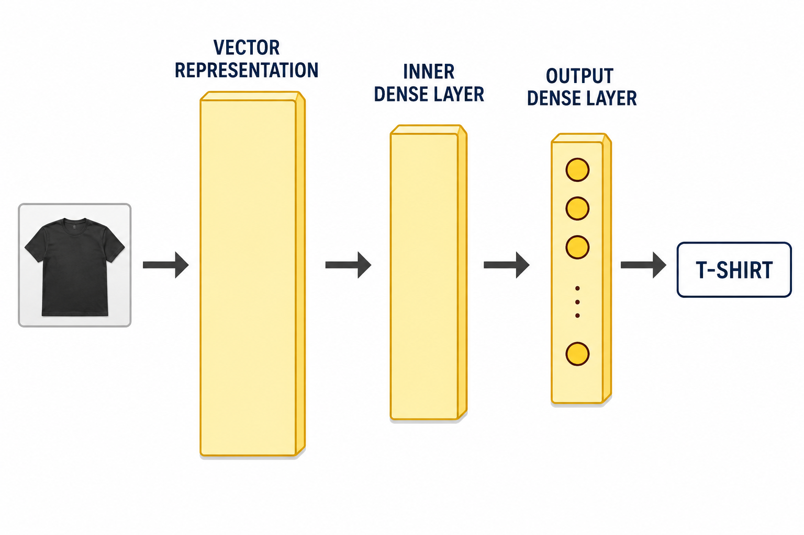
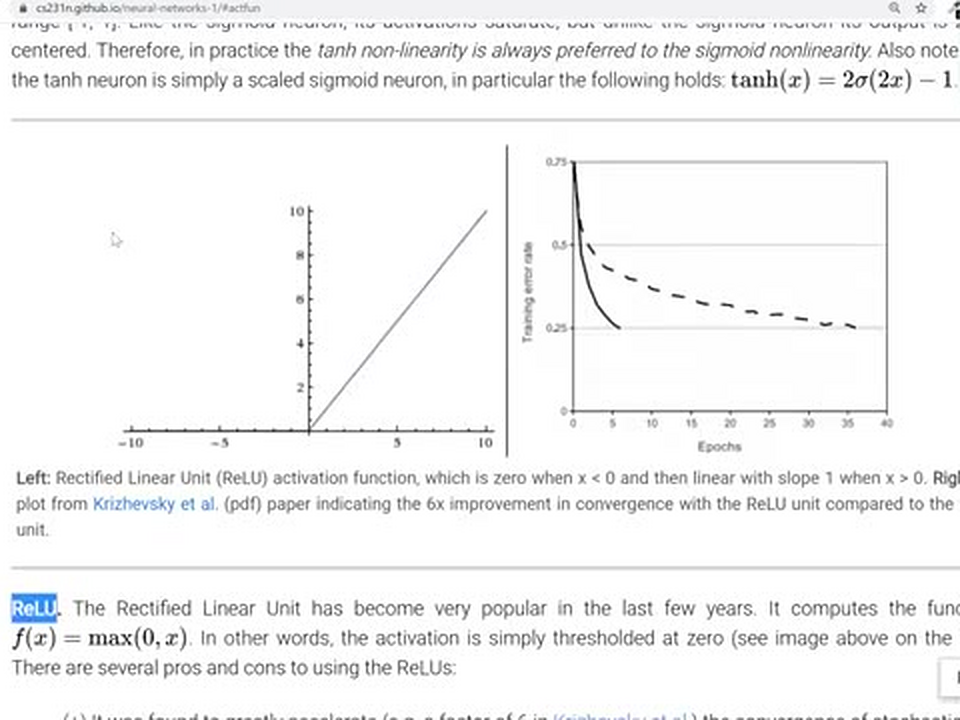
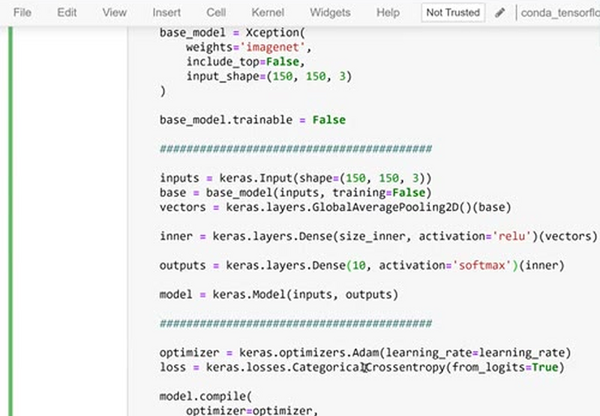
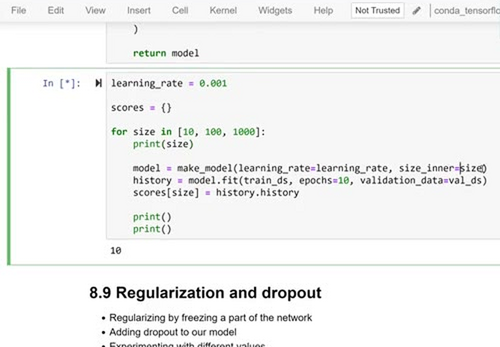
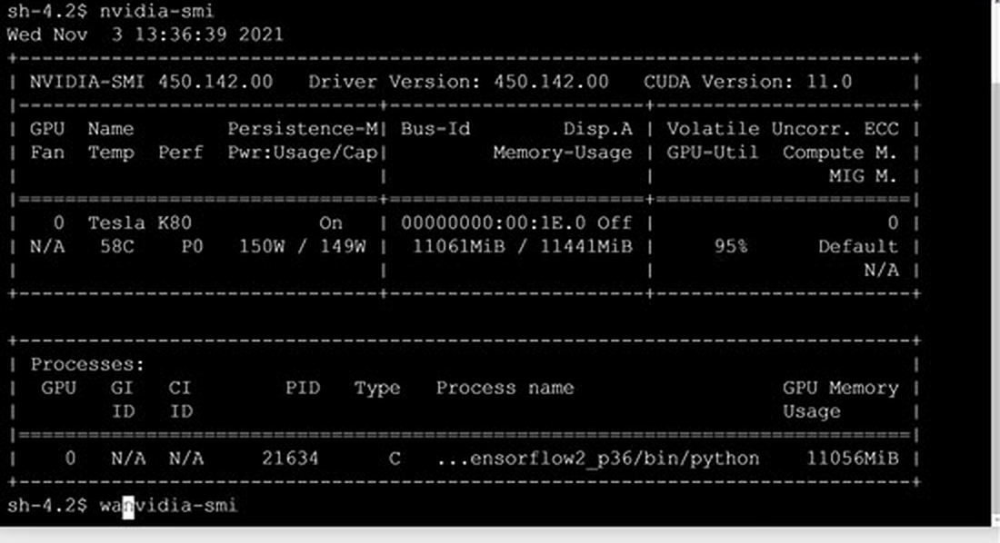
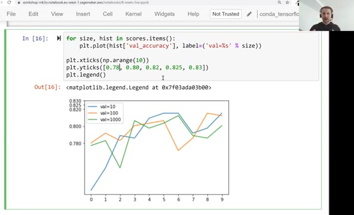

# Adding more layers

In the previous units we tuned the learning rate and added
checkpointing. In this unit we make the model itself a bit bigger:
we add one extra dense layer between the vector representation and
the output layer, and experiment with its size.

## Adding an inner dense layer

So far our model looks like this: the image goes to the base model
(frozen Xception), the base model produces the vector representation
via `GlobalAveragePooling2D`, and a single dense layer with 10
outputs turns that vector into predictions.

We can add more layers between the vector representation and the
output layer. These are the same dense layers as the output layer -
the difference is that intermediate layers use an activation function
for non-linearity. Without it, stacking dense layers wouldn't help:
several linear transformations in a row collapse into one linear
transformation.



Each activation takes the raw scores coming out of a dense layer and
transforms them. Softmax turns raw scores into probabilities - that's
what we use for the output layer (in our model we keep the raw
scores, the logits, and let the loss function handle it with
`from_logits=True`). For intermediate layers the usual choice is
ReLU: a negative input becomes zero, a positive input goes through
unchanged. For a good overview of activation functions, see the
[CS231n course notes](http://cs231n.stanford.edu/2017/).



Here's the updated `make_model` function - the only change is the
`inner` layer with `size_inner` neurons and `activation='relu'`:

```python
def make_model(learning_rate=0.01, size_inner=100):
    base_model = Xception(
        weights='imagenet',
        include_top=False,
        input_shape=(150, 150, 3)
    )

    base_model.trainable = False

    #########################################

    inputs = keras.Input(shape=(150, 150, 3))
    base = base_model(inputs, training=False)
    vectors = keras.layers.GlobalAveragePooling2D()(base)

    inner = keras.layers.Dense(size_inner, activation='relu')(vectors)

    outputs = keras.layers.Dense(10)(inner)

    model = keras.Model(inputs, outputs)

    #########################################

    optimizer = keras.optimizers.Adam(learning_rate=learning_rate)
    loss = keras.losses.CategoricalCrossentropy(from_logits=True)

    model.compile(
        optimizer=optimizer,
        loss=loss,
        metrics=['accuracy']
    )

    return model
```



The inner layer size is a hyperparameter, like the learning rate. We
don't know in advance how big it should be, so we experiment: with
the best learning rate from the previous unit (0.001), we try sizes
10, 100 and 1000:

```python
learning_rate = 0.001

scores = {}

for size in [10, 100, 1000]:
    print(size)

    model = make_model(learning_rate=learning_rate, size_inner=size)
    history = model.fit(train_ds, epochs=10, validation_data=val_ds)
    scores[size] = history.history

    print()
    print()
```



While the models train, we can check that the GPU is actually being
used. From Jupyter we can open a terminal and run `nvidia-smi` - a
command-line utility from NVIDIA that shows GPU utilization:



Here the GPU is utilized at 95%, so we're using it effectively. If
during training you see 30-50% utilization, the GPU is underutilized
and it's worth figuring out what the bottleneck is. To keep an eye on
it, run `watch nvidia-smi` - it re-executes the command every two
seconds.

To compare the runs, we plot the validation accuracy of each size:

```python
for size, hist in scores.items():
    plt.plot(hist['val_accuracy'], label=('val=%s' % size))

plt.xticks(np.arange(10))
plt.yticks([0.78, 0.80, 0.82, 0.825, 0.83])
plt.legend()
```



The curves for all three sizes are close to each other: validation
accuracy lands somewhere between 0.78 and 0.83 for each size, and the
biggest layer doesn't clearly beat the smaller ones. When a larger
layer shows no improvement over the simpler model, the simpler model
is preferable. For the following experiments we keep `size_inner=100`.

That said, it's not always possible to see right away that the model
doesn't improve - adding layers means adding complexity, which isn't
always worth it. Before deciding, it helps to try regularizing the
more complex model first. That's exactly what we'll do in the next
unit: regularization and dropout.

## Materials

[Slides](https://www.slideshare.net/AlexeyGrigorev/ml-zoomcamp-8-neural-networks-and-deep-learning-250592316)

## Notes

It is also possible to add more layers between the `vector representation layer` and the `output layer` to perform intermediate processing of the vector representation. These layers are the same dense layers as the output but the difference is that these layers use `relu` activation function for non-linearity.

Like learning rates, we should also experiment with different values of inner layer sizes:

```python
# Function to define model by adding new dense layer
def make_model(learning_rate=0.01, size_inner=100): # default layer size is 100
    base_model = Xception(weights='imagenet',
                          include_top=False,
                          input_shape=(150,150,3))

    base_model.trainable = False

    #########################################

    inputs = keras.Input(shape=(150,150,3))
    base = base_model(inputs, training=False)
    vectors = keras.layers.GlobalAveragePooling2D()(base)
    inner = keras.layers.Dense(size_inner, activation='relu')(vectors) # activation function 'relu'
    outputs = keras.layers.Dense(10)(inner)
    model = keras.Model(inputs, outputs)

    #########################################

    optimizer = keras.optimizers.Adam(learning_rate=learning_rate)
    loss = keras.losses.CategoricalCrossentropy(from_logits=True)

    # Compile the model
    model.compile(optimizer=optimizer,
                  loss=loss,
                  metrics=['accuracy'])

    return model
```

Next, train the model with different sizes of inner layer:

```python
# Experiement different number of inner layer with best learning rate
# Note: We should've added the checkpoint for training but for simplicity we are skipping it
learning_rate = 0.001

scores = {}

# List of inner layer sizes
sizes = [10, 100, 1000]

for size in sizes:
    print(size)

    model = make_model(learning_rate=learning_rate, size_inner=size)
    history = model.fit(train_ds, epochs=10, validation_data=val_ds)
    scores[size] = history.history

    print()
    print()
```

Note: It may not always be possible that the model improves. Adding more layers mean introducing complexity in the model, which may not be recommended in some cases.

In the next section, we'll try different regularization technique to improve the performance with the added inner layer.

* softmax takes raw scores from a dense layer and transforms it into a probability
* activation functions used for output vs activation functions used for intermediate steps
* have a look at http://cs231n.stanford.edu/2017/
* sigmoid: negativ input --> zero, positive input --> straight line
* relu
* softmax

<table>
   <tr>
      <td>⚠️</td>
      <td>
         The notes are written by the community. <br>
         If you see an error here, please create a PR with a fix.
      </td>
   </tr>
</table>

* [Notes from Peter Ernicke](https://knowmledge.com/2023/11/25/ml-zoomcamp-2023-deep-learning-part-10/)
