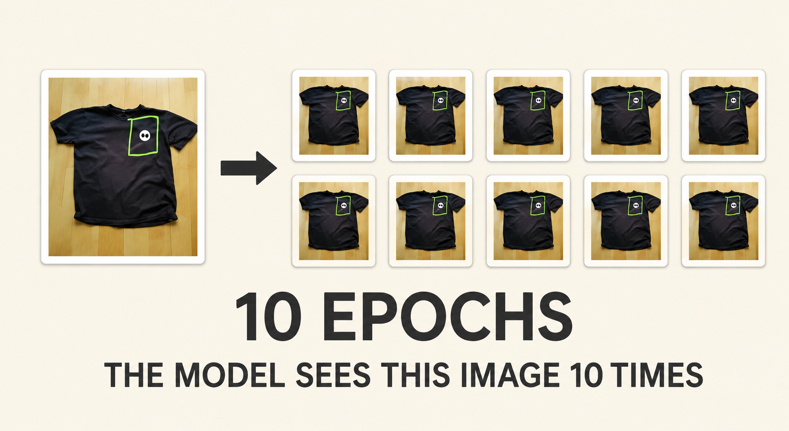
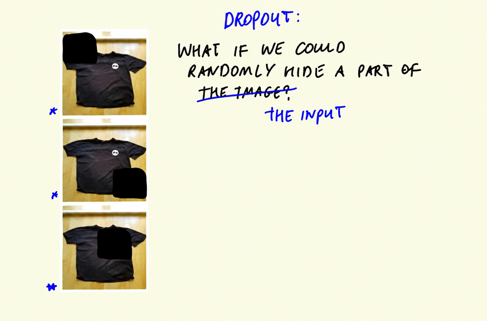
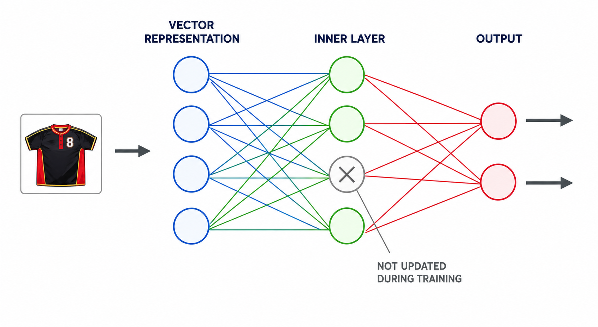
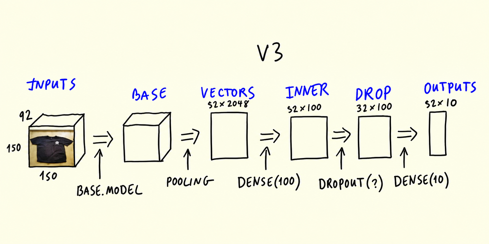
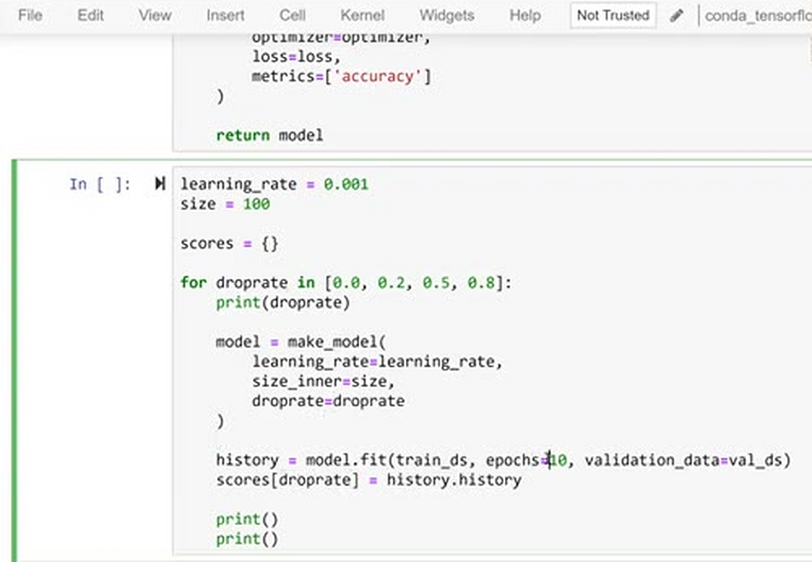
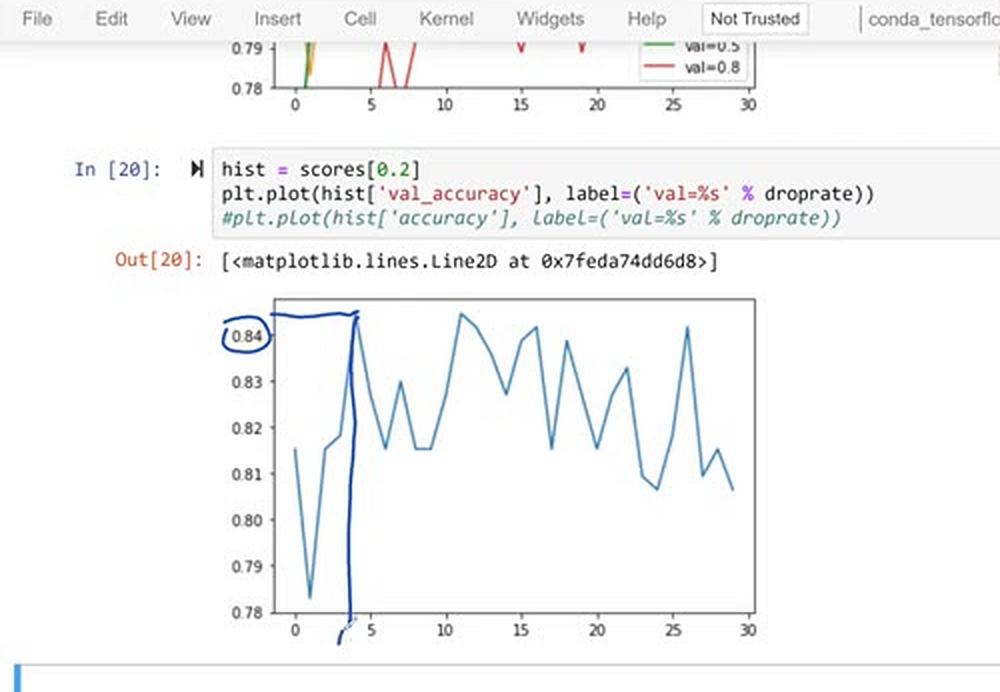
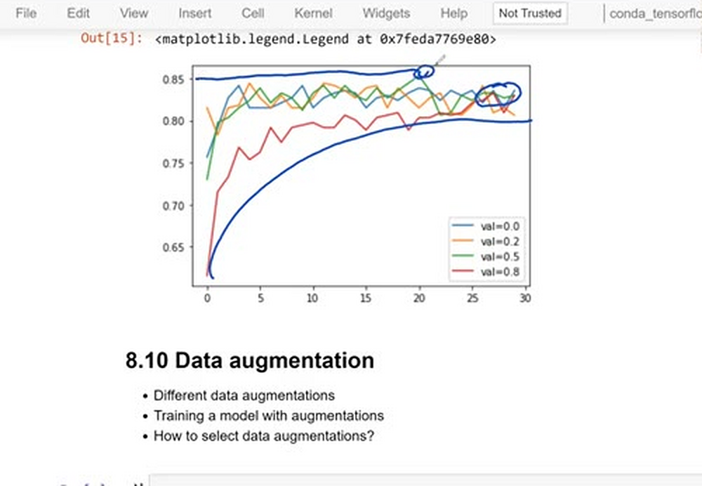
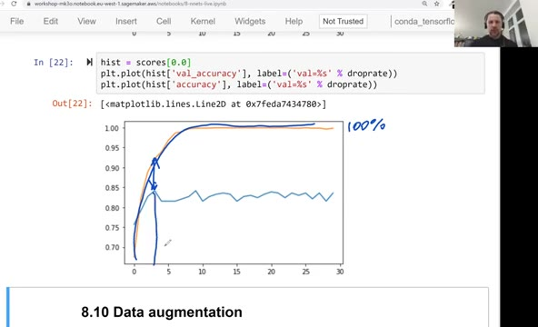

# Regularization and dropout

In the previous unit the bigger model didn't clearly beat the simpler
one - instead of shrinking it back, we'll try to regularize it.
Regularization is a way to keep a model from overfitting, and the
technique we add here is dropout: randomly freezing a part of the
network during training.

## Why models overfit

When we train for 10 epochs, the model sees every image 10 times. It
may start to latch onto details instead of learning general features.
For example, if it repeatedly recognizes a certain logo on t-shirts,
it might learn that the logo defines a t-shirt - but the same logo
can appear on a hoodie, so on the validation set this leads to
mistakes. What we want instead is for the model to focus on the
bigger picture: the shape of the item, not the details.



## The dropout idea

Dropout addresses this by hiding a random part of the network at each
iteration - not the image itself, but the input to the inner dense
layer. The intuition: it's as if we hid random parts of the image with
a black patch at each step, so the model never sees the same image
twice.



Take a dense layer with 4 inputs and 3 outputs. With dropout,
each training step freezes part of this layer: some inputs are set to
zero and don't participate in that step. The next step freezes a
different part. The output layer, on the other hand, sees all the
parts, including the frozen ones.



The `droprate` parameter controls how much is hidden: with
`droprate=0.5`, each iteration freezes 50% of the layer. Dropout
doesn't change the dimensionality of the layer - it only temporarily
zeros out parts of it while training.

In Keras, dropout is one more layer between the inner layer and the
output layer:

```python
def make_model(learning_rate=0.01, size_inner=100, droprate=0.5):
    base_model = Xception(
        weights='imagenet',
        include_top=False,
        input_shape=(150, 150, 3)
    )

    base_model.trainable = False

    #########################################

    inputs = keras.Input(shape=(150, 150, 3))
    base = base_model(inputs, training=False)
    vectors = keras.layers.GlobalAveragePooling2D()(base)

    inner = keras.layers.Dense(size_inner, activation='relu')(vectors)
    drop = keras.layers.Dropout(droprate)(inner)

    outputs = keras.layers.Dense(10)(drop)

    model = keras.Model(inputs, outputs)

    #########################################

    optimizer = keras.optimizers.Adam(learning_rate=learning_rate)
    loss = keras.losses.CategoricalCrossentropy(from_logits=True)

    model.compile(
        optimizer=optimizer,
        loss=loss,
        metrics=['accuracy']
    )

    return model
```



## Experimenting with droprate

We take the best values from the previous experiments - learning rate
0.001 and inner size 100 - and try several droprates: 0.0 (no
dropout), 0.2, 0.5 and 0.8:

```python
learning_rate = 0.001
size = 100

scores = {}

for droprate in [0.0, 0.2, 0.5, 0.8]:
    print(droprate)

    model = make_model(
        learning_rate=learning_rate,
        size_inner=size,
        droprate=droprate
    )

    history = model.fit(train_ds, epochs=30, validation_data=val_ds)
    scores[droprate] = history.history

    print()
    print()
```

One change compared to before: we train for 30 epochs instead of 10.
The downside of dropout is that the model needs more iterations to
learn - at each step it can't use the whole network, so learning is
slower. In this experiment we don't add checkpointing - though it
would have been useful here to keep the best model instead of the
last one.



Looking at the results: without dropout, training accuracy quickly
goes to 100% and stays there, while the validation accuracy stays
around 0.84 - a textbook overfitting picture. The 0.8 rate is clearly
the worst of the four: freezing 80% of the layer at every step is too
aggressive. With `droprate=0.2`, the model peaks slightly above 0.84
early on and then oscillates around 0.83 - better than the best score
of the previous unit.



One caveat: the single spike of the 0.5 curve to 0.85 looks more like
luck than a genuinely better model - right after it, the score drops
back down. And 0.8 is so large that Keras itself prints a warning
saying it's a very large dropout rate.

To compare the runs, plot the validation accuracy of each droprate:

```python
for droprate, hist in scores.items():
    plt.plot(hist['val_accuracy'], label=('val=%s' % droprate))

plt.ylim(0.78, 0.86)
plt.legend()
```



It also helps to zoom in on the two curves with the best validation
accuracy, 0.0 and 0.2:

```python
hist = scores[0.0]
plt.plot(hist['val_accuracy'], label=0.0)

hist = scores[0.2]
plt.plot(hist['val_accuracy'], label=0.2)

plt.legend()
```



In the end, `droprate=0.2` is the choice: it's not too large, the
performance is reasonably good, and unlike plain 0.0 it actually
fights overfitting. This is the value we use in the following units.

## Materials

[Slides](https://www.slideshare.net/AlexeyGrigorev/ml-zoomcamp-8-neural-networks-and-deep-learning-250592316)

## Notes

Dropout is a technique that prevents overfitting in neural networks by randomly dropping nodes of a layer during training. As a result, the trained model works as an ensemble model consisting of multiple neural networks.

From previous experiments we got the best values of learning rate `0.01` and layer size of `100`. We'll use these values for the next experiment along with different values of dropout rates:

```python
# Function to define model by adding new dense layer and dropout
def make_model(learning_rate=0.01, size_inner=100, droprate=0.5):
    base_model = Xception(weights='imagenet',
                          include_top=False,
                          input_shape=(150,150,3))

    base_model.trainable = False

    #########################################

    inputs = keras.Input(shape=(150,150,3))
    base = base_model(inputs, training=False)
    vectors = keras.layers.GlobalAveragePooling2D()(base)
    inner = keras.layers.Dense(size_inner, activation='relu')(vectors)
    drop = keras.layers.Dropout(droprate)(inner) # add dropout layer
    outputs = keras.layers.Dense(10)(drop)
    model = keras.Model(inputs, outputs)

    #########################################

    optimizer = keras.optimizers.Adam(learning_rate=learning_rate)
    loss = keras.losses.CategoricalCrossentropy(from_logits=True)

    # Compile the model
    model.compile(optimizer=optimizer,
                  loss=loss,
                  metrics=['accuracy'])

    return model


# Create checkpoint to save best model for version 3
filepath = './xception_v3_{epoch:02d}_{val_accuracy:.3f}.h5'
checkpoint = keras.callbacks.ModelCheckpoint(filepath=filepath,
                                             save_best_only=True,
                                             monitor='val_accuracy',
                                             mode='max')

# Set the best values of learning rate and inner layer size based on previous experiments
learning_rate = 0.001
size = 100

# Dict to store results
scores = {}

# List of dropout rates
droprates = [0.0, 0.2, 0.5, 0.8]

for droprate in droprates:
    print(droprate)

    model = make_model(learning_rate=learning_rate,
                       size_inner=size,
                       droprate=droprate)

    # Train for longer (epochs=30) cause of dropout regularization
    history = model.fit(train_ds, epochs=30, validation_data=val_ds, callbacks=[checkpoint])
    scores[droprate] = history.history

    print()
    print()
```

Note: Because we introduce dropout in the neural networks, we will need to train our model for longer, hence, number of epochs is set to `30`.

**Classes, functions, attributes**:

- `tf.keras.layers.Dropout()`: dropout layer to randomly sets input units (i.e, nodes) to 0 with a frequency of rate at each epoch during training
- `rate`: argument to set the fraction of the input units to drop, it is a value of float between 0 and 1

* A neural network might learn false patterns, i.e. if it repeatedly recognizes a certain logo on a t-shirt it might learn that the logo defines the t-shirt which is wrong since the logo might also be seen on a hoodie.
* hiding parts of the images (freeze) from being seen by the learning neural network
* dropout = randomly freezing parts of the image
* comparing different performance parameters while changing dropout rate and regularization

<table>
   <tr>
      <td>⚠️</td>
      <td>
         The notes are written by the community. <br>
         If you see an error here, please create a PR with a fix.
      </td>
   </tr>
</table>

* [Notes from Peter Ernicke](https://knowmledge.com/2023/11/26/ml-zoomcamp-2023-deep-learning-part-11/)
