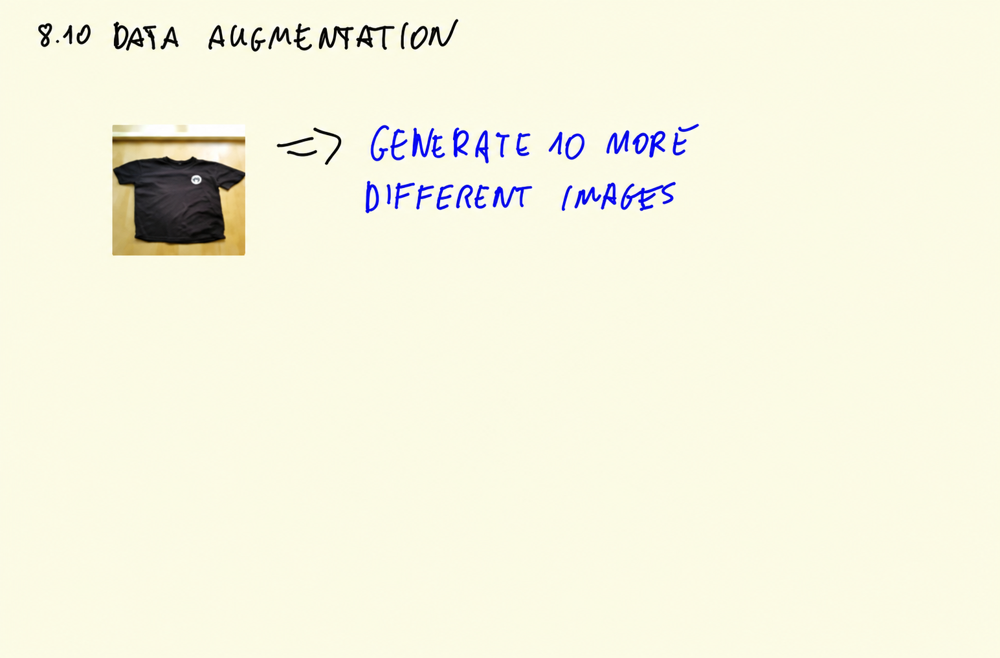
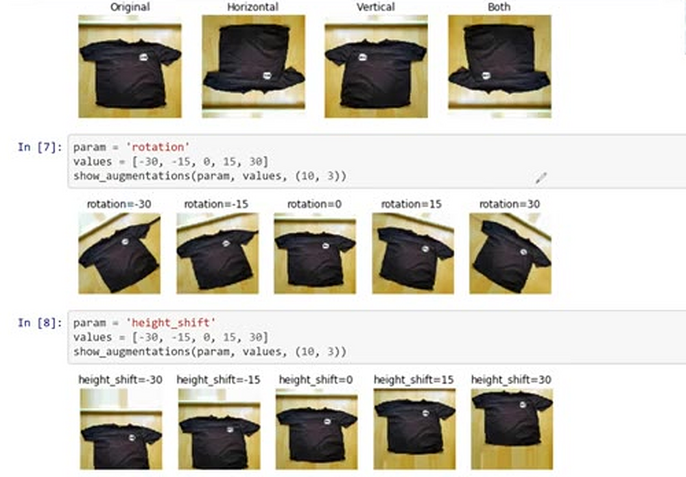
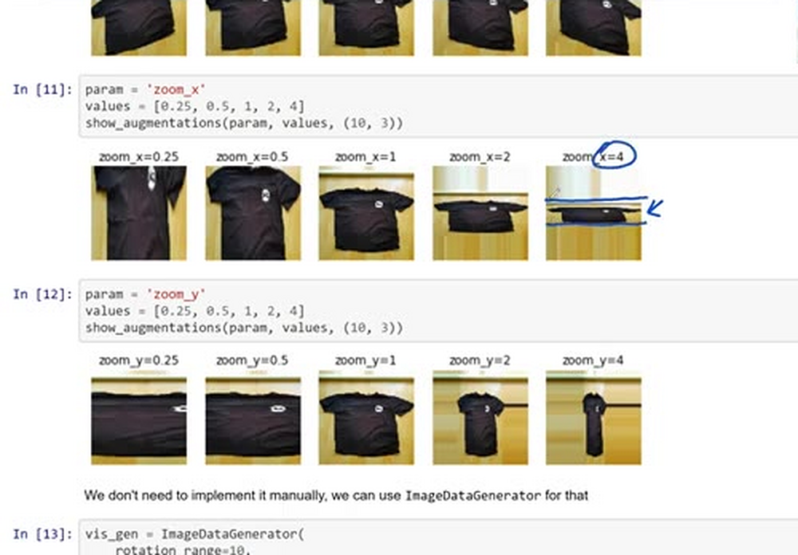
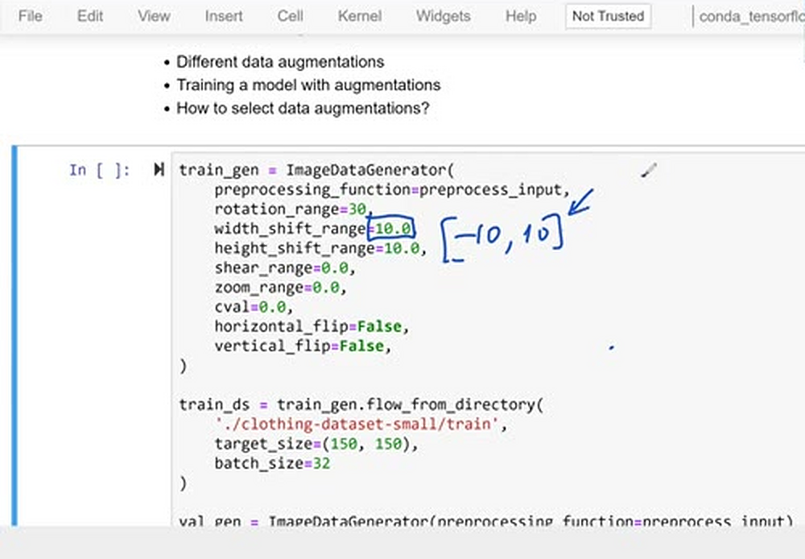
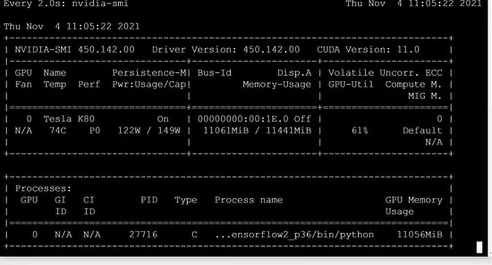
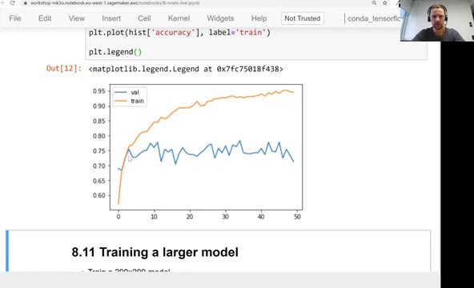

# Data augmentation

Dropout regularizes the network itself. Data augmentation is another
way to fight overfitting - this time on the data side: we generate
more training images from the existing ones by applying random
transformations, so the network never sees the same image twice in
exactly the same form.



## What augmentations look like

There are many transformations we can apply, and we can combine them:

- flipping the image horizontally or vertically
- rotating it or shifting it left/right and up/down
- shearing - moving one of the corners so the image gets skewed
- zooming in or out
- changing brightness and contrast





The idea is similar to the dropout picture from the previous unit:
augmentation can randomly hide parts of the image, and it changes
details like the position or the orientation of the item, forcing the
model to learn the shape rather than the details.

In Keras, the `ImageDataGenerator` class we already use for reading
the data has parameters for all these augmentations. For example:

```python
train_gen = ImageDataGenerator(
    preprocessing_function=preprocess_input,
    rotation_range=30,
    width_shift_range=10,
    height_shift_range=10,
    shear_range=10,
    zoom_range=0.1,
    vertical_flip=True,
)
```



## One important detail (and a bug in the video)

Augmentation should be applied only to the training data, never to
validation. We leave the validation dataset unchanged, because we
want consistent results: the validation images must always be the
same, otherwise the scores are not comparable between epochs.

In this video, I had a typo/bug: instead of using `val_gen` for
generating images for validation, I used `train_gen`. That's why
adding augmentations didn't help in the video.

## Training with augmentations

After experimenting, most of the augmentations above were turned off
again, and only a few were kept (in this notebook cell the vertical
flip is commented out as well):

```python
train_gen = ImageDataGenerator(
    preprocessing_function=preprocess_input,
#     vertical_flip=True,
)

train_ds = train_gen.flow_from_directory(
    './clothing-dataset-small/train',
    target_size=(150, 150),
    batch_size=32
)

val_gen = ImageDataGenerator(preprocessing_function=preprocess_input)

val_ds = val_gen.flow_from_directory(
    './clothing-dataset-small/validation',
    target_size=(150, 150),
    batch_size=32,
    shuffle=False
)
```

The generators find the familiar 3068 training images and 341
validation images, belonging to 10 classes each. Then we train with
the parameters from the previous unit - learning rate 0.001, inner
size 100, droprate 0.2 - for 50 epochs, because augmented data
usually needs longer training:

```python
learning_rate = 0.001
size = 100
droprate = 0.2

model = make_model(
    learning_rate=learning_rate,
    size_inner=size,
    droprate=droprate
)

history = model.fit(train_ds, epochs=50, validation_data=val_ds)
```

And plot the curves:

```python
hist = history.history
plt.plot(hist['val_accuracy'], label='val')
plt.plot(hist['accuracy'], label='train')

plt.legend()
```

In this experiment the augmentation didn't really help - usually it
does. Note that augmentation happens on the CPU, before each batch
goes to the GPU, so it can also slow training down: the GPU sits idle
while the CPU prepares the next batch. We can watch this with
`nvidia-smi` - during this run the utilization dropped to around 60%,
well below the 95% we saw before:





## How to select augmentations

Which augmentations should you use? A few guidelines:

- First, use your own judgement: if you don't expect to see
  horizontally flipped images in real life, flipping doesn't make
  sense. Look at the images - both train and validation - and at the
  kind of variations they have. Are the objects always centered? Are
  they always upright?
- Treat augmentations as hyperparameters: train the model with a new
  augmentation for 10-20 epochs and compare. If it's better, keep it;
  if not, don't use it. If the results are similar, train for around
  20 more epochs and compare again.

And remember: tuning neural networks is more art than science.

## Materials

[Slides](https://www.slideshare.net/AlexeyGrigorev/ml-zoomcamp-8-neural-networks-and-deep-learning-250592316)

## Notes

Data augmentation is a process of artifically increasing the amount of data by generating new images from existing images. This includes adding minor alterations to images by flipping, cropping, adding brightness and/or contrast, and many more.

Keras `ImageDataGenerator` class has many parameters for data augmentation that we can use for generating data. Important thing to remember that the data augmentation should only be implemented on train data, not the validation. Here's how we can generate augmented data for training the model:

```python
# Create image generator for train data and also augment the images
train_gen = ImageDataGenerator(preprocessing_function=preprocess_input,
                               rotation_range=30,
                               width_shift_range=10.0,
                               height_shift_range=10.0,
                               shear_range=10,
                               zoom_range=0.1,
                               vertical_flip=True)

train_ds = train_gen.flow_from_directory(directory=train_imgs_dir,
                                         target_size=(150,150),
                                         batch_size=32)
```

**How to choose augmentations?**

- First step is to use our own judgement, for example, looking at the images (both on train and validation), does it make sense to introduce horizontal flip?
- Look at the dataset, what kind of variations are there? Are objects always centered?
- Augmentations are hyperparameters: like many other hyperparameters, often times we need to test whether image augmentations are useful for the model or not. If the model doesn't improve or have same performance after certain epochs (let's say 20), in that case we don't use it.

Usually augmented data required training for longer.

<table>
   <tr>
      <td>⚠️</td>
      <td>
         The notes are written by the community. <br>
         If you see an error here, please create a PR with a fix.
      </td>
   </tr>
</table>

* [Notes from Peter Ernicke](https://knowmledge.com/2023/11/27/ml-zoomcamp-2023-deep-learning-part-12/)
