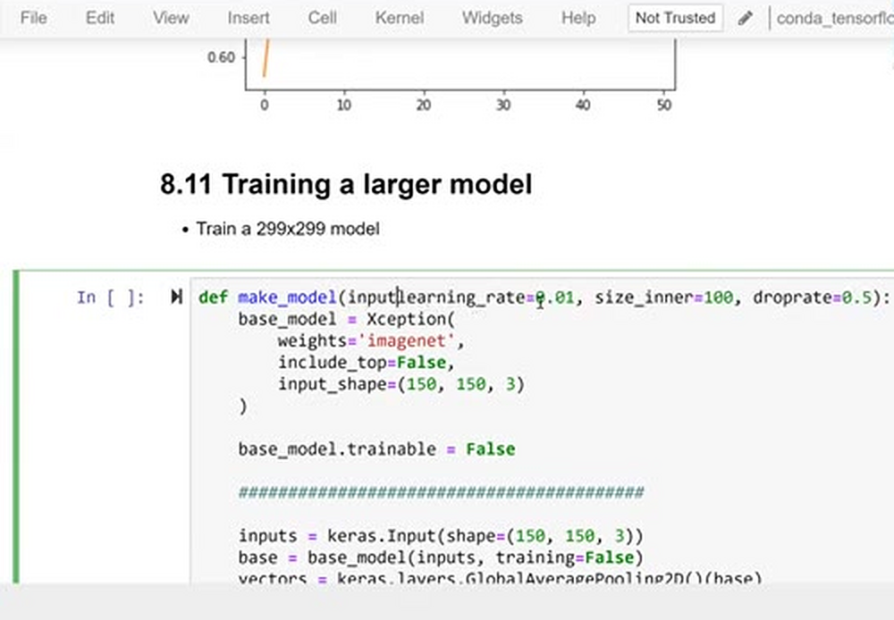
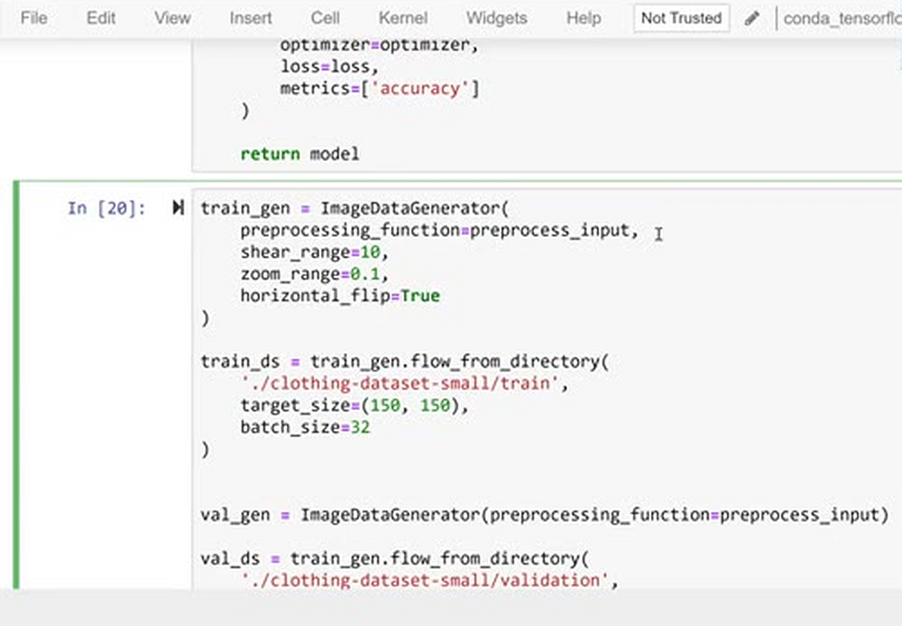
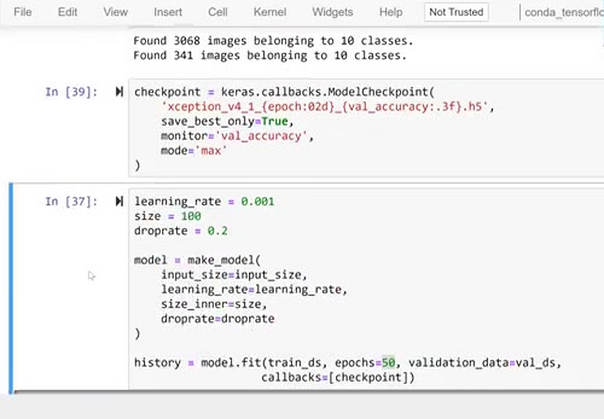
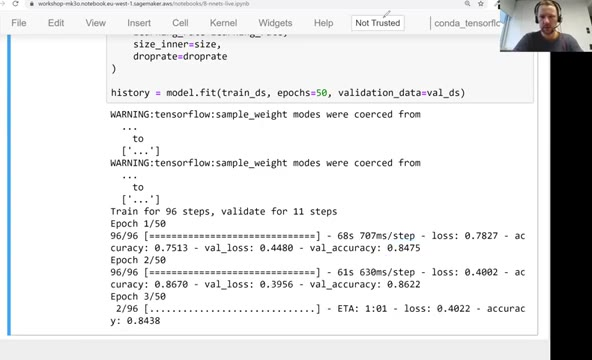
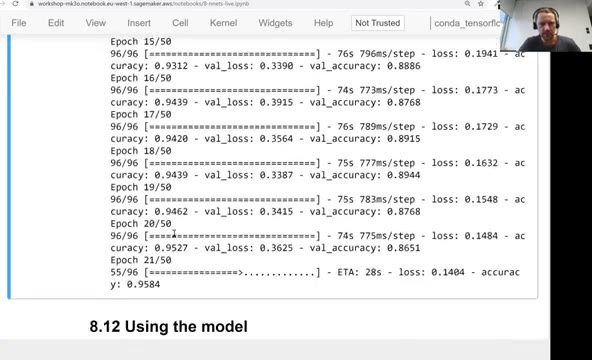
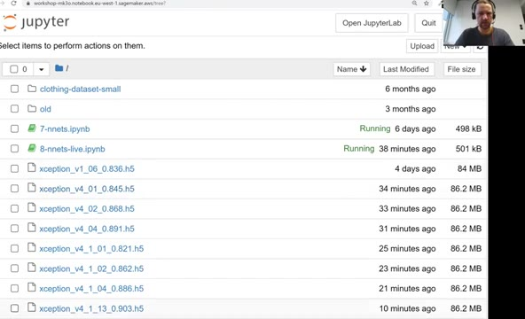

# Training a larger model

All our experiments so far used 150x150 images, because smaller
images train roughly four times faster - that's what we want while
tuning parameters. Now that the parameters are chosen, it's time to
train the final, larger model on images of the original size, 299x299,
using everything we have learned: an inner layer, dropout, a bit of
augmentation, and a lower learning rate.

## Making the input size a parameter

First, `make_model` gets one more parameter, `input_size`, which is
used in the input shape - both for the input layer and for the base
model. The default of 150 keeps the old behaviour:



```python
def make_model(input_size=150, learning_rate=0.01, size_inner=100,
               droprate=0.5):

    base_model = Xception(
        weights='imagenet',
        include_top=False,
        input_shape=(input_size, input_size, 3)
    )

    base_model.trainable = False

    #########################################

    inputs = keras.Input(shape=(input_size, input_size, 3))
    base = base_model(inputs, training=False)
    vectors = keras.layers.GlobalAveragePooling2D()(base)

    inner = keras.layers.Dense(size_inner, activation='relu')(vectors)
    drop = keras.layers.Dropout(droprate)(inner)

    outputs = keras.layers.Dense(10)(drop)

    model = keras.Model(inputs, outputs)

    #########################################

    optimizer = keras.optimizers.Adam(learning_rate=learning_rate)
    loss = keras.losses.CategoricalCrossentropy(from_logits=True)

    model.compile(
        optimizer=optimizer,
        loss=loss,
        metrics=['accuracy']
    )

    return model
```

Then we set the input size to 299:

```python
input_size = 299
```

## Reading the data at full size

The generators now produce images of `input_size` x `input_size`. The
augmentation is reduced to a few gentle transformations: a bit of
shear, a small zoom and a horizontal flip:



```python
train_gen = ImageDataGenerator(
    preprocessing_function=preprocess_input,
    shear_range=10,
    zoom_range=0.1,
    horizontal_flip=True
)

train_ds = train_gen.flow_from_directory(
    './clothing-dataset-small/train',
    target_size=(input_size, input_size),
    batch_size=32
)


val_gen = ImageDataGenerator(preprocessing_function=preprocess_input)

val_ds = train_gen.flow_from_directory(
    './clothing-dataset-small/validation',
    target_size=(input_size, input_size),
    batch_size=32,
    shuffle=False
)
```

Careful readers will spot the same typo as in the previous unit: the
validation generator is created from `train_gen`, not `val_gen`, so
the validation images are augmented too. The generators still report
the expected 3068 training and 341 validation images in 10 classes.

Since training takes long and we don't want to lose the best model,
we bring back the checkpoint callback - the filename pattern encodes
the epoch and the validation accuracy:



```python
checkpoint = keras.callbacks.ModelCheckpoint(
    'xception_v4_1_{epoch:02d}_{val_accuracy:.3f}.h5',
    save_best_only=True,
    monitor='val_accuracy',
    mode='max'
)
```

## Training

We can think of this model as version four: version one was plain
transfer learning, version two added the inner dense layer, version
three added dropout - and version four is the same model, just
trained on bigger images.

The very first run skipped augmentation to see what happens. The
validation accuracy jumped around and the training accuracy grew
quickly - signs of overfitting - so augmentation came back, and the
learning rate went down from 0.001 to 0.0005, because with 0.001 the
validation score was too jumpy. The final parameters: inner size 100,
droprate 0.2, and 50 epochs:



```python
learning_rate = 0.0005
size = 100
droprate = 0.2

model = make_model(
    input_size=input_size,
    learning_rate=learning_rate,
    size_inner=size,
    droprate=droprate
)

history = model.fit(train_ds, epochs=50, validation_data=val_ds,
                   callbacks=[checkpoint])
```

Training is now much slower: one step takes about 0.7 seconds instead
of 0.15 - exactly the predicted factor of four. But the results are
the best so far. After the first epoch the validation accuracy is
already above 0.81, and by the end of training it reaches about 0.88.
The training accuracy keeps growing to about 0.95, and with
augmentation, validation sometimes even beats training accuracy: the
model sees a slightly different variation of every image at each
epoch, so it memorizes them less easily.



The best checkpoint of this run is `xception_v4_1_13_0.903.h5` -
0.903 validation accuracy at epoch 13:



In all the experiments before,
80% was the best we could squeeze out of the 150x150 models; the
larger model clearly outperforms them. This is the model we'll use in
the next unit.

## Materials

[Slides](https://www.slideshare.net/AlexeyGrigorev/ml-zoomcamp-8-neural-networks-and-deep-learning-250592316)

## Notes

In this section we increase the image input size from `150` to `299`, reduce the amount of data augmentation parameters and lower the learning rate. This gives us the best results than any previous experiments.

<table>
   <tr>
      <td>⚠️</td>
      <td>
         The notes are written by the community. <br>
         If you see an error here, please create a PR with a fix.
      </td>
   </tr>
</table>

* [Notes from Peter Ernicke](https://knowmledge.com/2023/11/28/ml-zoomcamp-2023-deep-learning-part-13/)
