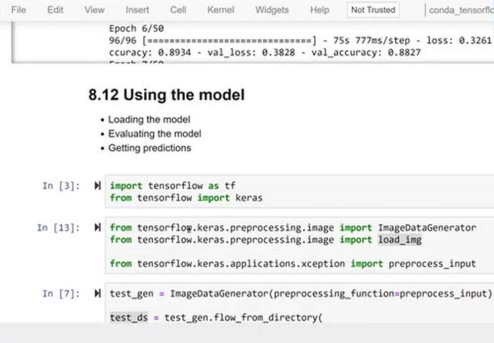
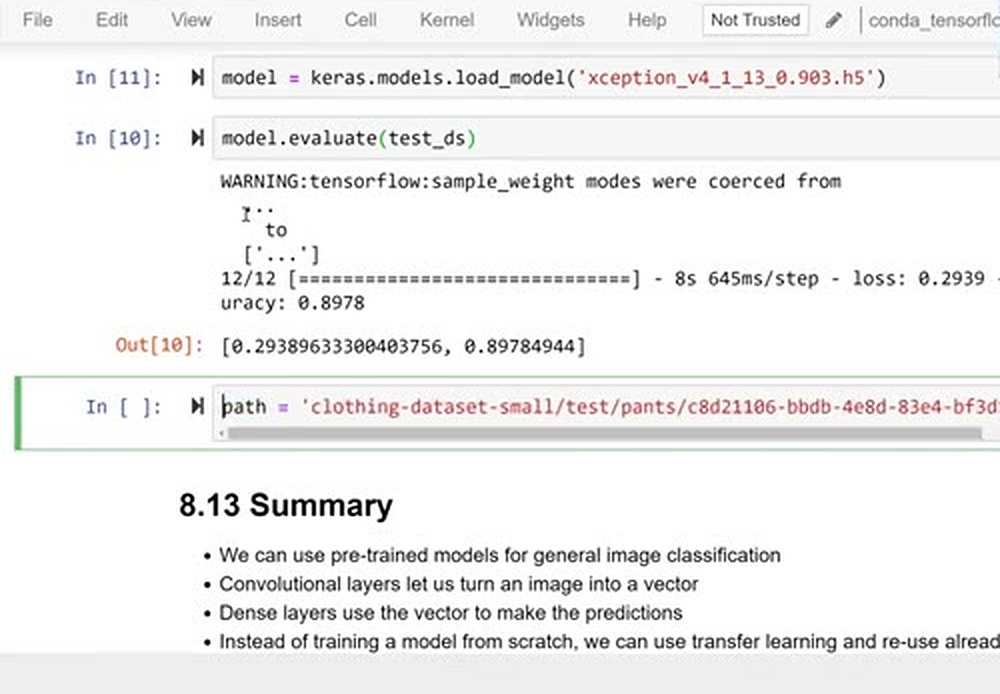
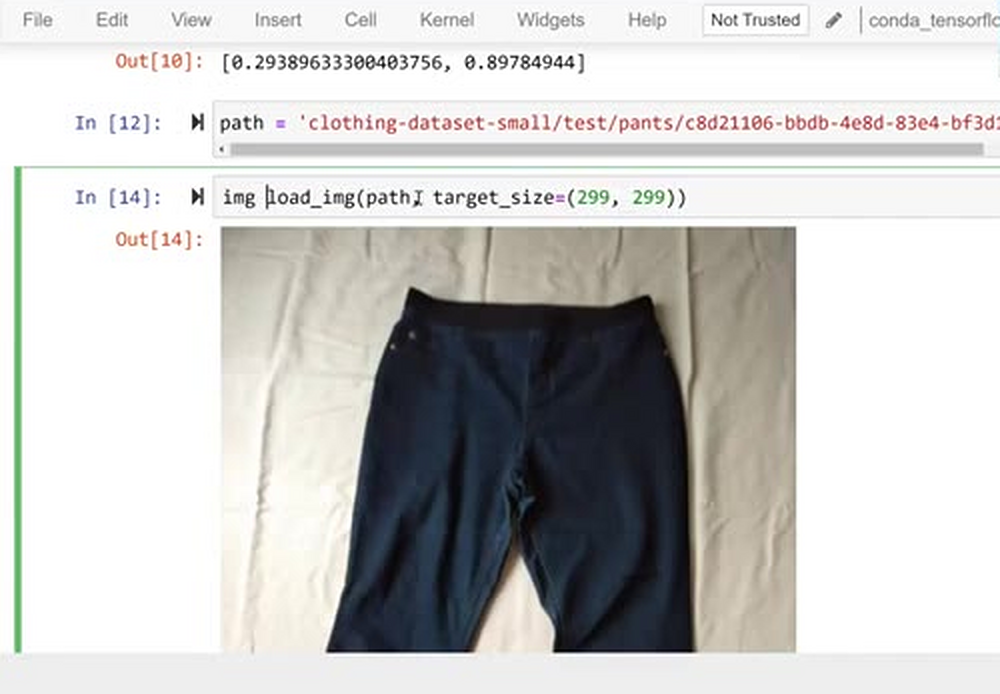
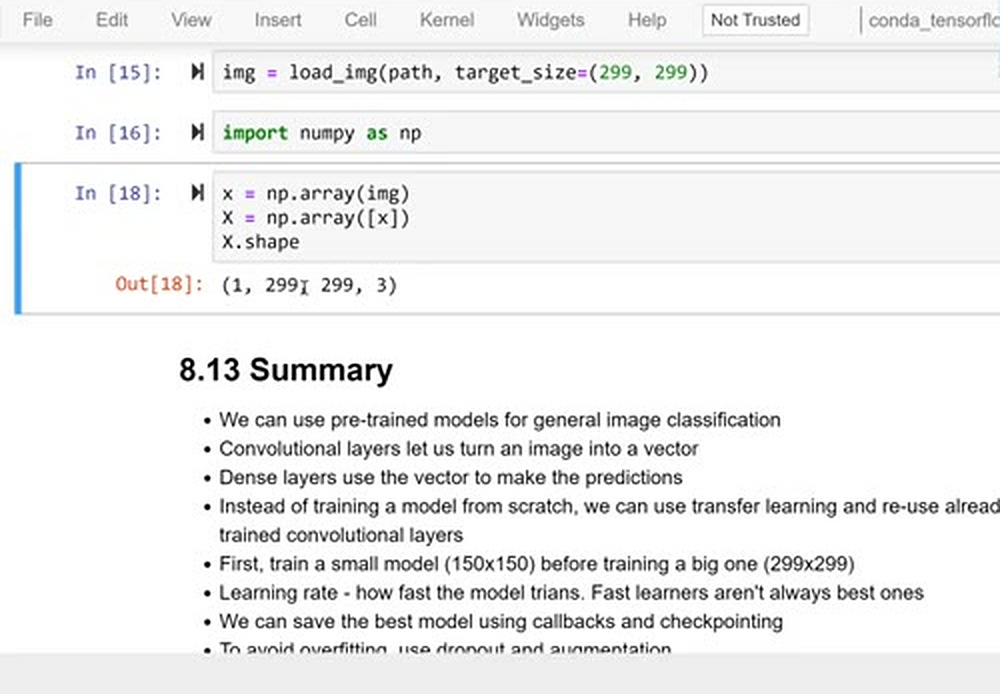
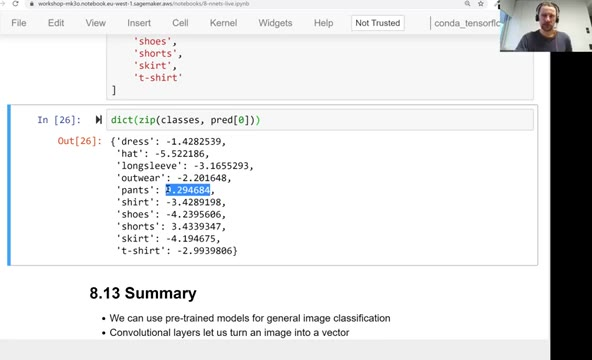

# Using the model

The model is trained and the best checkpoint is saved. In this unit
we take that saved model, load it into a fresh environment, evaluate
it on the test set, and use it to get predictions for a single image.

## Loading the model

Throughout the module we saved checkpoints in the h5 format - the
HDF5 format. Such a file contains the model's architecture, the
values of the weights, and the information from `compile()`, so a
checkpoint is a complete, ready-to-use model. Loading it takes one
line with `keras.models.load_model`.

Imagine we do this in a fresh notebook - all we need is the imports
and the saved file:

```python
import tensorflow as tf
from tensorflow import keras
```

```python
from tensorflow.keras.preprocessing.image import ImageDataGenerator
from tensorflow.keras.preprocessing.image import load_img

from tensorflow.keras.applications.xception import preprocess_input
```



First we prepare the test set with the same preprocessing as for
train and validation: an `ImageDataGenerator` with
`preprocessing_function=preprocess_input`, images of 299x299, no
shuffling. It finds 372 test images belonging to 10 classes:

```python
test_gen = ImageDataGenerator(preprocessing_function=preprocess_input)

test_ds = test_gen.flow_from_directory(
    './clothing-dataset-small/test',
    target_size=(299, 299),
    batch_size=32,
    shuffle=False
)
```

Now load the best model from the previous unit:

```python
model = keras.models.load_model('xception_v4_1_13_0.903.h5')
```

## Evaluating the model

Evaluation is one line:

```python
model.evaluate(test_ds)
```

It returns the loss and the accuracy on the test set:

```text
12/12 [==============================] - 8s 645ms/step - loss: 0.2939 - accuracy: 0.8978
[0.29389633300403756, 0.89784944]
```



The test accuracy is about 90%, very close to the 0.903 validation
accuracy from training. When the test score matches the validation
score, the model does not overfit - we trained a good model.

## Getting predictions

Let's use the model on a single image - one of the pants photos from
the test set:

```python
path = 'clothing-dataset-small/test/pants/c8d21106-bbdb-4e8d-83e4-bf3d14e54c16.jpg'
```

We need exactly the same preprocessing as during training: load the
image and resize it to 299x299, turn it into a numpy array, put it
into a batch with one image, and apply `preprocess_input`:

```python
img = load_img(path, target_size=(299, 299))
```



```python
import numpy as np
```

```python
x = np.array(img)
X = np.array([x])
X.shape
```

The shape is `(1, 299, 299, 3)` - a batch with one image:



Then:

```python
X = preprocess_input(X)
pred = model.predict(X)
```

The prediction is a vector with 10 scores - one per class. To see
which is which, zip the class names with the scores:

```python
classes = [
    'dress',
    'hat',
    'longsleeve',
    'outwear',
    'pants',
    'shirt',
    'shoes',
    'shorts',
    'skirt',
    't-shirt'
]
```

```python
dict(zip(classes, pred[0]))
```

```text
{'dress': -1.4282539,
 'hat': -5.522186,
 'longsleeve': -3.1655293,
 'outwear': -2.201648,
 'pants': 9.294684,
 'shirt': -3.4289198,
 'shoes': -4.2395606,
 'shorts': 3.4339347,
 'skirt': -4.194675,
 't-shirt': -2.9939806}
```



The highest score is pants (9.29), followed by shorts (3.43) - and
that makes sense, because shorts look similar to pants. The model
clearly picked the right class for this image. These numbers
are not probabilities: our model was trained with `from_logits=True`,
so `predict` returns the raw scores, the logits. They still tell us
how likely each class is relative to the others - and if we want
actual probabilities, we can apply softmax ourselves.

## Materials

[Slides](https://www.slideshare.net/AlexeyGrigorev/ml-zoomcamp-8-neural-networks-and-deep-learning-250592316)

## Notes

Earlier we used **h5 format** to save our model when creating the checkpoint. The HDF5 format contains the model's architecture, weights values, and `compile()` information. The saved model can be loaded and used for prediction with `keras.models.load_model(path/to/saved_model)` method.

To evaluate the model and make prediction on test data, we'll need to create the same preprocessing steps for the image as we have done with train and validation data:

```python
# Create image generator for test data
test_gen = ImageDataGenerator(preprocessing_function=preprocess_input)

# Path of test images directory
test_imgs_dir = '../input/mlzoomcampimageclassification/zoomcamp-image-classification/clothing-dataset-small/test'

# Load in test images to generator
test_ds = test_gen.flow_from_directory(directory=test_imgs_dir,
                                       target_size=(299,299),
                                       batch_size=32,
                                       shuffle=False)

# Path of an image to make predictions
img_path = 'path/to/image'
# Load image
img = load_img(img_path, target_size=(299,299))

# Convert image to numpy array
x = np.array(img)
# Add batch dimension to the image
X = np.array([x])
# Preprocess the image
X = preprocess_input(X)
```

The model performance can be evaluated on test data with `model.evaluate(test_ds)` and the prediction on the test image can be made using the method `model.predict(X)`. We can then zip the class names and prediction to see the likelihood.

**Classes, functions, attributes**:

- `keras.models.load_model()`: method to load saved model
- `model.evaluate()`: method to evaluate the performance of the model based on the evaluation metrics
- `model.predict()`: method to make predictions of output depending on the input

<table>
   <tr>
      <td>⚠️</td>
      <td>
         The notes are written by the community. <br>
         If you see an error here, please create a PR with a fix.
      </td>
   </tr>
</table>

* [Notes from Peter Ernicke](https://knowmledge.com/2023/11/29/ml-zoomcamp-2023-deep-learning-part-14/)
