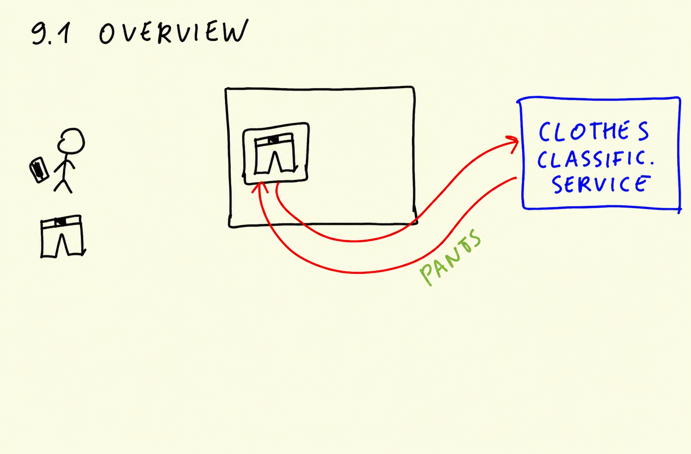
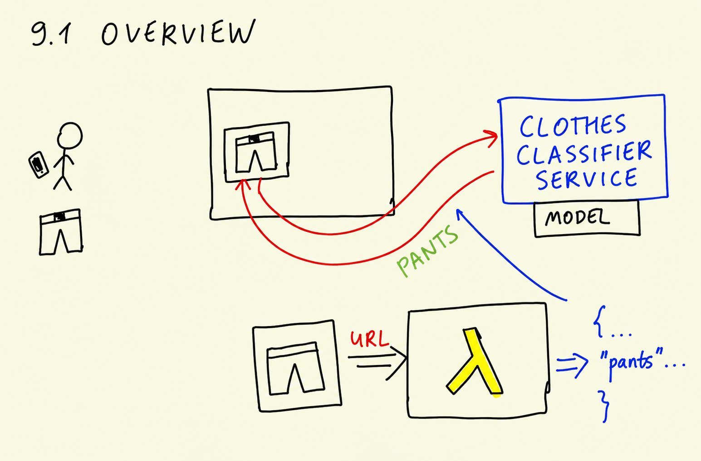
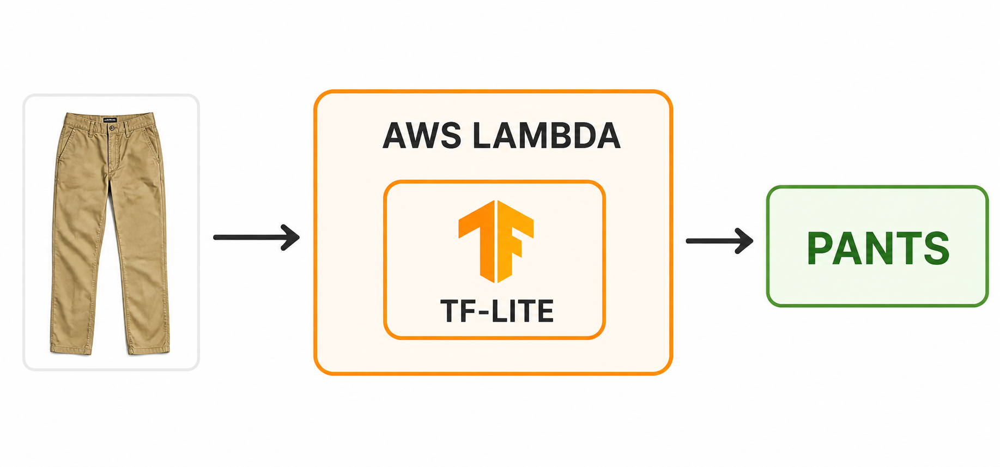
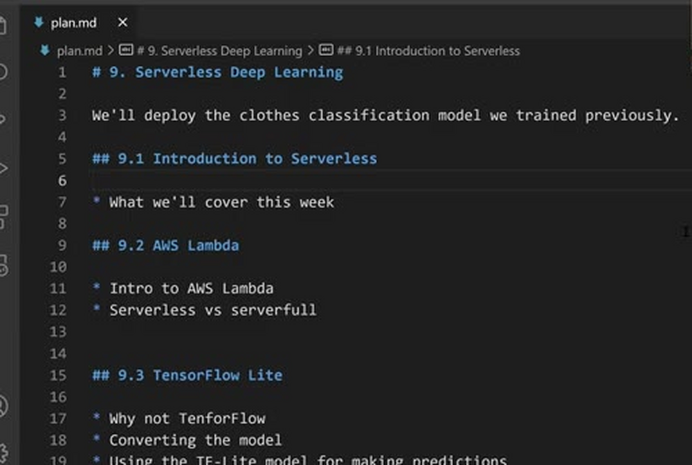
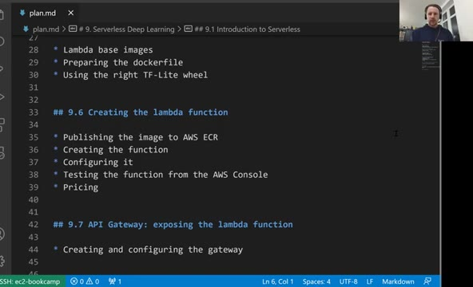

# Introduction to Serverless

This is the first lesson of the serverless module. In the previous
session we trained a neural network for classifying images of clothes.
Now we take that model and deploy it as a web service using AWS Lambda
and TensorFlow Lite.

Refer to [updates.md](updates.md) for info on running TF lite in 2024.

## The use case

Let's first recall the use case from the previous session. We have an
online classifieds platform - a site where people post things they want
to sell. A user wants to sell pants. They take a picture of the pants
with their phone and upload it to the website.

Once we have the picture, we send it to our clothes classification
service. The service looks at the image and replies that it's pants.
We use this answer to pre-fill the category for the user: "looks like
you're trying to sell pants, so we'll put it in the pants category."

In the previous session we covered the training part of this pipeline.
We used Keras and TensorFlow to train an image classification model
that can tell different types of clothes apart. Now we have a trained
model, and this session is about deployment: how do we take this model
and turn it into a service that our website can call?

## Deploying with AWS Lambda

One way of deploying this model is AWS Lambda. Lambda is a service from
AWS that lets us deploy many different things, including machine
learning models.

The way it works: we have a picture of pants. We send the URL of this
picture to the model deployed with Lambda, and the service replies with
many different classes. One of these classes will be "pants", together
with a score. This is what we respond with to the user.

Inside Lambda we won't use plain TensorFlow. We will use TensorFlow
Lite instead - a lighter version of TensorFlow that is better suited
for this particular use case. We'll talk about the reasons for that
later in the module.

## The plan

Here's what we'll cover in this module:

- What AWS Lambda actually is, and how it differs from other approaches
  to deploying models
- TensorFlow Lite as an alternative to TensorFlow, and why it's better
  for this use case
- Converting the model we trained previously into the TensorFlow Lite
  format, and using the converted model inside Lambda
- Packaging everything as a Docker container and deploying it to AWS
  Lambda
- Exposing the Lambda function as a web service using API Gateway

That's the plan. In the next lesson we start with AWS Lambda: what it
is and how it's different from other approaches.

## Notes

In the last session, we built and trained a clothes classification deep learning model using `Keras` and `TensorFlow`. This session focuses on deploying it. The model categorizes images of clothing items (e.g., 👕 t-shirts, 👖 pants, etc.) uploaded by users on a website. Deployment will be done using **AWS Lambda**, a serverless solution to execute code without managing servers, and instead of `TensorFlow`, we will use `TensorFlow-lite`.

* introduction to the topic of the week: deploying a deep learning model to the cloud, aws lambda and tensorflow lite

<table>
   <tr>
      <td>⚠️</td>
      <td>
         The notes are written by the community.  
         If you see an error here, please create a PR with a fix.
      </td>
   </tr>
</table>

* [Notes from Peter Ernicke](https://knowmledge.com/2023/11/30/ml-zoomcamp-2023-serverless-part-1/)
