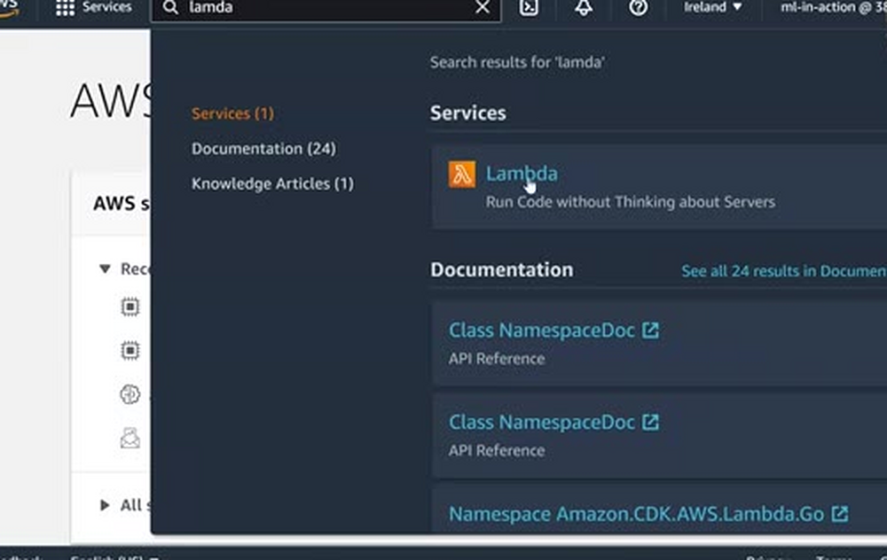
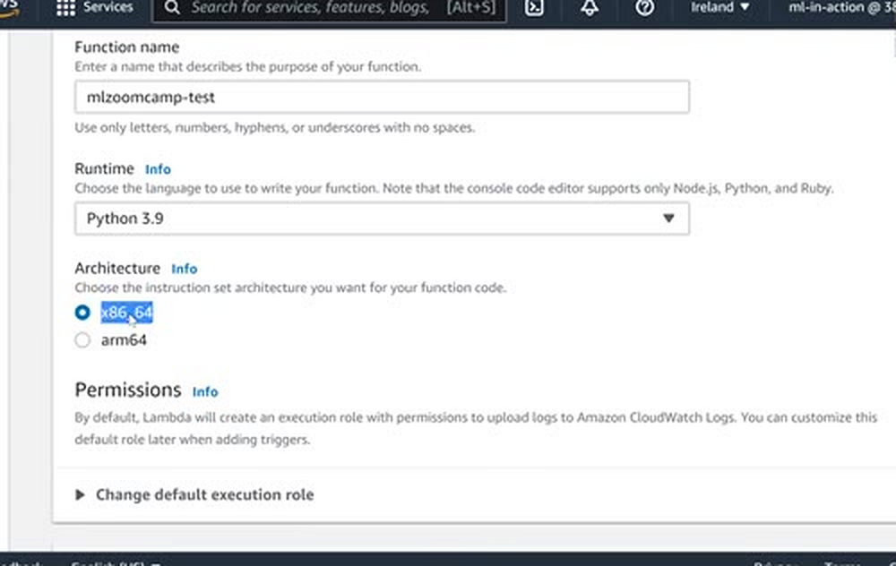
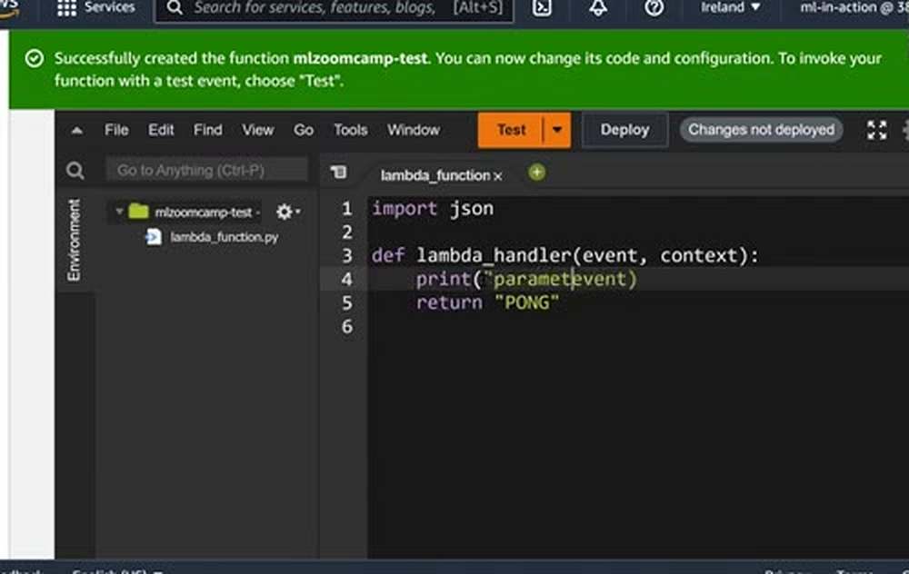
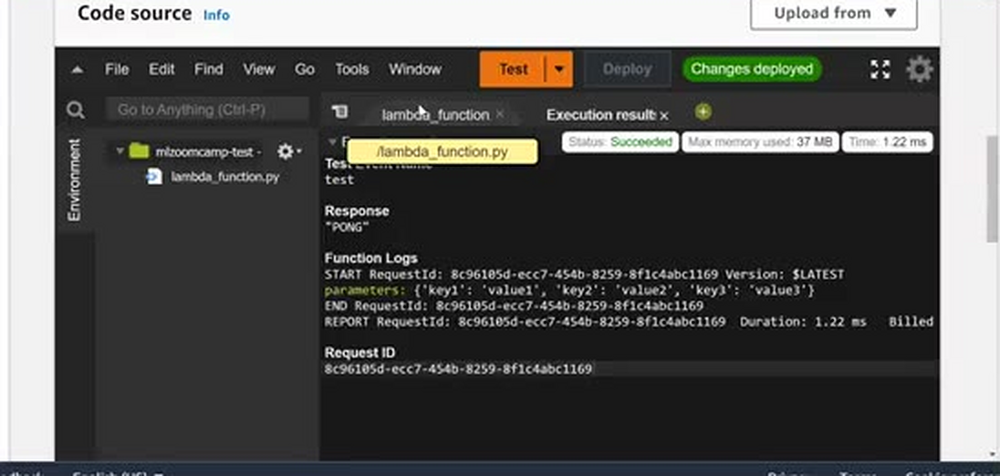
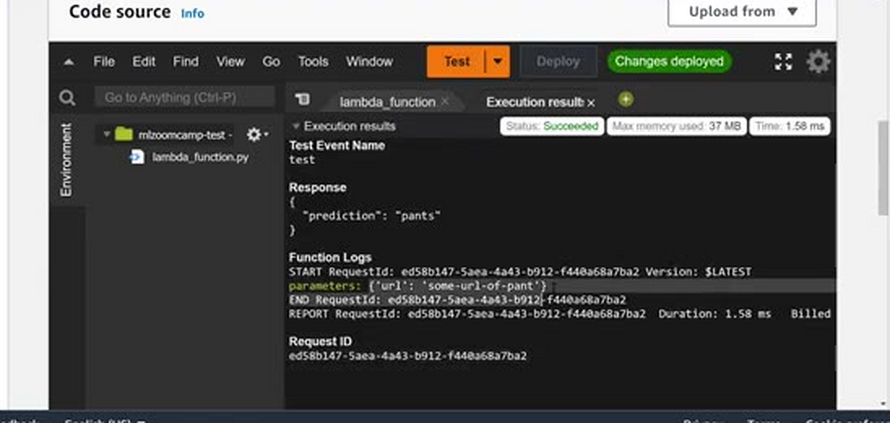
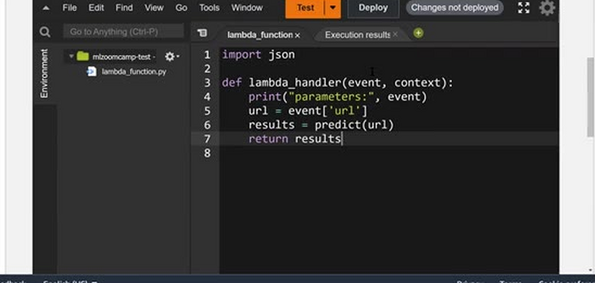
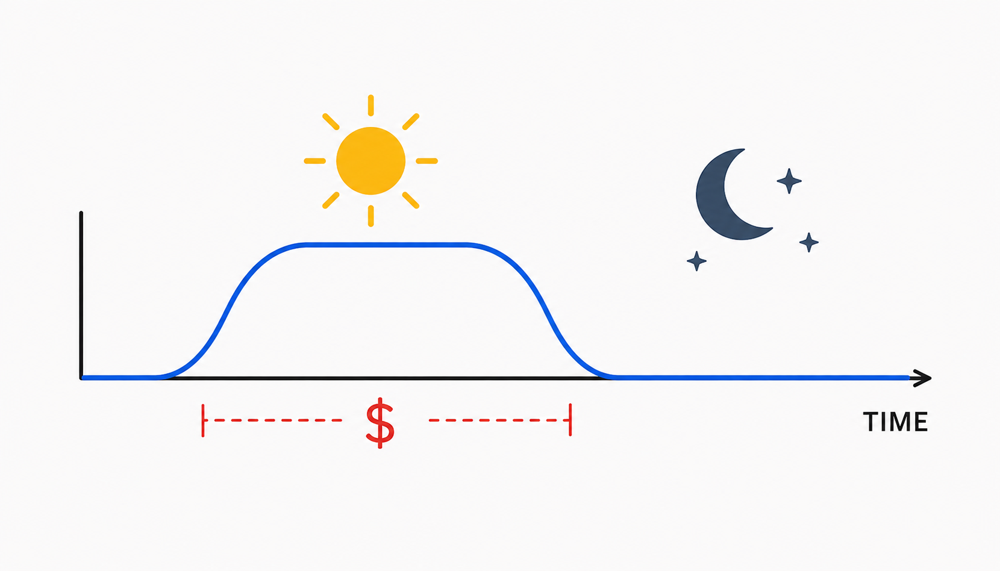
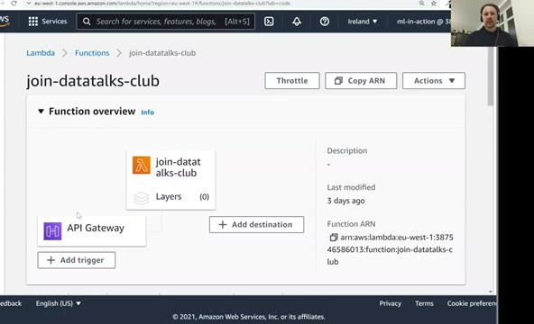

# AWS Lambda

In this lesson we look at AWS Lambda: what the service is, how it
differs from the "serverful" way of deploying things, and how to
create and test a first toy function in the AWS console.

## What is AWS Lambda

To deploy the model we trained previously, we'll use AWS Lambda. Let's
take a look at what it actually is. In the AWS console, type "lambda"
in the search box: Lambda is one of the services, and next to it we
see its promise - "Run code without thinking about servers".



That's the main promise of Lambda. All we need to do is write some
function, and we don't think about creating EC2 instances or any other
servers - Lambda takes care of everything.

This is in contrast with what we did a few sessions ago with AWS
Elastic Beanstalk: there, under the hood, a server is actually created
for us. With Lambda we don't have that. That's why it's called
"serverless" - because we don't need to worry about servers.

## Creating a function

Inside Lambda we can see the functions we already have. Let's create a
new one. Use the "Author from scratch" option, put any name - I'll
call it `mlzoomcamp-test` - and select the runtime. I'll use Python
3.9; it doesn't really matter here.

There's also a new option: the architecture. AWS now offers `arm64`
besides `x86_64`. For recording this video I use a computer with ARM
architecture, so this could be interesting to explore - but for now
let's go with the usual one, `x86_64`. Nothing else needs to change,
so click "Create function".



## The lambda handler

Lambda creates the function, and we can see its code right in the
browser. There's one file, `lambda_function.py`, with one function
called `lambda_handler` that takes two parameters. Let's remove all
the default code. Whatever we return will be returned to whoever
invokes the function - so let's just return "PONG". This is similar to
the PONG example we used in session five when we were testing Flask.

```python
import json

def lambda_handler(event, context):
    print("parameters: ", event)
    return "PONG"
```

The interesting parameter here is `event`. This is the input to the
lambda function: whatever we pass to it will be passed here. We send
JSON, and it will be converted from JSON into a dictionary. I'm not
sure what `context` is needed for - usually it's not needed. What we
can do for now is print the event to see what's inside, and of course
we can access it and do whatever we want with it.



## Testing the function

We can test it right now: click the "Test" button. This opens the
"Configure test event" dialog - a test event is what will be passed to
the `event` parameter. Let's call it "test" and create it.

Now click "Test" again. We see that the response is still old - it's
the response of the default code. Look at the button: it says
"Changes not deployed". We need to deploy the changes first. Click
"Deploy", then "Test" again - now we see the response, "PONG", and
also the parameters we printed: the contents of the test event.



Now let's make the event closer to what we want for our image
classification model. Change the test event to contain a URL:

```json
{
    "url": "some-url-of-pants"
}
```

And change the handler to read this parameter:

```python
import json

def lambda_handler(event, context):
    print("parameters: ", event)
    url = event['url']
    return {"prediction": "pants"}
```

Deploy the changes and test. We see the parameters - the URL we
accessed. We didn't do anything with this URL yet. In principle, this
is where the model call goes: `results = predict(url)`, and then we
return the results. This is a lambda function: all we need to do is
write some code, deploy it, and test it - no EC2 instances, no servers.





## Serverless vs serverful

The good things about Lambda: first, we don't need to think about the
infrastructure for serving our models - no EC2 machines to manage. And
second, we pay per request: we pay only when the lambda function is
doing something. When it's idle - not responding to any requests -
we're not paying.

To see why that's convenient, imagine the time of day. During the day
people use our model and there are requests; during the night there
are none. With a regular server you pay all the time, even at night
when there's no traffic. With Lambda, when there are no requests, you
don't pay any money.



By the way, when you no longer need a function, deleting it is easy:
go to "Actions" and select "Delete function", and it's gone.

## Example: dynamic link management

I actually have two Lambda functions in my account. One of them I use
when somebody wants to join the DataTalks.Club Slack community: they
go to join.datatalks.club, which redirects to the current invite link.

The problem with invite links is that they expire, and I don't want to
keep an up-to-date link everywhere every time. So there's one link,
and a simple Lambda function behind it - written in JavaScript - that
does the redirect. The actual invite URL lives in the config. When the
link expires, I just go to this lambda function, click edit, and
replace the invite URL there. No server needed - it's serverless, and
I only pay per request.



Actually, I'm not paying anything for this function: each account gets
some amount of free Lambda usage per month - the free tier includes 1
million free requests and 400,000 GB-seconds of compute time. As long
as I'm under this limit, I don't need to pay anything. When more
people start using it, maybe I will - but not right now.

So Lambda is quite convenient. But we don't want to use TensorFlow for
deploying our model - TensorFlow is too big. In the next lesson we'll
see how to use something lighter: TensorFlow Lite, a lighter version
of TensorFlow.

## Notes

AWS Lambda is a **serverless computing service** that lets you execute code without worrying about managing servers. Here's an overview of how it works and its benefits:  

### Setting Up a Lambda Function 🛠️
1. Accessing Lambda:
   - Go to the AWS Management Console and search for the `Lambda` service.

2. Creating a Function:
   - Choose the `Author from scratch` option.
   - Name your function (e.g., `mlzoomcamp-test`).
   - Select the runtime environment (e.g., `Python 3.9`) and architecture (`x86_64`).

3. Understanding Function Parameters:
   - `event`: Contains the input data passed to the function (e.g., a JSON payload).
   - `context`: Provides details about the invocation, configuration, and execution environment.

4. Updating the Default Function:
   - Edit `lambda_function.py` with custom logic. Example:  
     ```python
     def lambda_handler(event, context):
         print("Parameters:", event) # Print input parameters
         url = event["url"]  # Extract URL from input
         return {"prediction": "clothes"}  # Sample response
     ```

### Testing and Deployment 🚀
1. Create a Test Event:
   - Define a mock input to simulate real-world data.  

2. Deploy Changes:
   - Save and deploy the function to apply updates.  

3. Test Your Function:
   - Run the function with the test event to ensure it works as expected.

### Advantages of AWS Lambda ✅
- Serverless Architecture 🖥️: No need to provision or manage servers.  
- Cost-Effective 💰: Pay only for requests and compute time—idle time is free!  
- Automatic Scaling 📈: Adjusts automatically based on request volume.  
- Ease of Use 🎯: Focus on coding; AWS handles infrastructure.  

### Dynamic Link Management Use Case 🌐
 `AWS lambda` was used to automatically redirect users to updated invite links for joining the DataTalks.Club community. This is to avoid expired links on the user side, by using a Lambda function that reads from a config file where invitation links can be update.  

### Free Tier Usage
Note that `AWS Lambda` offers a free tier that includes a certain number of free requests (1 million requests per month), and free compute time (400,000 GB-seconds per month).

<table>
   <tr>
      <td>⚠️</td>
      <td>
         The notes are written by the community. <br>
         If you see an error here, please create a PR with a fix.
      </td>
   </tr>
</table>
