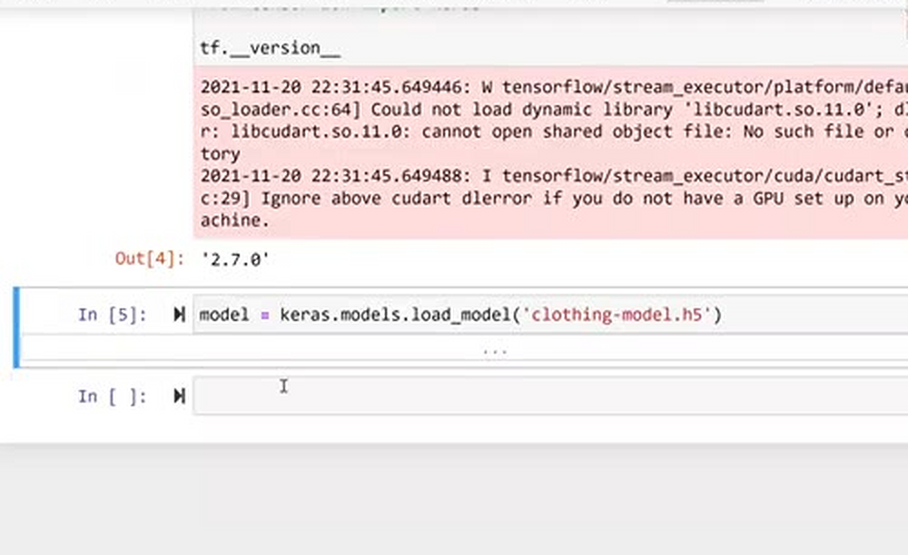
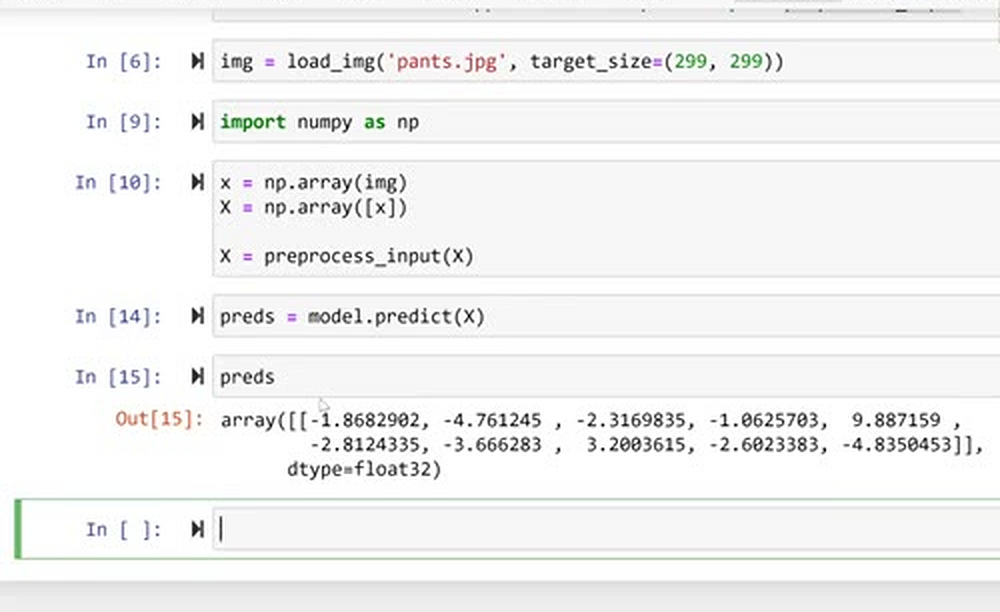
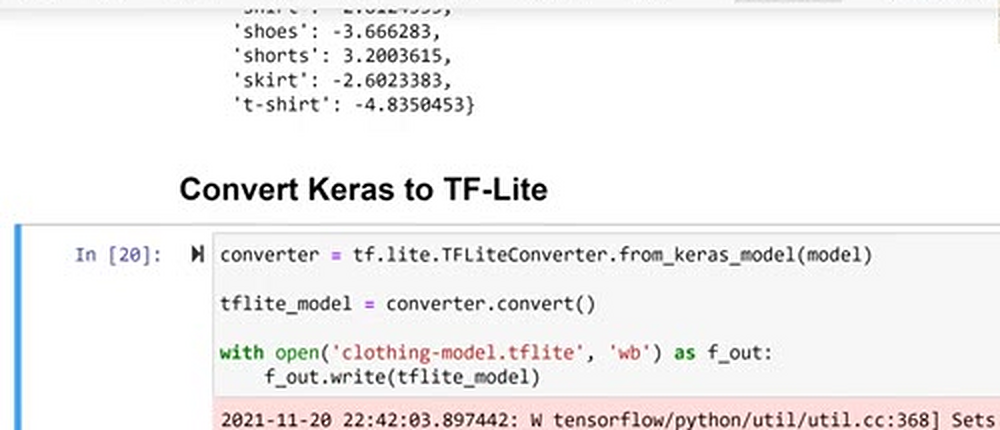
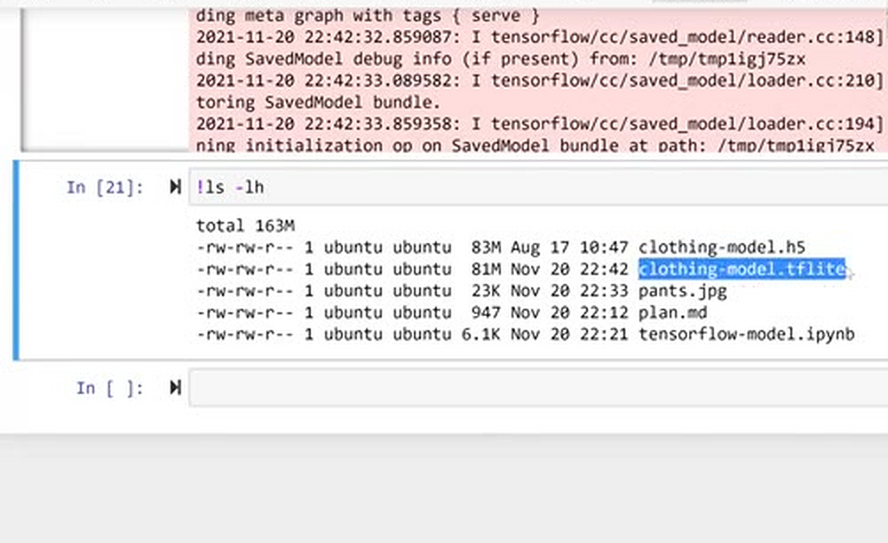
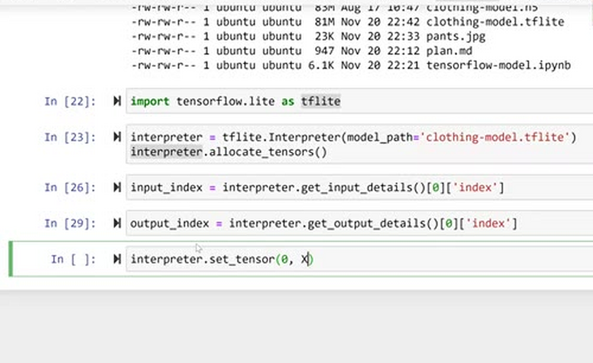
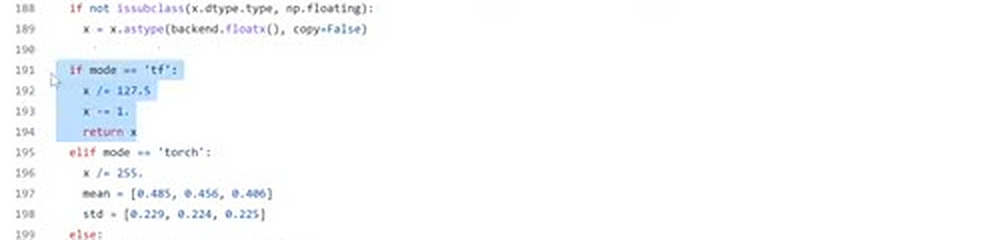
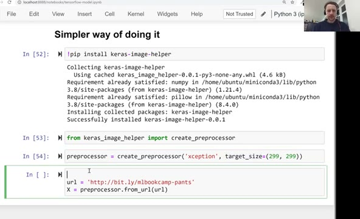
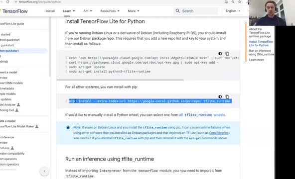

# TensorFlow Lite

TensorFlow is a large framework, and size matters when we deploy to
the cloud. In this lesson we meet TensorFlow Lite - a lightweight
version of TensorFlow that can only do inference - and convert our
clothes classification model to the TF-Lite format. Along the way we
also remove the dependency on TensorFlow from the prediction code
entirely.

> Note: the materials in this unit are outdated.
> 
> Refer to the [ONNX Workshop](workshop/) for the up-to-date materials.

## Why not TensorFlow

If we take the usual TensorFlow package and unpack it, it takes about
1.7 GB of disk space. For deployment that's a problem for several
reasons:

- Historically, AWS Lambda had a hard limit: a package could not be
  larger than 50 MB. With Docker-based deployment the limit is now
  around 10 GB, so this particular reason is mostly gone - but size
  still matters.
- Large images cost more to store. Storing them on S3 is relatively
  cheap, but we still pay for it.
- When a Lambda function is invoked for the first time, AWS needs to
  download the image and initialize the function. The larger the
  image, the longer this takes - and we pay for that time.
- Even `import tensorflow` is not instant: the library is so large
  that simply loading it takes time and has a large RAM footprint.

The solution is to not use TensorFlow at all for the deployed service,
but TensorFlow Lite instead. TensorFlow Lite focuses on inference only
- inference is what we do when we call `model.predict(X)`. We cannot
train models with it and we don't need to: training happened already,
in the previous module. All we want from the deployed service is
predictions.

## Using the model with Keras

Let's first do everything the usual way, with TensorFlow and Keras, and
then replace it step by step.

We use a model similar to the one we trained in the previous module -
it's slightly less accurate, but it's a good model and it's available
for download from the releases of the course repo:

```bash
wget https://github.com/DataTalksClub/machine-learning-zoomcamp/releases/download/chapter7-model/xception_v4_large_08_0.894.h5 -O clothing-model.h5
```

Then we load it and classify an image of pants:

```python
import numpy as np
import tensorflow as tf
from tensorflow import keras

model = keras.models.load_model('clothing-model.h5')
```

You may see warnings about CUDA and about the binary not being
optimized for the platform - it's safe to ignore them.

```python
from tensorflow.keras.preprocessing.image import load_img
from tensorflow.keras.applications.xception import preprocess_input

img = load_img('pants.jpg', target_size=(299, 299))

x = np.array(img)
X = np.array([x])
X = preprocess_input(X)
```



We read the image, resize it to 299 by 299, convert it to an array,
turn the array into a batch of one image, and apply the Xception
preprocessing. The result `X` has shape (1, 299, 299, 3) - one image
in the batch, 299 by 299 pixels, 3 color channels.

```python
preds = model.predict(X)
```



The raw predictions are scores for each class. To make them
meaningful, we combine them with the class names from the previous
module:

```python
classes = [
    'dress',
    'hat',
    'longsleeve',
    'outwear',
    'pants',
    'shirt',
    'shoes',
    'shorts',
    'skirt',
    't-shirt'
]

dict(zip(classes, preds[0]))
```

For our picture, "pants" clearly gets the highest score.

## Converting the Keras model to TF-Lite

TensorFlow is big, and it actually contains TensorFlow Lite inside it -
including a converter. So the first step is to convert our Keras model
to the TF-Lite format:

```python
converter = tf.lite.TFLiteConverter.from_keras_model(model)

tflite_model = converter.convert()

with open('clothing-model.tflite', 'wb') as f_out:
    f_out.write(tflite_model)
```

Under the hood the converter first turns the Keras model into a
SavedModel - TensorFlow's format for serializing models - and then
converts the SavedModel to TF-Lite. After this we have two files on
disk: the original `clothing-model.h5` and the converted
`clothing-model.tflite`.





## Using the TF-Lite model

Using a TF-Lite model is a bit more verbose than Keras. In Keras we
just call `keras.models.load_model` and then `model.predict`. With
TF-Lite we work with an interpreter:

```python
import tensorflow.lite as tflite

interpreter = tflite.Interpreter(model_path='clothing-model.tflite')
interpreter.allocate_tensors()

input_index = interpreter.get_input_details()[0]['index']
output_index = interpreter.get_output_details()[0]['index']
```

A few things are happening here:

- We create an `Interpreter` and point it to the converted model.
- `allocate_tensors()` loads the weights from the model into memory.
  In Keras this happens automatically; here we need to do it
  explicitly.
- Keras knew what the input and the output of the model are. TF-Lite
  doesn't - we need to figure that out ourselves.
  `get_input_details()` tells us everything about the input: the shape
  is 299 by 299 by 3 (the first dimension, -1, means "as many images
  as we want"). What we care about is the index of the input - which
  part of the model receives the data. We do the same for the output:
  its shape is 10, because we have 10 classes, and we have only one
  output (some models have several). We take its index as well.

Now the actual inference - three steps instead of one
`model.predict` call:

```python
interpreter.set_tensor(input_index, X)
interpreter.invoke()
preds = interpreter.get_tensor(output_index)
```

- `set_tensor` puts our preprocessed image `X` into the input of the
  interpreter.
- `invoke` runs the computations: the data goes through the base model
  and all the layers of the neural network.
- `get_tensor` fetches the results, which are now sitting in the
  output.



The predictions are the same as before - it's the same model, just
served by TF-Lite instead of Keras. It's more verbose, but it works.

## Removing the TensorFlow dependency

There's still a problem: both image preparation functions we use -
`load_img` and `preprocess_input` - live in TensorFlow. If our goal is
to deploy without TensorFlow, we need to replace them.

For `load_img`: under the hood Keras uses PIL, the Python Imaging
Library, to load and resize images. We can do the same:

```python
from PIL import Image

with Image.open('pants.jpg') as img:
    img = img.resize((299, 299), Image.NEAREST)
```

For `preprocess_input`: if we look at the Keras source code, the
Xception version boils down to two lines:

```python
def preprocess_input(x):
    x /= 127.5
    x -= 1.
    return x
```

We also need to make sure the array is `float32`:



```python
x = np.array(img, dtype='float32')
X = np.array([x])

X = preprocess_input(X)
```

Running this through the interpreter gives the same predictions as
before. At this point our code has no dependency on TensorFlow - only
on NumPy, PIL, and TF-Lite.

## A simpler way: keras-image-helper

There's an even simpler way of doing the image preparation: a small
library called keras-image-helper. It knows, for each architecture,
which preprocessing function to use - for Xception it's the
"tensorflow mode" preprocessing we just saw, for ResNet it would be
the "caffe" one - so we don't have to dig through source code
ourselves:

```python
!pip install keras-image-helper
```

```python
import tflite_runtime.interpreter as tflite
from keras_image_helper import create_preprocessor

preprocessor = create_preprocessor('xception', target_size=(299, 299))
```

The preprocessor has two methods we care about: `from_path`, for an
image stored locally, and `from_url`, which downloads the image for
us:

```python
url = 'http://bit.ly/mlbookcamp-pants'
X = preprocessor.from_url(url)
```



The predictions stay exactly the same.

## Using tflite-runtime instead of TensorFlow

One last piece. Until now we imported TF-Lite from TensorFlow itself:

```python
import tensorflow.lite as tflite
```

The TF-Lite website has a Python quickstart guide, and there we find a
separate package with just the inference part - the TF-Lite runtime:



```python
import tflite_runtime.interpreter as tflite
```

Everything else in the code stays the same. This is exactly what we
want to deploy on AWS Lambda: we don't want to carry all of
TensorFlow around just because it contains a small inference engine -
we take only the runtime.

In the next lesson we take this code out of the notebook and put it
into a Python script that we'll later deploy to Lambda.

## Notes

New URL for downloading the model:

```bash
wget https://github.com/DataTalksClub/machine-learning-zoomcamp/releases/download/chapter7-model/xception_v4_large_08_0.894.h5 -O clothing-model.h5
```

* tensorflow has a size of approximately 1.7 GB
* there are size limits of cloud services and docker container
* tensorflow lite is small in size and limited to using a model to make predictions (inference)
* convert tensorflow keras model to a tensorflow lite model

<table>
   <tr>
      <td>⚠️</td>
      <td>
         The notes are written by the community. <br>
         If you see an error here, please create a PR with a fix.
      </td>
   </tr>
</table>

* [Notes from Peter Ernicke](https://knowmledge.com/2023/12/01/ml-zoomcamp-2023-serverless-part-2/)
* [Notes from Peter Ernicke](https://knowmledge.com/2023/12/02/ml-zoomcamp-2023-serverless-part-3/)
