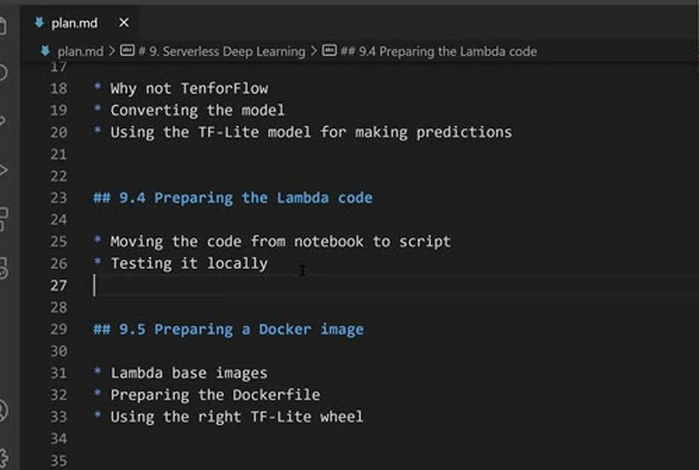
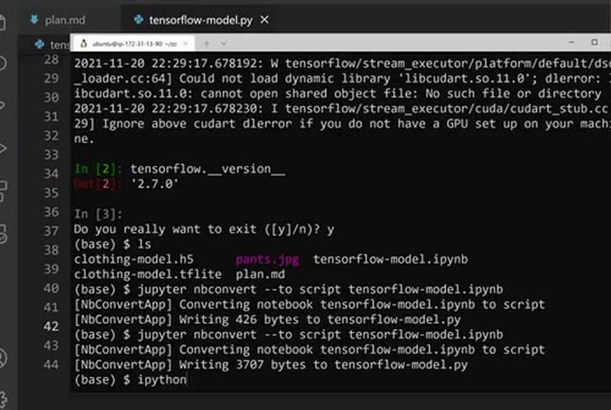
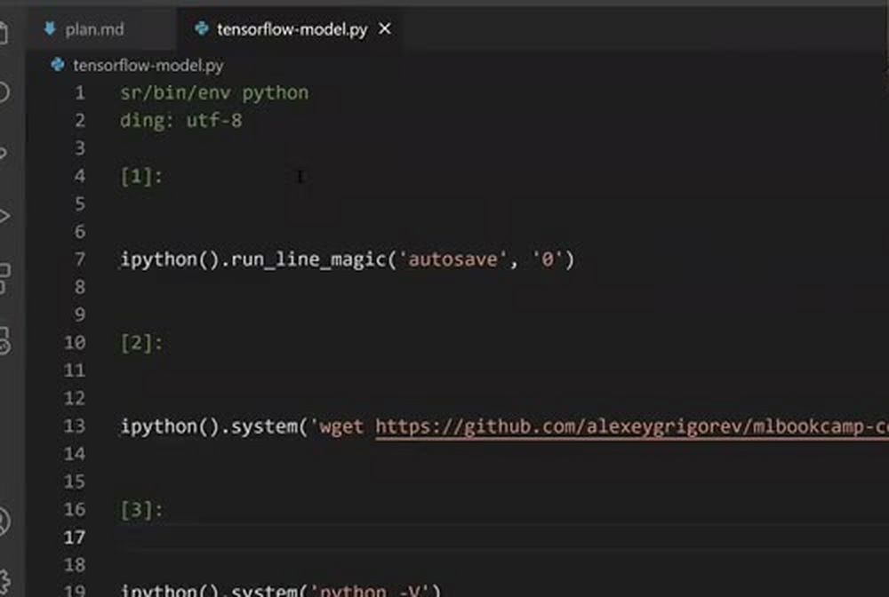
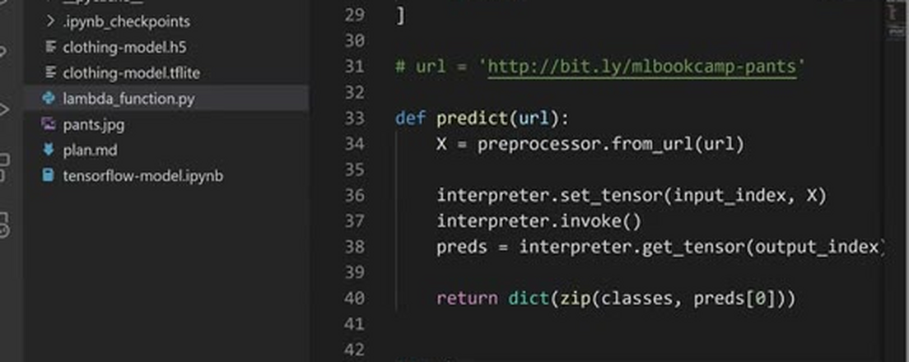
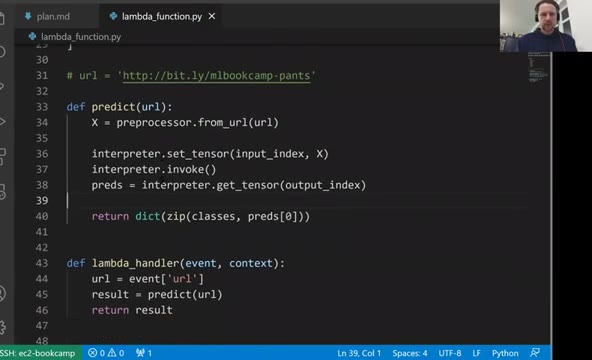
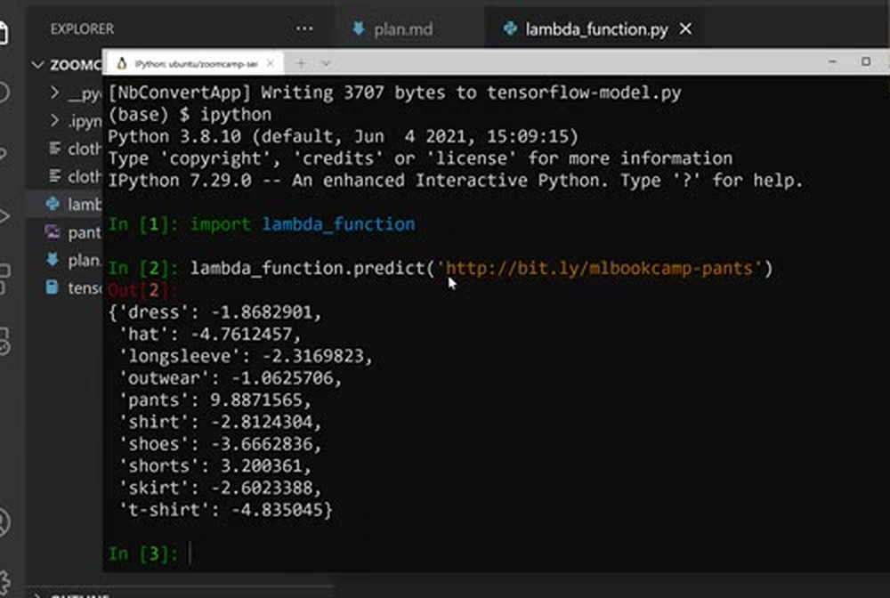

# Preparing the code for Lambda

In the previous lesson we built the inference code in a Jupyter
notebook. Lambda needs a Python script, not a notebook, so in this
lesson we move the code from the notebook to a script and test it
locally.



> Note: the materials in this unit are outdated.
> 
> Refer to the [ONNX Workshop](workshop/) for the up-to-date materials.

## From notebook to script

We could download the notebook as a Python file from the Jupyter File
menu, but there's a command line utility for doing this: nbconvert:

```bash
jupyter nbconvert --to-script tensorflow-model.ipynb
```



This converts the notebook to a Python file with the same name -
`tensorflow-model.py`. Let's open it.



The generated script contains all the cells of the notebook converted
to Python code, including a lot of stuff we don't need for making
predictions: downloading the model, experimenting with PIL, comparing
results, and so on. We remove most of it and keep only the code that
is actually necessary for inference: the imports, the initialization
where we load the model, the preprocessor, and the part that downloads
the image, makes the prediction and does the post-processing.

## The predict function

Let's clean this code up and put it into a function called `predict`
that takes a URL. Inside, it fetches the image from the URL (for now
this line is commented out - we don't need it here, we'll use it for
testing), runs the inference, and converts the predictions to the
dictionary form:



After cleaning, the script looks like this:

```python
import tflite_runtime.interpreter as tflite
from keras_image_helper import create_preprocessor


preprocessor = create_preprocessor('xception', target_size=(299, 299))


interpreter = tflite.Interpreter(model_path='clothing-model.tflite')
interpreter.allocate_tensors()

input_index = interpreter.get_input_details()[0]['index']
output_index = interpreter.get_output_details()[0]['index']


classes = [
    'dress',
    'hat',
    'longsleeve',
    'outwear',
    'pants',
    'shirt',
    'shoes',
    'shorts',
    'skirt',
    't-shirt'
]


def predict(url):
    X = preprocessor.from_url(url)

    interpreter.set_tensor(input_index, X)
    interpreter.invoke()
    preds = interpreter.get_tensor(output_index)

    return dict(zip(classes, preds[0]))
```

Nothing here depends on TensorFlow: this is the code we stripped of
TensorFlow dependencies in the previous lesson.

## The lambda handler

The entry point of a Lambda function is a function called
`lambda_handler`. It takes two parameters - `event` and `context`.
The `event` is a dictionary with the parameters of the request; we
will have a `url` parameter there. So the handler is just three lines
of code:

```python
def lambda_handler(event, context):
    url = event['url']
    result = predict(url)
    return result
```



We rename the file to `lambda_function.py` - this is where our lambda
function will live. (The version of this file in the module's
[code/](code/) directory already includes a small fix we add in the
next lesson: converting the NumPy predictions to usual Python floats.)

## Testing it locally

Now let's test it. Open IPython and import the script:

```python
import lambda_function
```

First, call `predict` directly with the URL of a pants picture:

```python
lambda_function.predict('http://bit.ly/mlbookcamp-pants')
```



It works: it fetches the image, prepares it, makes the prediction, and
converts the prediction to the dictionary form. We see the scores we
know, with "pants" having the highest value:

```python
{'dress': -1.8682901,
 'hat': -4.7612457,
 'longsleeve': -2.3169823,
 'outwear': -1.0625706,
 'pants': 9.8871565,
 'shirt': -2.8124304,
 'shoes': -3.6662836,
 'shorts': 3.200361,
 'skirt': -2.6023388,
 't-shirt': -4.835045}
```

Then let's test the handler the same way Lambda will call it. We
build the event - a dictionary with the URL - and call
`lambda_handler`, passing `None` as the context, since our code
doesn't use it:

```python
event = {'url': 'http://bit.ly/mlbookcamp-pants'}
lambda_function.lambda_handler(event, None)
```

The output is the same dictionary of predictions.

There are actually some problems with this code, but we will talk
about them a bit later - we'll see them when we try to package this
in a Docker container. For now, it works.

Before uploading anything to Lambda, we want to package everything in
a Docker container and make sure the container has TensorFlow Lite,
keras-image-helper, NumPy and so on. That's what we'll do in the next
lesson: create the Dockerfile and test it locally.

## Notes

<table>
   <tr>
      <td>⚠️</td>
      <td>
         The notes are written by the community. <br>
         If you see an error here, please create a PR with a fix.
      </td>
   </tr>
</table>

* [Notes from Peter Ernicke](https://knowmledge.com/2023/12/03/ml-zoomcamp-2023-serverless-part-4/)
