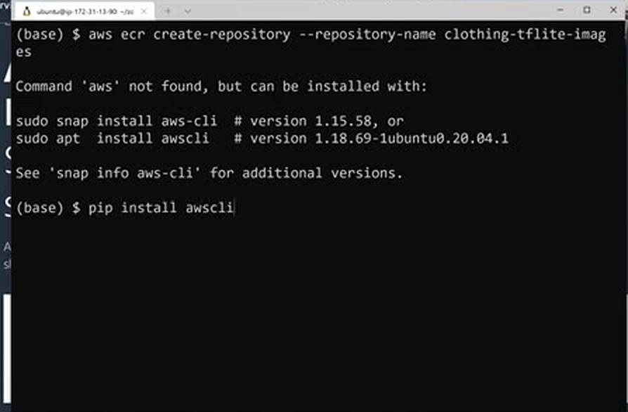
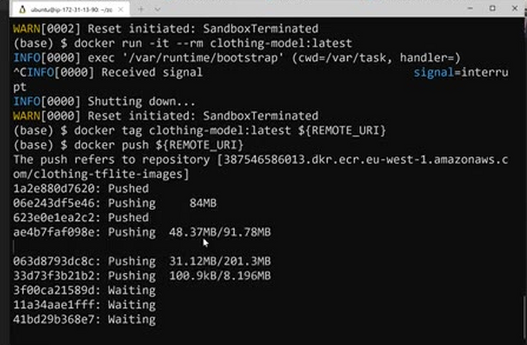
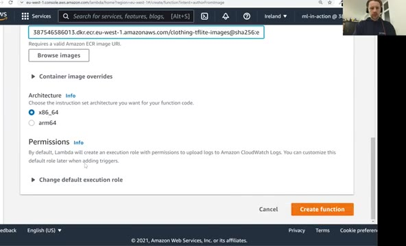
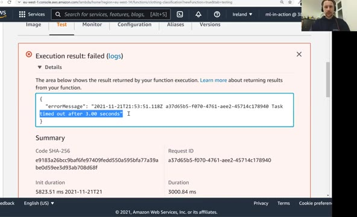
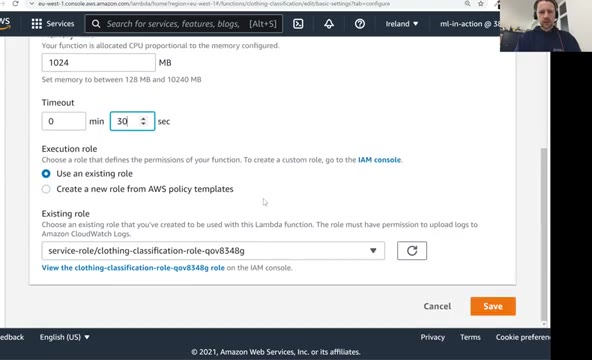
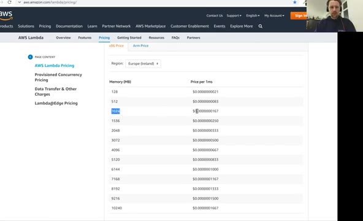
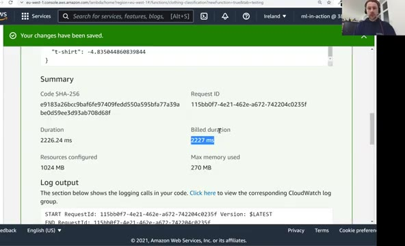
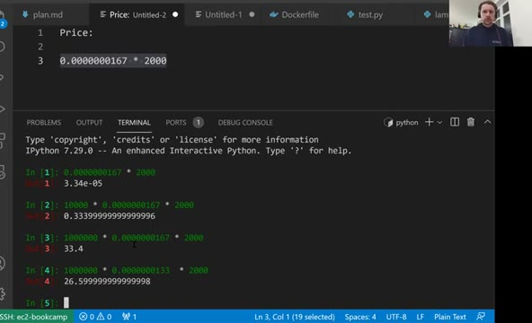

# Creating the lambda function

In the previous lesson we prepared a Docker image and tested it
locally. Now we deploy it to AWS Lambda: we publish the image to
Amazon ECR, create a Lambda function from it, configure timeout and
memory, and test it from the AWS console. At the end we look at the
pricing.

> Note: the materials in this unit are outdated.
> 
> Refer to the [ONNX Workshop](workshop/) for the up-to-date materials.

## Publishing the image to AWS ECR

When we created our first Lambda function in lesson two, we used the
"Author from scratch" option. This time we need the second option:
"Container image". Lambda needs the image to be published somewhere,
and that place is Amazon ECR - the Elastic Container Registry. It's a
registry where we can push our local Docker images.

We'll use the AWS CLI for this (install it with `pip install awscli`
if you don't have it, and run `aws configure` once to set up your
credentials). To create a repository:

```bash
aws ecr create-repository --repository-name clothing-tflite-images
```

(The first time I ran it, `aws` wasn't installed on this machine - I
installed it with `pip install awscli`.) The response contains the
details of the repository we just created:



```text
"registryId": "387546586013",
"repositoryName": "clothing-tflite-images",
"repositoryUri": "387546586013.dkr.ecr.eu-west-1.amazonaws.com/clothing-tflite-images"
```

The pattern is: first the account id, then the region, then the name
of the registry. If we refresh the ECR page in the console, we see the
repository there - it's empty for now.

Before we can push anything to this registry, we need to log in to it
- it's private, only visible to us. AWS can generate the login command
for us:

```bash
aws ecr get-login --no-include-email
```

This prints a `docker login` command, including the password in clear
text. (The `--no-include-email` flag is there because older versions
of the command included an email parameter that Docker no longer
accepts.) To avoid exposing the password, we can mask the output with
`sed`, replacing anything that looks like the password - a long base64
string of digits, letters and `=` characters, at least 20 of them -
with the word PASSWORD:

```bash
aws ecr get-login --no-include-email | sed 's/[0-9a-zA-Z=]\{20,\}/PASSWORD/g'
```

What we actually want is to take whatever this command returns and
immediately execute it. For that, wrap it in `$(...)` - bash reads the
output as another command and runs it:

```bash
$(aws ecr get-login --no-include-email)
```

It prints a warning, but the important part is "Login Succeeded".

Now let's prepare the full address of the image we want to push, using
a few variables:

```bash
ACCOUNT=<ACCOUNT-ID>
REGION=eu-west-1
REGISTRY=clothing-tflite-images

PREFIX=${ACCOUNT}.dkr.ecr.${REGION}.amazonaws.com/${REGISTRY}

TAG=clothing-model-xception-v4-001

REMOTE_URI=${PREFIX}:${TAG}
```

The remote URI consists of the URI of the registry plus a tag specific
to this image: the name of the image and the version - this is the
first version of our lambda function, based on the v4 Xception model.

Let's check the name of the local image we built in the previous
lesson:

```bash
docker images
```

It's `clothing-model:latest`. We tag it with the remote URI:

```bash
docker tag clothing-model:latest ${REMOTE_URI}
```

And push it:

```bash
docker push ${REMOTE_URI}
```

I'm pushing from an EC2 instance, so it's quite fast. Afterwards,
refreshing the ECR page in the console shows the image with our tag.



## Creating the function

Now back to Lambda. Click "Create function", select "Container image",
and give the function a name - let's call it `clothing-classification`.
For the container image URI, we could paste our remote URI, but it's
easier to click "Browse images", select the ECR repository and the
image we just pushed. Note that the console then refers to the image
by its digest instead of the tag - it's the same image, and we can
refer to it either way. We keep the `x86_64` architecture and don't
change anything else. Click "Create function".

One difference from the first function we created: there is no code
preview, because the code now lives in the container image.



## Testing and configuring

The console suggests invoking the function with a test event. Let's do
that: create a test called "pants" with this body:

```json
{
    "url": "http://bit.ly/mlbookcamp-pants"
}
```

Click "Test". It fails:

```text
Task timed out after 3.00 seconds
```



Three seconds is the default timeout, and it's not sufficient for us.
To change it, go to "Configuration", then "General configuration", and
click "Edit". Increase the timeout to 30 seconds and give the function
more memory - 1024 MB, that is 1 GB. The first invocation needs this:
it has to initialize everything, download the image, import the
libraries and load the model. Save.



Test again - it's successful. We see the output we know: the
predictions with "pants" having the highest score. But this time it
comes from AWS Lambda, not from our local computer.

Look at the timing information. The first invocation took about seven
seconds of duration, plus some init time - that's the warm-up. If we
run it one more time, it takes only about two seconds, and there is no
init duration: the function is already warm. It did all the imports
and loaded the model, so it's ready to serve requests. The first
invocation is usually slower, the consequent ones are faster.



## Pricing

The last thing is pricing - how much does this cost?

Search for "AWS Lambda pricing". The price depends on the region (I'm
looking at Ireland) and on how much memory we give the function: we
pay for every millisecond the function runs, multiplied by the amount
of memory. The pricing page has a table with the price per 1ms for
each memory setting.



Our function is configured with 1024 MB of memory - in my test run it
actually used at most 270 MB - and takes about two seconds to classify
an image. At 1024 MB we pay $0.000000167 per millisecond. Let's do a
quick calculation in Python:



- One image costs about 0.0000334 dollars ($0.000000167 x 2000 ms).
- Classifying 10,000 images costs about 33 cents.
- Classifying 1 million images costs about 33 dollars.

There is also a dependency between memory and speed: with half a
gigabyte more memory the function runs faster. And it's worth checking
the ARM prices: ARM is cheaper per millisecond - classifying a million
images costs about 27 dollars instead of 33, roughly 6 dollars less.
Probably worth trying, although I don't know if it's faster or slower.

For experiments this is really cheap. Lambda is great when you don't
have a lot of traffic - for testing a model, for personal projects,
for low-traffic services. But be careful at scale: if you classify one
million images every day, at roughly 30 dollars per million that's
around 1,000 dollars per month for one model - a significant sum.

We now have a working Lambda function. But we can't use it as a web
service yet - that's what we'll do in the next lesson with API
Gateway.

## Notes

<table>
   <tr>
      <td>⚠️</td>
      <td>
         The notes are written by the community. <br>
         If you see an error here, please create a PR with a fix.
      </td>
   </tr>
</table>

* [Notes from Peter Ernicke](https://knowmledge.com/2023/12/05/ml-zoomcamp-2023-serverless-part-6/)
