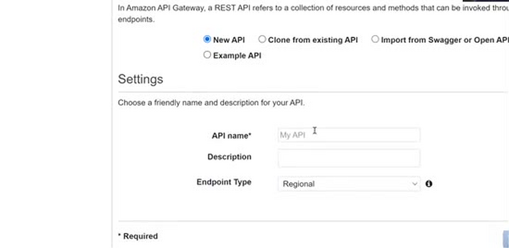
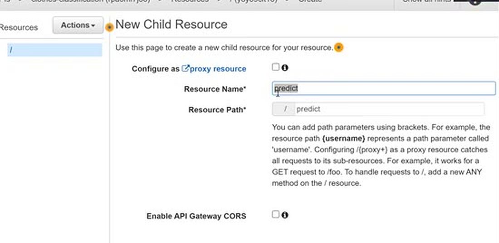
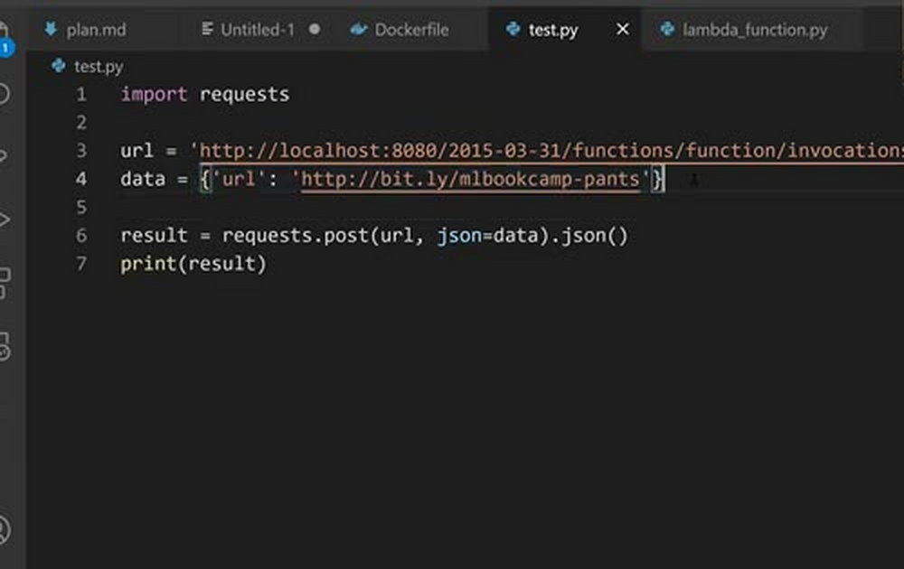
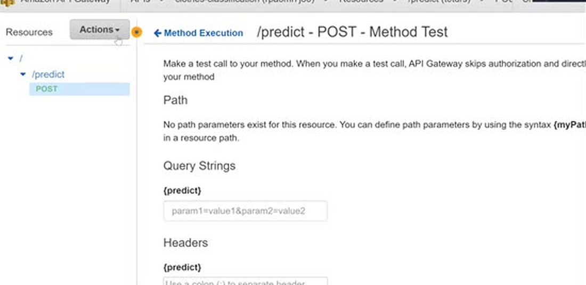
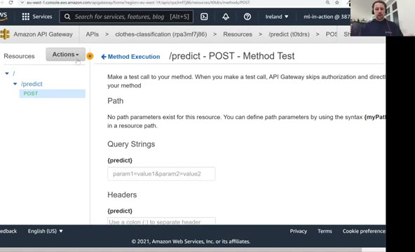
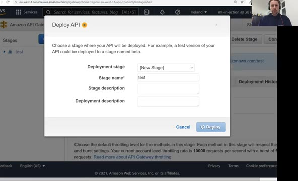
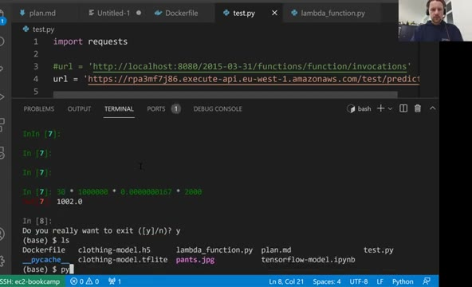

# API Gateway: exposing the lambda function

Our Lambda function works, but so far we can only invoke it from the
AWS console. In this lesson we expose it as a web service using API
Gateway - a service from AWS that lets us expose different AWS
services, including Lambda functions, over HTTP.

## Creating the gateway

Open API Gateway in the AWS console and create a new API. We need a
REST API, so select "REST API" and click "Build". Give it a name -
let's say `clothes-classification` - and click "Create API".

A REST API is organized into resources. Usually resources are nouns -
`users`, `items` and so on. We'll break with that convention and call
ours `predict`, following what we did in the Flask lessons, where the
endpoint was `/predict`.



So: create a resource called `predict`. We don't need to configure
anything else - in particular, we don't need to make it a proxy
resource.



## Adding a POST method

Now we create a method for this resource: this is how exactly we
invoke the endpoint. We use `POST` - remember that our payload, the
JSON with the image URL, is sent with a POST request.

For the integration type, select "Lambda Function", then pick the
region where our function lives and its name: `clothing-classification`.
We don't need proxy integration or a non-default timeout. Click "Save".

AWS tells us that it needs to modify the permissions of the Lambda
function to let API Gateway invoke it - click OK. Now our function can
be called by the gateway.



## Testing

The interesting part is the "Test" link with the lightning bolt icon.
Click it and put the request body in - the JSON payload from our
`test.py` script:

```json
{
    "url": "http://bit.ly/mlbookcamp-pants"
}
```



Run the test. It took about four seconds, and the response body
contains what we already know - the scores for all ten classes, with
"pants" at the top. (There's also some metadata in the response that
we don't care about.) Testing one more time is faster, as usual, since
the function is already warm.



## Deploying the API

Testing from the console is nice, but we want a URL we can call. For
that we deploy the API: from the "Actions" dropdown, choose "Deploy
API". Create a new stage - call it `test` - and click "Deploy".

AWS now gives us a URL for this stage. Let's take it and update our
`test.py` script: comment out the local address and use the gateway
URL instead, followed by `/predict` - the resource we created:



```python
import requests

# url = 'http://localhost:8080/2015-03-31/functions/function/invocations'
url = 'https://pja3mfj786.execute-api.eu-west-1.amazonaws.com/test/predict'

data = {'url': 'http://bit.ly/mlbookcamp-pants'}

result = requests.post(url, json=data).json()
print(result)
```



When we run it, the request goes to API Gateway, which invokes the
Lambda function, gets the response, and passes it back to us. And this
is how we turn our Lambda function into a web service.

## A word of warning

Right now this Lambda function is open: anyone who knows the URL can
send requests to it. You have the URL now, so you could send requests
to my function - and that's not ideal. You don't want to do this at
work: don't open your services to everyone in the world. Limiting
access (with API keys, authorization, and so on) is outside the scope
of this course, but keep it in mind. For experiments and learning,
an open endpoint is fine - just talk to people who know AWS before
deploying something like this for real.

That's it for this lesson and for the demos of this session. In the
next video we summarize everything we learned.

## Notes

<table>
   <tr>
      <td>⚠️</td>
      <td>
         The notes are written by the community. <br>
         If you see an error here, please create a PR with a fix.
      </td>
   </tr>
</table>

* [Notes from Peter Ernicke](https://knowmledge.com/2023/12/06/ml-zoomcamp-2023-serverless-part-7/)
