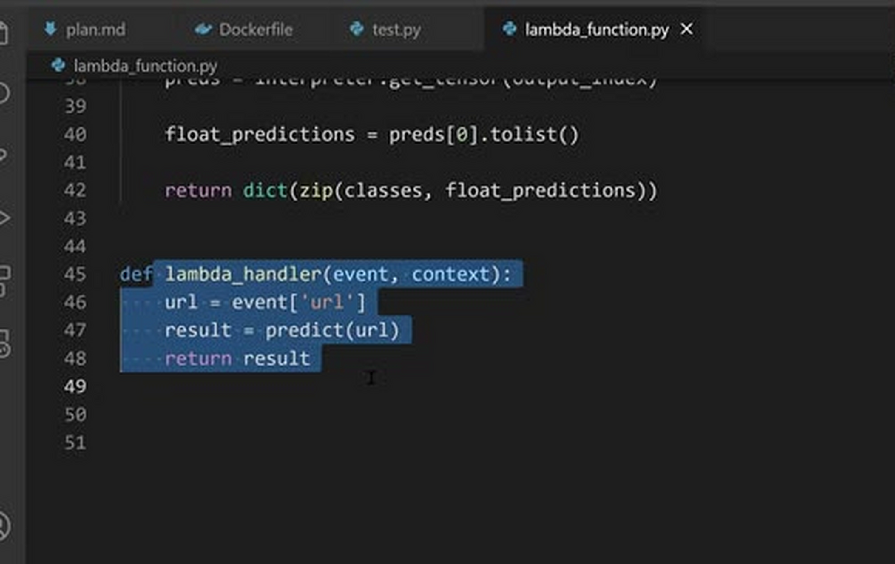
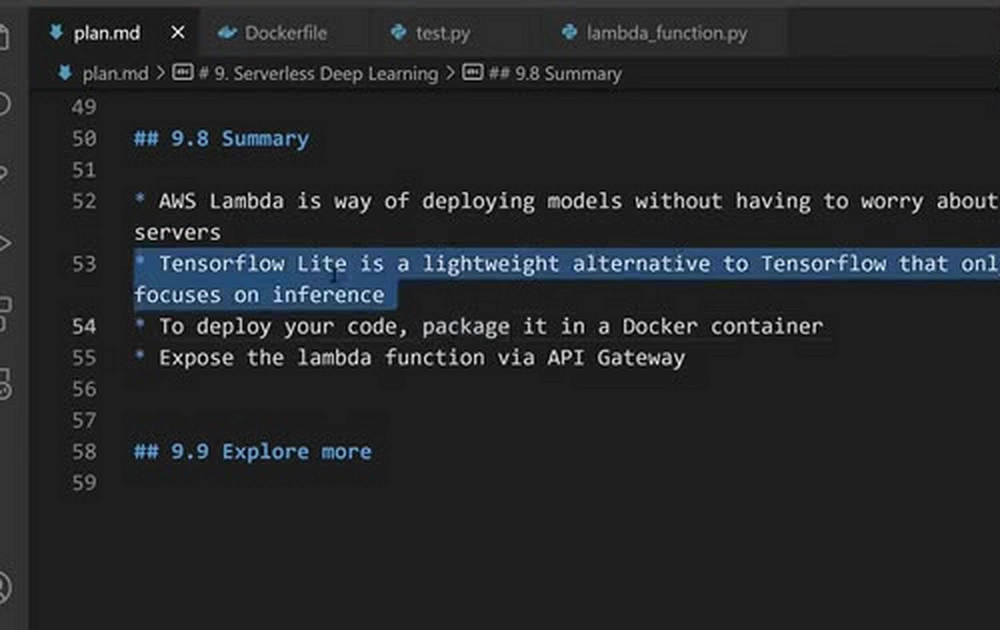
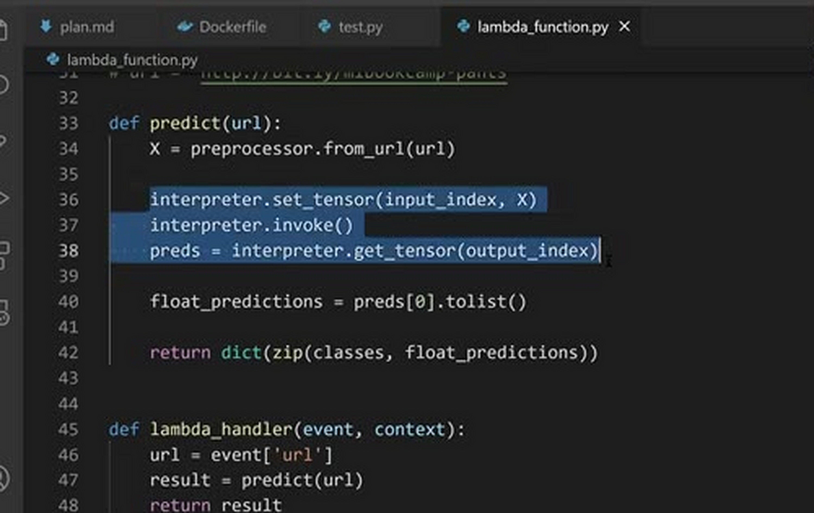
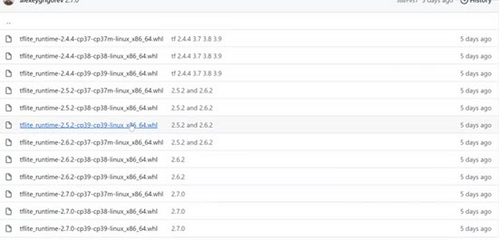
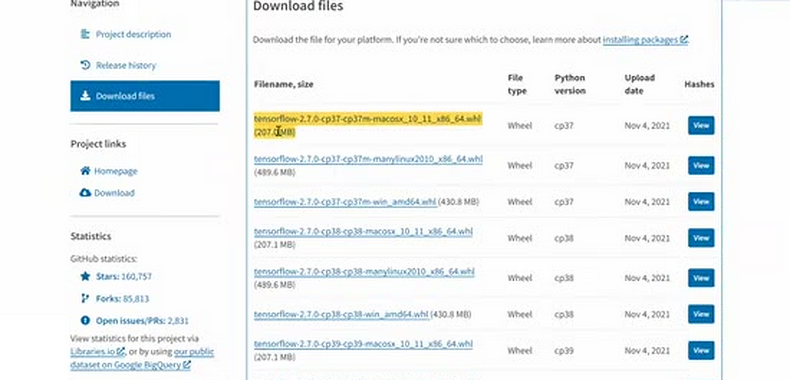

# Summary

This is the summary of the serverless module. Let's quickly go over
everything we learned about deploying deep learning models with AWS
Lambda and TensorFlow Lite.

## AWS Lambda

In this session we talked about deploying deep learning models using
AWS Lambda. It's a nice way of doing this without worrying about
servers: all we need to do is define a lambda handler - a function
that takes the request and returns the response. It doesn't even have
to be called `lambda_handler`; we can name it whatever we want. We
deploy it to Lambda, and AWS takes care of everything else.

We only pay when the function is actually doing something: a request
comes in, the function computes the answer and replies. We don't pay
for the idle time when no requests are coming. This makes Lambda a
good fit for low-volume services, and I also use it quite often for my
personal projects - you saw one such example in lesson two.

## Docker

Then we took the code we wrote and packaged it in Docker. This is very
convenient because you don't need to deploy to Lambda to test things.
You put everything into a Docker image, run it locally, and easily
make sure that the environment you have locally works. After verifying
that everything is fine, you deploy it to Lambda - and you will not
have any surprises there.

After deploying, the only things left to do were giving the function
more RAM, increasing the timeout, and exposing it with API Gateway.
That's all you need.

## TensorFlow Lite

The other topic of this session was TensorFlow Lite. It focuses only
on the inference part of TensorFlow models. It's very small, but it's
not as simple to use: you remember that we needed to write quite a lot
more code than a plain `model.predict`.

The benefit is the size. Let's actually look at it. The TF-Lite
runtime wheel is tiny - about 2-3 MB. There are precompiled wheels for
different Python and TensorFlow versions:

Now compare that with TensorFlow: the TensorFlow 2.7.0 wheel is a
couple hundred megabytes, almost 500 MB - and that's packed, unpacked
it's much more than that (we saw 1.7 GB in lesson three). So using
TF-Lite instead of TensorFlow gives us roughly a hundredfold reduction
in size, which is exactly what we want when we deploy.

## Explore more

There are more things you can explore on your own:

- AWS Lambda is not the only way of deploying models in this so-called
  serverless fashion. Google Cloud provides something similar, and so
  does Microsoft Azure - most cloud providers have such a service.
  Experiment with them and see which one you like more.
- You can deploy other models. In the homework, for example, you will
  deploy the cats versus dogs image classifier we built in the
  previous module - with Lambda as well.
- And it's not just for deep learning: Lambda works well for usual
  machine learning models too. You can deploy XGBoost, you can deploy
  linear regression from scikit-learn - pretty much anything. Try it,
  for example, for your capstone project.

That's all I have about this topic. Next week we'll talk about
Kubernetes as an alternative way of deploying machine learning models.

## Notes

<table>
   <tr>
      <td>⚠️</td>
      <td>
         The notes are written by the community.  
         If you see an error here, please create a PR with a fix.
      </td>
   </tr>
</table>
