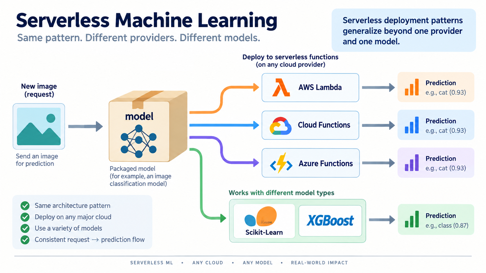

# Explore more

*Figure: The serverless request-to-prediction pattern generalizes across providers and models.*

* Try similar serverless services from Google Cloud and Microsoft Azure
* Deploy cats vs dogs and other Keras models with AWS Lambda
* AWS Lambda is also good for other libraries, not just Tensorflow. You can deploy Scikit-Learn and XGBoost models with it as well
 
