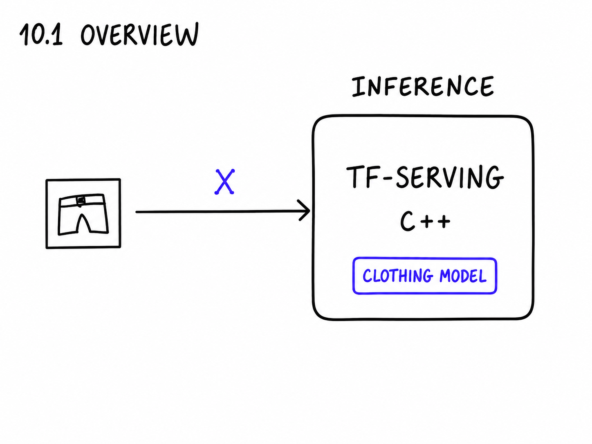
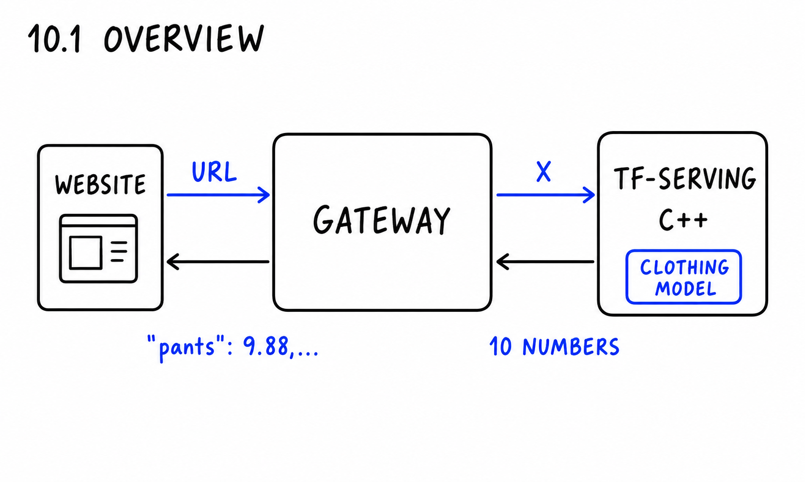
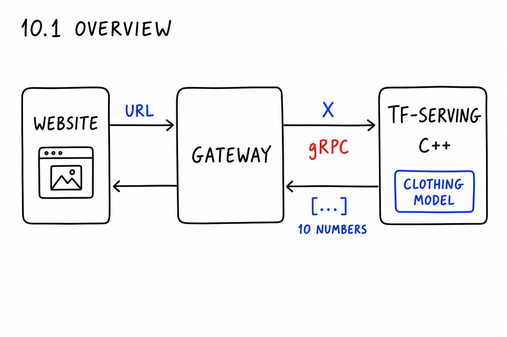
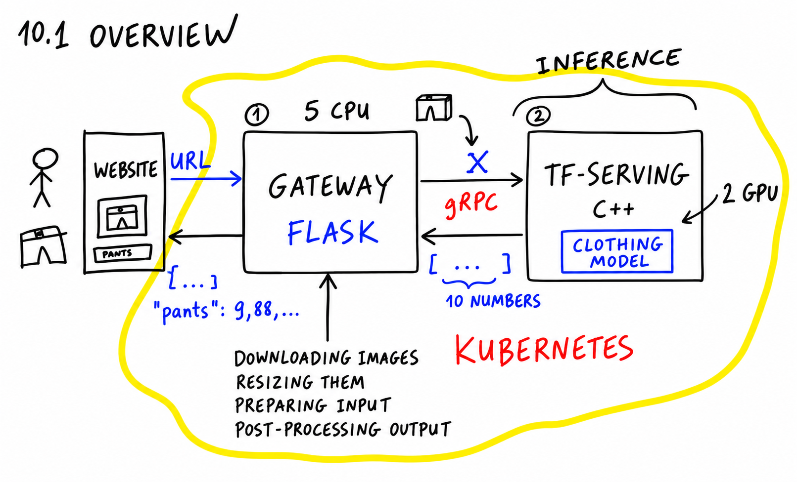
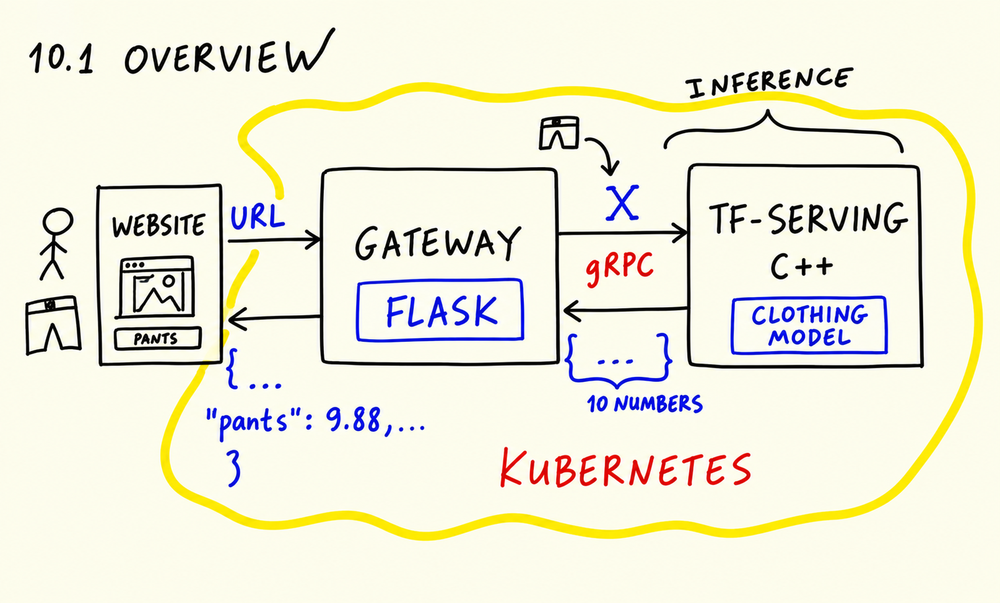
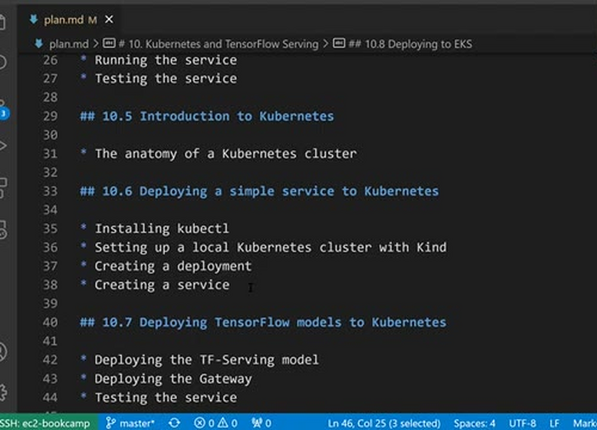

# Overview

In this session we take the clothes classification model we trained earlier
and turn it into a properly deployed service. TensorFlow Serving does the
inference, a small Flask gateway does the pre- and post-processing, and
Kubernetes runs both components and scales them.

## The scenario

We use the same scenario as in the session before. A user wants to sell
clothes on an online classifieds website. We build a system that helps them
by automatically selecting the category for an image - so an image
classifier that classifies clothes into different categories: t-shirts,
pants and other things.

## TensorFlow Serving

For serving the model we use TensorFlow Serving. It is a special tool from
the TensorFlow family of tools, created specifically for serving TensorFlow
models. It will serve the model we trained previously.

TensorFlow Serving is a library written in C++, so it is very efficient.
It focuses only on inference - you cannot do anything else with it. The way
it works: a request comes in, TensorFlow Serving gets the matrix `X` - our
image, already prepared. We download the image, turn it into a numpy array
and apply the `prepare_input` function to get `X`. The result is a numpy
array with 10 predictions - one score for each of the 10 classes we have.

## The gateway

Our user cannot download an image and apply the `prepare_input` function
themselves. So we put something in front of TensorFlow Serving: the gateway.
It takes a URL and outputs the predictions in a consumable format - JSON
with all the classes and their scores, for example `pants: 0.98`.

The user uploads the picture on the website with the form for uploading
images. The website sends the image URL to the gateway. The gateway
downloads the image, processes it and sends it to TensorFlow Serving. For
that it uses gRPC, a special binary protocol that is very efficient.
TensorFlow Serving applies the model and replies with 10 numbers. The
gateway post-processes these numbers into human-readable predictions and
sends them back. The website then uses them to suggest a category to the
user.

The gateway itself we implement in Flask - that gives us full control over
the pre- and post-processing code. TensorFlow Serving is C++, so we don't
have much control over what happens there; we just use it as is.

## Two components, two ways to scale

It might seem complicated to have two components instead of one. But there
are two good reasons for this architecture.

First, necessity. TensorFlow Serving expects the input to be prepared in a
particular format, so something needs to prepare it. We cannot put this
responsibility on the website. And TensorFlow Serving speaks gRPC, while
the website probably just wants to use JSON. The gateway shields the
website from all of that.

Second, scaling. The gateway does things that are not computationally very
expensive - downloading images, resizing them, turning them into numpy
arrays, preparing the input. A usual CPU is enough for that. Applying the
model, on the other hand, means a lot of matrix multiplication, and that
runs much faster on a GPU.

Because the components are separate, we can scale them independently. For
example, we can have five instances of the gateway on CPU machines and two
instances of TensorFlow Serving on GPU machines. GPU machines are more
expensive, so we don't want more TensorFlow Serving instances than we
need. The gateway needs less powerful machines, but maybe more of them.
With one monolithic service we couldn't do that.

One more thing the gateway does is post-processing the output. We already
have all this code: we wrote most of it in the previous session, when we
deployed the same model to AWS Lambda. In this session we mainly focus on
creating these two services, deploying them and testing them.

## The plan

Here is what we will do in this module:

- Convert the model we trained with Keras to the SavedModel format that
  TensorFlow Serving expects (it is a different format from TensorFlow
  Lite), then deploy it locally with Docker and see how to interact with
  it.
- Create the pre-processing service - the gateway.
- Put each service into its own Docker container and use Docker Compose to
  run two services that talk to each other on one machine.
- Talk about the main concepts of Kubernetes.
- Run Kubernetes locally using kind - a lightweight Kubernetes that runs
  on your computer - and deploy a simple application to it.
- Deploy our two services to Kubernetes.
- Move from our local Kubernetes cluster to a cluster in the cloud. We
  will use EKS, the Kubernetes offering from AWS, but in principle this
  should work with any cloud provider.

## Materials

- [Slides](https://www.slideshare.net/AlexeyGrigorev/ml-zoomcamp-10-kubernetes)

## Notes

* same use case as in the session before: classifying images of clothes
* using tensorflow serving, written in C++, with focus on inference
* gRPC binary protocol
* deploying to kubernetes
* 1st component: gateway (download image, resize, turn into numpy array - computationally not expensive - can be done with CPU)
* 2nd component: model (matrix multiplications - computationally expensive - thus use GPU)
* scaling the two components independently: i.e. 5 gateways handing images to 1 model
* two components in two different docker container (lesson four)
* kubernetes main concepts (lesson five)
* running kubernetes on your local machine (lesson six)
* deploy the two services to kubernetes (lesson seven)
* move from local to cloud (lesson eight)

<table>
   <tr>
      <td>⚠️</td>
      <td>
         The notes are written by the community.  
         If you see an error here, please create a PR with a fix.
      </td>
   </tr>
</table>
