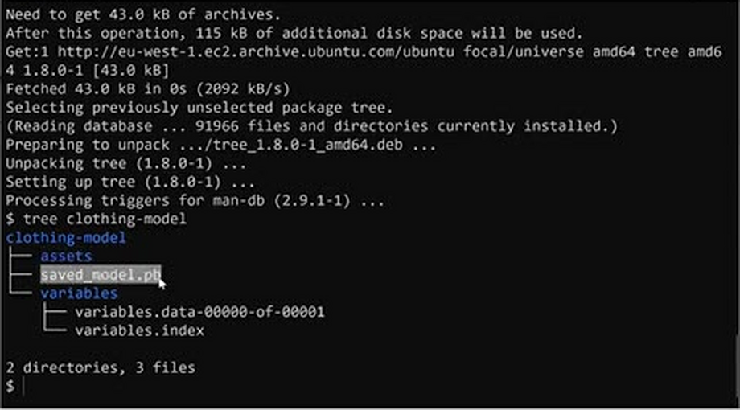
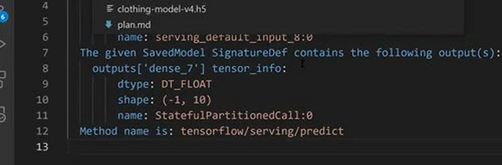
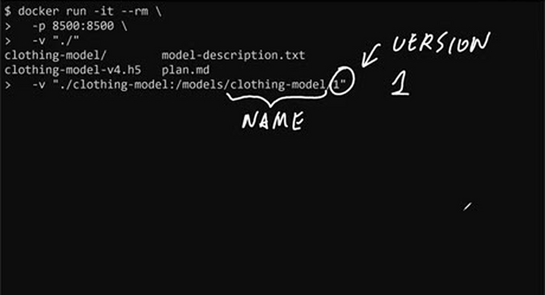
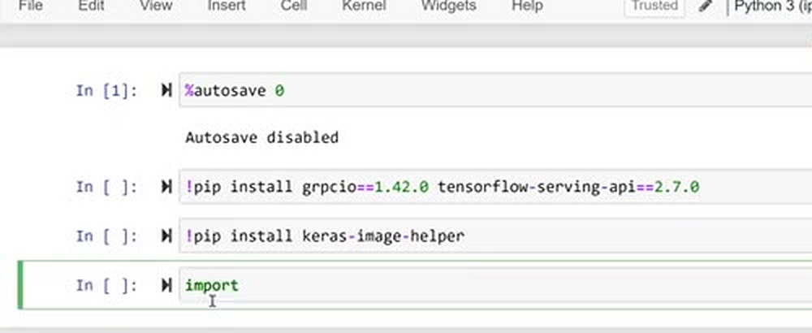
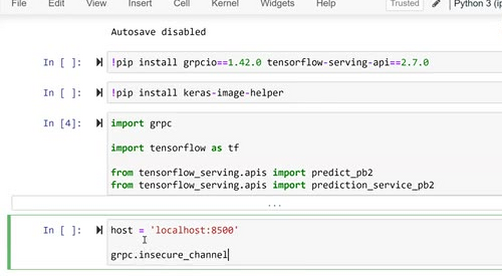
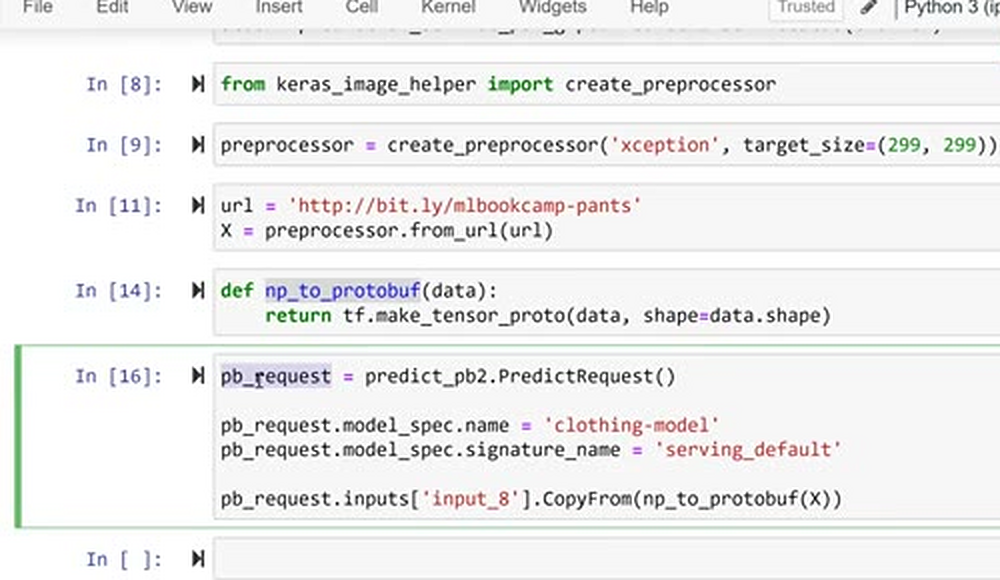
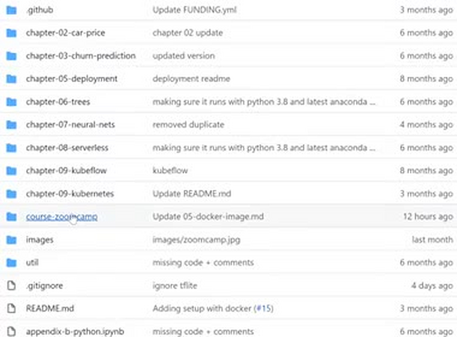

# TensorFlow Serving

In this lesson we take the clothes classification model we trained with
Keras, convert it to the SavedModel format that TensorFlow Serving expects,
run TensorFlow Serving locally with Docker, and invoke it from a Jupyter
notebook.

## Converting the model to SavedModel

TensorFlow Serving cannot work with the Keras `HDF5` model directly. To
build the app we first need to convert the model into a special format
called TensorFlow `SavedModel`. We download a prebuilt model and save it in
the working directory:

```bash
wget https://github.com/DataTalksClub/machine-learning-zoomcamp/releases/download/chapter7-model/xception_v4_large_08_0.894.h5 -O clothing-model.h5
```

Then we load the model and save it in the `SavedModel` format:

```python
import tensorflow as tf
from tensorflow import keras

model = keras.models.load_model('./clothing-model.h5')

tf.saved_model.save(model, 'clothing-model')
```

This creates a `clothing-model` directory with the model in the new
format - `saved_model.pb` plus a `variables` folder with the weights:



## Looking inside the SavedModel

We can inspect what's inside the saved model with `saved_model_cli`, a
utility that comes with TensorFlow:

```bash
saved_model_cli show --dir clothing-model --all
```

The command outputs a few things, but we are interested in the signature,
specifically the `serving_default` one:

```bash
signature_def['serving_default']:
  The given SavedModel SignatureDef contains the following input(s):
    inputs['input_8'] tensor_info:
        dtype: DT_FLOAT
        shape: (-1, 299, 299, 3)
        name: serving_default_input_8:0
  The given SavedModel SignatureDef contains the following output(s):
    outputs['dense_7'] tensor_info:
        dtype: DT_FLOAT
        shape: (-1, 10)
        name: StatefulPartitionedCall:0
  Method name is: tensorflow/serving/predict
```



This tells us how to talk to the model: the input is called `input_8` and
expects float tensors of shape `(-1, 299, 299, 3)`, and the output is
called `dense_7` and has shape `(-1, 10)` - one score per clothing class.

Alternatively, we can use this command to print just the signature:

```bash
saved_model_cli show --dir clothing-model --tag_set serve --signature_def serving_default
```

## Running TensorFlow Serving with Docker

We can run the model (`clothing-model`) with the prebuilt Docker image
`tensorflow/serving:2.7.0`:

```bash
docker run -it --rm \
  -p 8500:8500 \
  -v $(pwd)/clothing-model:/models/clothing-model/1 \
  -e MODEL_NAME="clothing-model" \
  tensorflow/serving:2.7.0
```

- `docker run -it --rm` - run the Docker container
- `-p 8500:8500` - port mapping
- `-v $(pwd)/clothing-model:/models/clothing-model/1` - volume mapping of
  the model directory on our machine to the model directory inside the
  Docker image. TensorFlow Serving looks for models under
  `/models/<model name>/<version>` - the version number is required, and
  without the `/1` at the end it will not work. Even if you later have a
  second or third version of the model, putting `1` there is fine
- `-e MODEL_NAME="clothing-model"` - set the environment variable for the
  Docker image. It should be the same as the folder name
- `tensorflow/serving:2.7.0` - the name of the image to run

One gotcha: the local path for the volume needs to be the full path. With
a relative path like `./clothing-model`, Docker cannot tell which
directory we mean and the container fails to start. That's what `$(pwd)`
is for - it executes the `pwd` command and inserts the current directory
into the command, giving us the absolute path to the folder with the
model. When TF-Serving starts successfully, it prints
`entering the event loop` and `status success`.



## gRPC and protobuf

TensorFlow Serving uses a special protocol called `gRPC`, which is
optimized for a binary data format. So to talk to the server, we need to
convert our prediction request into `protobuf` - we cannot send the numpy
array as it is.

## Invoking the model from a notebook

The [tf-serving-connect.ipynb](code/tf-serving-connect.ipynb) notebook
shows how to communicate with the model deployed with TensorFlow Serving.

First we install the dependencies. We need `grpcio` for talking gRPC,
`tensorflow-serving-api` for the generated request/response classes, and
`keras-image-helper` for pre-processing the images:

```
!pip install grpcio==1.42.0 tensorflow-serving-api==2.7.0
!pip install keras-image-helper
```



Then we import what we need and create a gRPC channel to the server:

```python
import grpc

import tensorflow as tf

from tensorflow_serving.apis import predict_pb2
from tensorflow_serving.apis import prediction_service_pb2_grpc
```

```python
host = 'localhost:8500'

channel = grpc.insecure_channel(host)

stub = prediction_service_pb2_grpc.PredictionServiceStub(channel)
```

We use an insecure channel because we're trying things locally - a secure
channel is where we would add authentication. We don't need that here:
the whole thing will eventually run inside Kubernetes, both the gateway
and TensorFlow Serving, and TensorFlow Serving will not be accessible
from the outside. We won't cover secure channels in this course.

The stub is the thing we use for invoking the remote service - it's what
we'll use for making predictions.



For pre-processing we use `keras-image-helper`. It downloads the image from
a URL, resizes it to 299 by 299 and applies the Xception pre-processing:

```python
from keras_image_helper import create_preprocessor

preprocessor = create_preprocessor('xception', target_size=(299, 299))
```

```python
url = 'http://bit.ly/mlbookcamp-pants'
X = preprocessor.from_url(url)
```

Now we convert the numpy array to protobuf. TensorFlow already has a
function for that:

```python
def np_to_protobuf(data):
    return tf.make_tensor_proto(data, shape=data.shape)
```

And we prepare the request. We tell it which model to use
(`clothing-model`), which signature to use (`serving_default`), and we put
our protobuf tensor under the input name we saw in the signature,
`input_8`:

```python
pb_request = predict_pb2.PredictRequest()

pb_request.model_spec.name = 'clothing-model'
pb_request.model_spec.signature_name = 'serving_default'

pb_request.inputs['input_8'].CopyFrom(np_to_protobuf(X))
```



Then we send the request to TensorFlow Serving:

```python
pb_response = stub.Predict(pb_request, timeout=20.0)
```

The response comes back as a protobuf message as well. We extract the
output by the name from the signature, `dense_7`:

```python
preds = pb_response.outputs['dense_7'].float_val
```

This gives us 10 raw scores - the model outputs logits, not probabilities.
Note that we get a usual Python list with Python floats back, not a numpy
array - which is good for us, because we don't need any extra conversion.
To make it human-readable, we put the scores together with the class
names (copied from the previous session):

```python
classes = [
    'dress',
    'hat',
    'longsleeve',
    'outwear',
    'pants',
    'shirt',
    'shoes',
    'shorts',
    'skirt',
    't-shirt'
]
```

```python
dict(zip(classes, preds))
```

The result for the picture of pants:

```python
{'dress': -1.8682901859283447,
 'hat': -4.761244773864746,
 'longsleeve': -2.316983461380005,
 'outwear': -1.062570333480835,
 'pants': 9.88715934753418,
 'shirt': -2.8124334812164307,
 'shoes': -3.666282892227173,
 'shorts': 3.200361490249634,
 'skirt': -2.6023383140563965,
 't-shirt': -4.835045337677002}
```

'pants' clearly wins, so the model classified the image correctly.



In the next lesson we turn this notebook into a pre-processing service.

## Notes

<table>
   <tr>
      <td>⚠️</td>
      <td>
         The notes are written by the community. <br>
         If you see an error here, please create a PR with a fix.
      </td>
   </tr>
</table>
