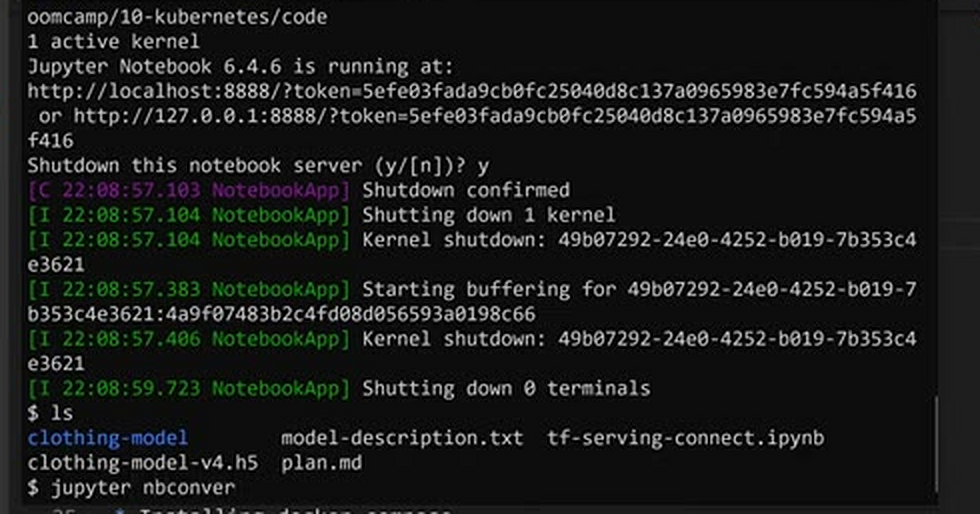
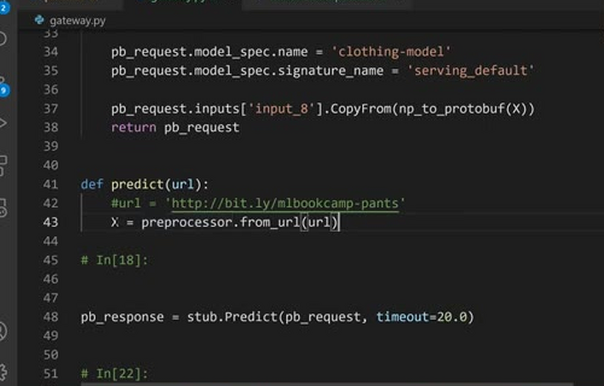
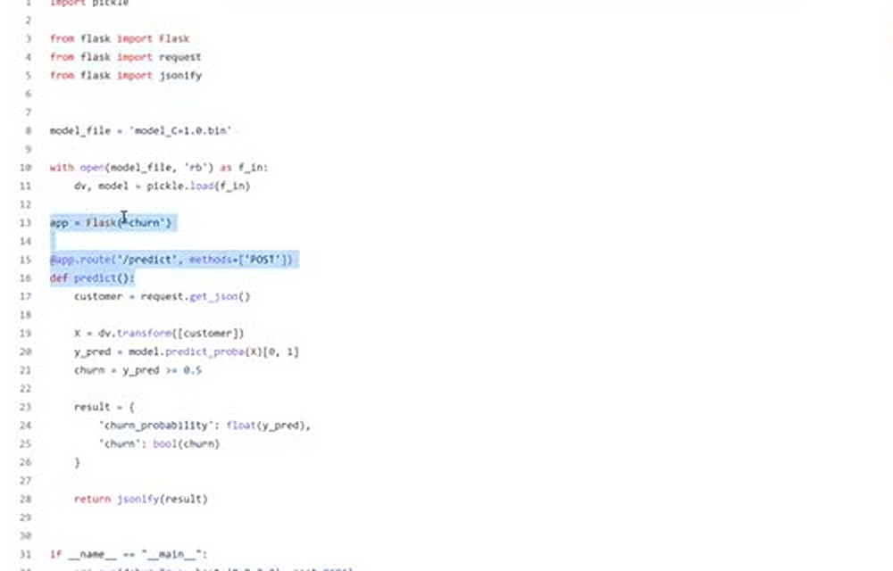
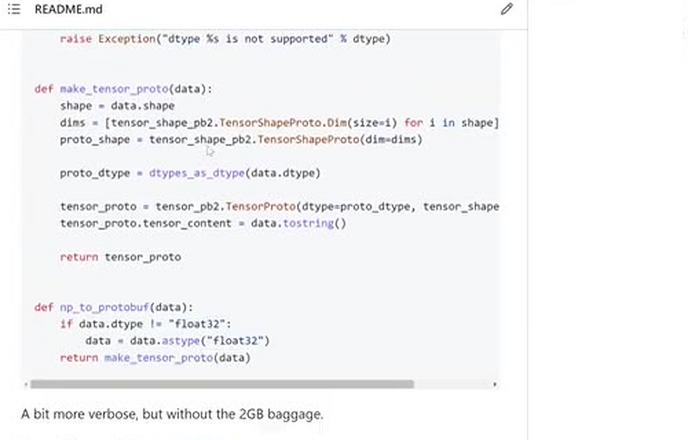
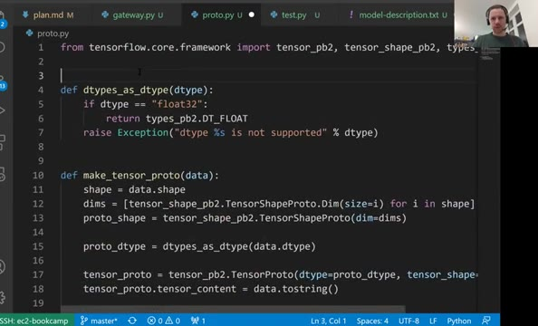
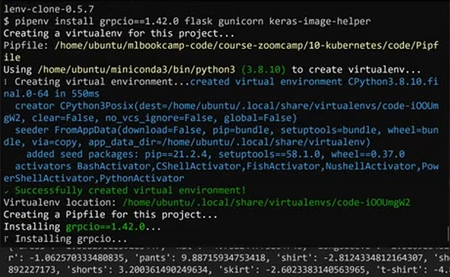

# Creating a pre-processing service

In the previous lesson we created a Jupyter notebook that talks to the
model deployed with TensorFlow Serving. In this lesson we convert that
notebook into a Flask application - the gateway that downloads an image,
prepares the request, sends it to TensorFlow Serving and turns the
response into a human-readable answer.

## From notebook to script

The notebook fetches an image, pre-processes it, turns it into protobuf,
sends it to TensorFlow Serving, does post-processing and finally gives a
human-readable answer. We now convert the notebook into a Python script
and wrap it into a Flask app.

To convert the notebook into a script we can run:

```bash
jupyter nbconvert --to script tf-serving-connect.ipynb
```

Before that we stop Jupyter - we don't need it anymore. The conversion
gives us a `.py` file, and we rename it to `gateway.py`, because this is
how we will call our service. This is the
[code/gateway.py](code/gateway.py) file. After cleaning it up, it has three
parts: preparing the request, sending it, and preparing the response.

We can run the script right away to check that it still works - it
prints the predictions, with `pants` on top.



To prepare the request we put the model name, the signature and our
protobuf tensor into a `PredictRequest`:

```python
def prepare_request(X):
    pb_request = predict_pb2.PredictRequest()

    pb_request.model_spec.name = 'clothing-model'
    pb_request.model_spec.signature_name = 'serving_default'

    pb_request.inputs['input_8'].CopyFrom(np_to_protobuf(X))
    return pb_request
```

Sending the request and post-processing the response: TensorFlow Serving
returns the scores as `float_val`, and we zip them with the class names to
get a dictionary:

```python
classes = [
    'dress',
    'hat',
    'longsleeve',
    'outwear',
    'pants',
    'shirt',
    'shoes',
    'shorts',
    'skirt',
    't-shirt'
]

def prepare_response(pb_response):
    preds = pb_response.outputs['dense_7'].float_val
    return dict(zip(classes, preds))


def predict(url):
    X = preprocessor.from_url(url)
    pb_request = prepare_request(X)
    pb_response = stub.Predict(pb_request, timeout=20.0)
    response = prepare_response(pb_response)
    return response
```



For the Flask app we can reuse the code from session 5 - the churn
prediction service. We copy the Flask imports and the endpoint pattern,
and adjust it: the app is called `gateway`, the endpoint function becomes
`predict_endpoint`, and it expects JSON with an image URL:

```python
# Create flask app
app = Flask('gateway')

@app.route('/predict', methods=['POST'])
def predict_endpoint():
    data = request.get_json()
    url = data['url']
    result = predict(url)
    return jsonify(result)
```



Like in session 5, we also create a `test.py` for testing the service:
we copy it from the previous session and replace the URL with
`http://localhost:9696/predict`.

Our application now has two components: a Docker container with
TensorFlow Serving, and a Flask application with the gateway.

## Creating the virtual environment with Pipenv

We also want to put everything in a `pipenv` environment for deployment -
we will need it when we prepare the Docker images. For that we need to
install a few libraries with pipenv:

```bash
pipenv install grpcio==1.42.0 flask gunicorn keras-image-helper
```

We need `gunicorn` because in Docker we will later use it for serving the
Flask app.

## Getting rid of the TensorFlow dependency

Be aware of the library sizes: TensorFlow itself is around 1.7 GB, and
the CPU-only version, `tensorflow-cpu`, is still around 400 MB. We don't
want such a heavy dependency in our gateway. In the notebook we only use
one function from TensorFlow - `make_tensor_proto`, the thing that
converts our numpy array into protobuf format. Dragging the entire
library with us just for that is too much.

Instead, we can use a small package with just the protobuf definitions of
TensorFlow - `tensorflow-protobuf`. It was created by extracting all the
protobuf files and compiling them separately: it still uses the
`tensorflow` namespace, but it only contains the protobuf files we need,
not the library itself. To make it work we install:

```bash
pipenv install tensorflow-protobuf==2.7.0 protobuf==3.19
```

We install it instead of TensorFlow and `tensorflow-serving-api`. The
code becomes a bit more verbose - but without the 2 GB baggage:



And we put the conversion code in a separate script,
[code/proto.py](code/proto.py), and import the `np_to_protobuf` function
into our `gateway.py`:

```python
from tensorflow.core.framework import tensor_pb2, tensor_shape_pb2, types_pb2


def dtypes_as_dtype(dtype):
    if dtype == "float32":
        return types_pb2.DT_FLOAT
    raise Exception("dtype %s is not supported" % dtype)


def make_tensor_proto(data):
    shape = data.shape
    dims = [tensor_shape_pb2.TensorShapeProto.Dim(size=i) for i in shape]
    proto_shape = tensor_shape_pb2.TensorShapeProto(dim=dims)

    proto_dtype = dtypes_as_dtype(data.dtype)

    tensor_proto = tensor_pb2.TensorProto(dtype=proto_dtype, tensor_shape=proto_shape)
    tensor_proto.tensor_content = data.tostring()

    return tensor_proto


def np_to_protobuf(data):
    if data.dtype != "float32":
        data = data.astype("float32")
    return make_tensor_proto(data)
```

This code turns a numpy array into the protobuf format that TensorFlow
Serving expects, without needing the full TensorFlow library installed.



In `gateway.py` we remove the old function and simply import from this
script - it does exactly the same thing as before. To check that
everything works, we activate the pipenv environment (`pipenv shell`) and
run `python gateway.py`: it still prints the predictions, and this time
it doesn't require TensorFlow at all - no CUDA warnings in the logs,
because we only load the parts of the code we need.



That's it for this lesson: TensorFlow Serving runs in a Docker container,
the gateway is a Flask application, and everything is put into a pipenv
environment. Now we want to package the gateway into Docker as well and
run these things together - for that we will use Docker Compose, which is
what we cover in the next lesson.

## Materials

- Bash script to create custom tf-serving-protobuf and compile:
  https://github.com/alexeygrigorev/tensorflow-protobuf/blob/main/tf-serving-proto.sh

## Notes

* turn jupyter notebook into flask app
* the notebook communicates with the model deployed with tensorflow
* the notebook fetches an image, pre-processes it, turns it into protobuf, sends it to tensorflow-serving, does post-processing and finally gives a human-readable answer
* convert notebook into python script and call the script gateway
* prepare request, send request, prepare response
* you can reuse the flask app code from session 5
* two components: docker container with tensorflow serving and flask application with the gateway
* be aware of the library sizes: tensorflow 1.7 GB, tensorflow CPU ~400 MB, tensorflow serving
* turn numpy array into protobuf format
* tensorflow protobuf

<table>
   <tr>
      <td>⚠️</td>
      <td>
         The notes are written by the community. <br>
         If you see an error here, please create a PR with a fix.
      </td>
   </tr>
</table>
