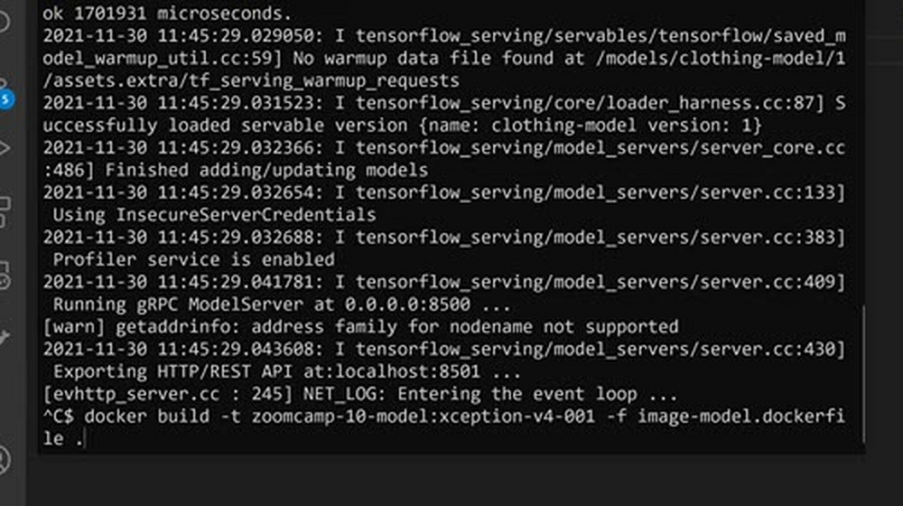
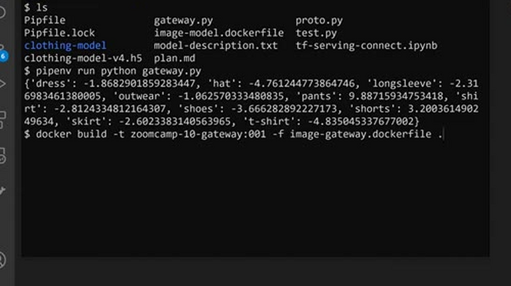
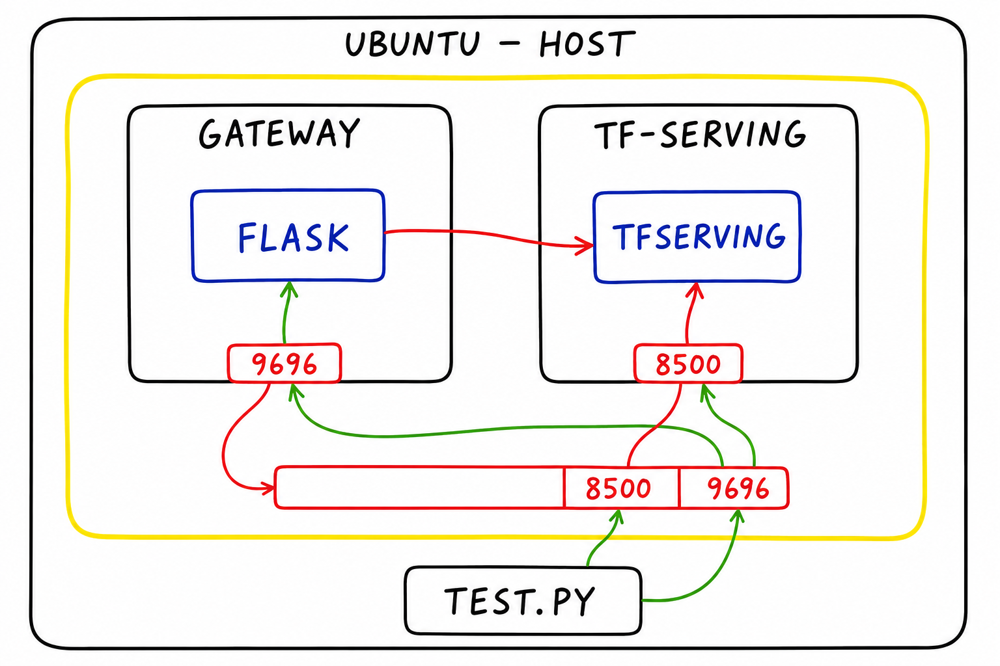
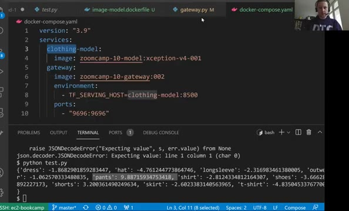
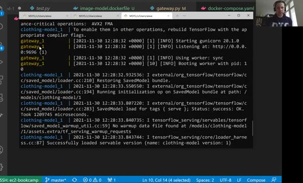
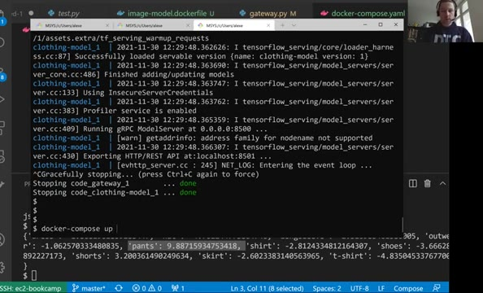

# Running everything locally with Docker-compose

We now have two services: TensorFlow Serving with the model, and the Flask
gateway. In this lesson we put each of them into its own Docker image and
use Docker Compose to run them together on one machine.

Docker Compose is a tool that helps us define and share multi-container
applications. With Compose, we create a YAML file to define the services
(in our case the `gateway` service and the `clothing-model` model) and with
a single command we can spin everything up or tear it all down. Docker
Compose is very useful for testing the application locally.

We install it following the official instructions at
`docs.docker.com/compose/install/` - download the binary from the GitHub
releases page and put it on the `PATH`. Then `docker-compose` should be an
executable we can call from the terminal.

## Preparing the model image

Instead of mapping volumes and ports and then running the Docker container
from the terminal for our TF-Serving model (`clothing-model`), we want to
create a Docker image and put everything in there. For this we create
`image-model.dockerfile`:

```dockerfile
FROM tensorflow/serving:2.7.0

# Copy model in the image
COPY clothing-model /models/clothing-model/1
# Specify environmental variable
ENV MODEL_NAME="clothing-model"
```

To build the image we need to specify the dockerfile name along with the
tag, for example:

```bash
docker build -t zoomcamp-10-model:xception-v4-001 -f image-model.dockerfile .
```

Now we could simply run the image with
`docker run -it --rm -p 8500:8500 zoomcamp-10-model:xception-v4-001`. To
check that it works, we can run the gateway locally (with the prediction
call in `gateway.py` uncommented) and point it at the container:



## Preparing the gateway image

Similarly we can do the same thing for our gateway service. The file name
is `image-gateway.dockerfile`:

```dockerfile
FROM python:3.8.12-slim

RUN pip install pipenv

# Create working directory in docker image
WORKDIR /app

# Copy Pipfile and Pipfile.lock files in working dir
COPY ["Pipfile", "Pipfile.lock", "./"]

# Install required packages using pipenv
RUN pipenv install --system --deploy

# Copy gateway and protobuf scripts in the working dir
COPY ["gateway.py", "proto.py", "./"]

EXPOSE 9696

ENTRYPOINT ["gunicorn", "--bind=0.0.0.0:9696", "gateway:app"]
```

Build the image:

```bash
docker build -t zoomcamp-10-gateway:001 -f image-gateway.dockerfile .
```



Run it:

```bash
docker run -it --rm -p 9696:9696 zoomcamp-10-gateway:001
```

## Connecting the two containers

Upon running these two containers separately and testing for a prediction,
we should expect a connection error: `UNAVAILABLE: failed to connect to
all addresses`. Inside the gateway container, `localhost` means the
gateway container itself - and there is no TensorFlow Serving running
there on port 8500. The two containers need a way to reach each other.
We could do this with plain Docker, but there is a nicer way of linking
multiple related services: Docker Compose. It runs all the containers in
one network, where they can talk to each other.



Docker Compose requires a YAML file which is executed when running the
commands from Docker Compose; usually the file is named
`docker-compose.yaml`:

```yaml
version: "3.9"
services:
  clothing-model: # tf-serving model
    image: zoomcamp-10-model:xception-v4-001
  gateway: # flask gateway service
    image: zoomcamp-10-gateway:002 # new version
    environment:
      - TF_SERVING_HOST=clothing-model:8500 # look for clothing model and port 8500
    ports: # map host machine with gateway
      - "9696:9696"
```

For this to work we also need to make a small change in `gateway.py` to
make the host configurable via an environment variable:

```python
host = os.getenv('TF_SERVING_HOST', 'localhost:8500')
```

Since we changed the gateway code, we rebuild its image with a new tag -
`zoomcamp-10-gateway:002` - and use that tag in the compose file.

Note that `clothing-model` needs no configuration at all - and no ports
mapped to the host. Both services live in the same network, so the
gateway can reach the model directly; only the gateway is exposed to our
host machine, because `test.py` runs outside the compose network and
still wants to use `localhost:9696`.

Docker Compose resolves service names inside that network: the gateway
looks for the host `clothing-model` on port 8500, and Docker Compose turns
that name into the address of the TF-Serving container.



Running the command `docker-compose up` establishes this connection
between both images. In the logs we see gunicorn starting for the
gateway, and TensorFlow Serving reporting `Successfully loaded servable
version name: clothing-model version: 1`.



As everything is configured properly we get the predictions back - we can
test it by posting an image URL to `localhost:9696/predict`:



## Useful commands

- `docker-compose up`: run docker compose
- `docker-compose up -d`: run docker compose in detached mode
- `docker ps`: to see the running containers
- `docker-compose down`: stop the docker compose

## Materials

- [Slides](https://www.slideshare.net/AlexeyGrigorev/ml-zoomcamp-10-kubernetes)

## Notes

<table>
   <tr>
      <td>⚠️</td>
      <td>
         The notes are written by the community. <br>
         If you see an error here, please create a PR with a fix.
      </td>
   </tr>
</table>
