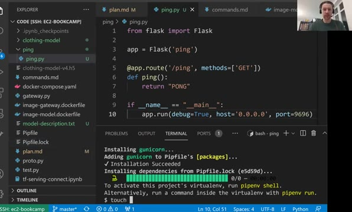
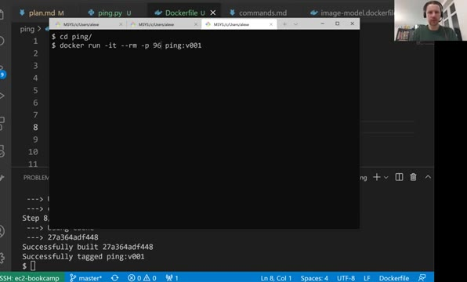
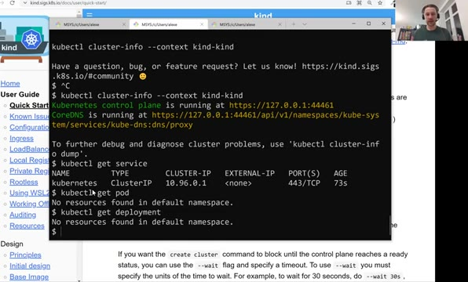
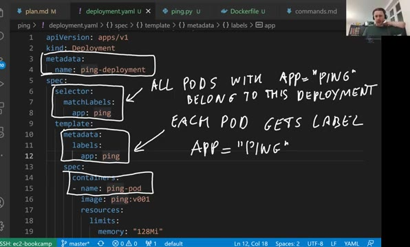
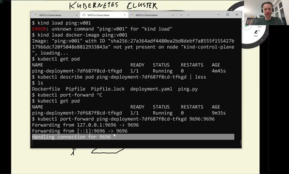
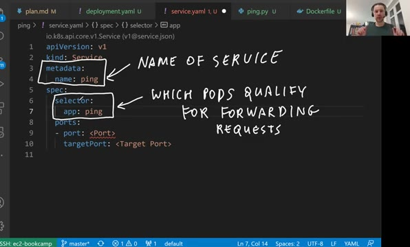
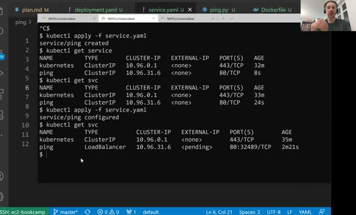

# Deploying a simple service to Kubernetes

In this lesson we set up a local Kubernetes cluster with kind and deploy a
simple web application to it. We create a small Flask "ping" service,
build its image, create a deployment and a service in Kubernetes, and
finally set up MetalLB so we can reach the service from our machine.

## Creating a cluster with Kind

kind is a tool for running local Kubernetes clusters - it runs the
cluster inside Docker containers. We use
[kind](https://github.com/kubernetes-sigs/kind) to create the cluster and
[kubectl](https://kubernetes.io/docs/reference/kubectl/), the command line
tool for interacting with Kubernetes clusters, to work with it.

If you use WSL2 and get the following errors when creating a cluster with
`kind create cluster`:

```
✗ Starting control-plane 🕹️
ERROR: failed to create cluster: failed to init node with kubeadm: command "docker exec --privileged kind-control-plane kubeadm init --skip-phases=preflight --config=/kind/kubeadm.conf --skip-token-print --v=6" failed with error: exit status 1
```

the solution is to specify the node image:

```
kind create cluster --image kindest/node:v1.23.0
```

## The ping application

We'll deploy a simple web application to the Kubernetes cluster. For that,
we create a directory `ping` with its own `Pipfile` (a separate
environment, to avoid conflicts with the gateway project) and install
`flask` and `gunicorn`.

The application itself we take from session 5, with slight changes. It's a
single file, `ping.py`, with one GET endpoint that answers `PONG`:

```python
from flask import Flask

app = Flask('ping')

@app.route('/ping', methods=['GET'])
def ping():
    return "PONG"

if __name__ == "__main__":
    app.run(debug=True, host='0.0.0.0', port=9696)
```

We create a separate `Pipfile` for it (with `touch Pipfile` - otherwise
pipenv walks up the directory tree and finds the gateway's Pipfile) and
install the dependencies there, so the environment doesn't conflict with
the gateway project:

```bash
pipenv install flask gunicorn
```

The `Dockerfile` we also take from session 5, with small edits: we copy
`ping.py` instead of the gateway files, and we start `ping:app` instead of
`gateway:app`:

```dockerfile
FROM python:3.8.12-slim

RUN pip install pipenv

WORKDIR /app

COPY ["Pipfile", "Pipfile.lock", "./"]

RUN pipenv install --system --deploy

COPY "ping.py" .

EXPOSE 9696

ENTRYPOINT ["gunicorn", "--bind=0.0.0.0:9696", "ping:app"]
```

To build the image we need to specify the tag explicitly - something like
`ping:v001`. If we don't, the tag defaults to `latest`, and the local
Kubernetes setup `kind` that we use in this lesson doesn't like the
`latest` tag; it needs a specific one:

```bash
docker build -t ping:v001 .
```



Now we can run the Docker container and, in a separate terminal, test the
application with `curl localhost:9696/ping` - it should answer `PONG`.



## Installing kubectl and kind

We'll install kubectl from AWS, because later in the module we deploy our
application on AWS:

```bash
curl -o kubectl https://s3.us-west-2.amazonaws.com/amazon-eks/1.24.7/2022-10-31/bin/linux/amd64/kubectl
```

To install kind, we download the executable binary, make it executable and
put it on the `$PATH` in our preferred binary installation directory:

```bash
wget https://kind.sigs.k8s.io/dl/v0.17.0/kind-linux-amd64 -O kind
chmod +x ./kind
```

## Setting up a local cluster and testing it

First thing we need to do is create a cluster:

```bash
kind create cluster
```

The default cluster name is `kind`. Then we configure kubectl to interact
with it:

```bash
kubectl cluster-info --context kind-kind
```

And we check the running services to make sure it works:

```bash
kubectl get service
```



## Creating a deployment

Kubernetes requires quite a lot of configuration, and for that VS Code has
a [handy extension](https://code.visualstudio.com/docs/azure/kubernetes)
that can take a lot of the hassle away.

We create a `deployment.yaml`. A deployment describes the pods we want:
which Docker image they run, how many replicas, which resources each pod
gets, and which ports it exposes:

```yaml
apiVersion: apps/v1
kind: Deployment
metadata: # name of the deployment
  name: ping-deployment
spec:
  replicas: 1 # number of pods to create
  selector:
    matchLabels: # all pods that have the label app name 'ping' are belonged to 'ping-deployment'
      app: ping
  template: # template of pods (all pods have same configuration)
    metadata:
      labels: # each app gets the same label (i.e., ping in our case)
        app: ping
    spec:
      containers: # name of the container
      - name: ping-pod
        image: ping:v001 # docker image with tag
        resources:
          limits:
            memory: "128Mi"
            cpu: "500m"
        ports:
        - containerPort: 9696 # port to expose
```



We can now apply the `deployment.yaml` to our Kubernetes cluster:

```bash
kubectl apply -f deployment.yaml
```

Next we need to load the Docker image into our cluster - the kind node
doesn't see the images we built locally. If we forget this step, the pod
stays in `Pending` with the reason `ErrImagePull`:

```bash
kind load docker-image ping:v001
```

Executing the command `kubectl get pod` should give us the pod with
status `Running`.

To test the pod we can forward a local port to it - this is called port
forwarding. We take the pod name from `kubectl get pod`, then map a port
on our machine to the port on the pod:

```bash
kubectl port-forward <pod-name> 9696:9696
```

and execute `curl localhost:9696/ping` to get the response. In the
port-forward output we see `Handling connection for 9696` for every
request - it goes through kubectl, to the pod, and the answer comes back
the same way. Once we stop the port-forwarding, the same `curl` fails
with `connection refused` - there is nothing listening on our local port
anymore.



## Creating a service

Instead of forwarding ports to individual pods, we create a service in
front of the deployment. We create `service.yaml`:

```yaml
apiVersion: v1
kind: Service
metadata: # name of the service ('ping')
  name: ping
spec:
  type: LoadBalancer # type of the service (external in this case)
  selector: # which pods qualify for forwarding requests
    app: ping
  ports:
  - port: 80 # port of the service
    targetPort: 9696 # port of the pod
```



One more thing to fill in: the service type. There are several options -
`ClusterIP`, `ExternalName`, `LoadBalancer`, `NodePort`. Remember the two
types from the previous lesson: `ClusterIP` is an internal service,
`LoadBalancer` is an external one. The default is `ClusterIP`. With kind
it doesn't really matter locally, but on a real cluster it decides
whether the service is exposed outside of Kubernetes or not. We want the
service to be external, so we set the type to `LoadBalancer`.

Apply it:

```bash
kubectl apply -f service.yaml
```

Running `kubectl get service` gives us the list of services along with
their type and other information. If we created it with the default type
first and then changed it to `LoadBalancer`, kubectl reports it as
`configured` instead of `created`.

Now the external IP of our `LoadBalancer` service - but it shows
`<pending>`. On a real cluster - EKS or Kubernetes from any other cloud
provider - the provider assigns an external IP or name to a
`LoadBalancer` service automatically. But this is a local cluster, and we
haven't configured it to hand out external IPs, so it stays pending
forever.



We can still test the service by port forwarding, pretending that we are
connected to an external service:

```bash
kubectl port-forward service/ping 8080:80
```

(we map it to 8080 instead of 80 to avoid a permission requirement -
mapping port 80 would need `sudo`) and executing
`curl localhost:8080/ping` should give us the output `PONG`. Notice in
the output that kubectl forwards to port 9696 - the service itself takes
care of translating port 80 to the pods' port 9696.

## Making the external IP work with MetalLB

If you want the external IP of the `LoadBalancer` service to actually
work on kind, the kind documentation has a "load balancer" page that
describes what to do. The video doesn't go through these steps, but here
is the recipe: we install MetalLB, a load balancer implementation that
assigns external IP addresses to `LoadBalancer` services in a cluster.

Apply the MetalLB manifest:

```
kubectl apply -f https://raw.githubusercontent.com/metallb/metallb/v0.13.7/config/manifests/metallb-native.yaml
```

Wait until the MetalLB pods (controller and speakers) are ready:

```
kubectl wait --namespace metallb-system \
                 --for=condition=ready pod \
                 --selector=app=metallb \
                   --timeout=90s
```

Then we set up the address pool used by load balancers. First we get the
range of IP addresses on the Docker kind network:

```
docker network inspect -f '{{.IPAM.Config}}' kind
```

Then we create an IP address pool using `metallb-config.yaml` - we pick a
range inside the addresses we just saw:

```yaml
apiVersion: metallb.io/v1beta1
kind: IPAddressPool
metadata:
  name: example
  namespace: metallb-system
spec:
  addresses:
  - 172.20.255.200-172.20.255.250
---
apiVersion: metallb.io/v1beta1
kind: L2Advertisement
metadata:
  name: empty
  namespace: metallb-system
```

Apply the deployment and service again for the updates to pick up:

```
kubectl apply -f deployment.yaml
kubectl apply -f service.yaml
```

And get the external load balancer IP:

```
kubectl get service
```

Now we can test using the load balancer IP address:

```
curl <LB_IP>:80/ping
```

This should again answer `PONG` - but now the request goes through the
external load balancer, the way it would in a real cluster.

## Materials

- [Slides](https://www.slideshare.net/AlexeyGrigorev/ml-zoomcamp-10-kubernetes)

## Notes

* kind = local kubernetes cluster https://github.com/kubernetes-sigs/kind
* kubectl = tool for interacting with kubernetes cluster https://kubernetes.io/docs/reference/kubectl/
* yaml kubernetes configuration: allocating resources (RAM, CPU), templates, port labels
* kubernetes ports/pods: requests, responses, forwarding, connection refusal

<table>
   <tr>
      <td>⚠️</td>
      <td>
         The notes are written by the community. <br>
         If you see an error here, please create a PR with a fix.
      </td>
   </tr>
</table>
