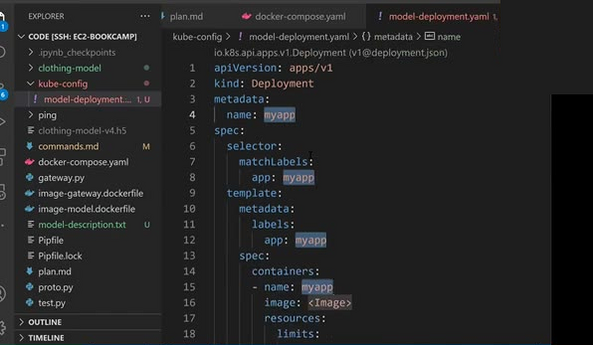
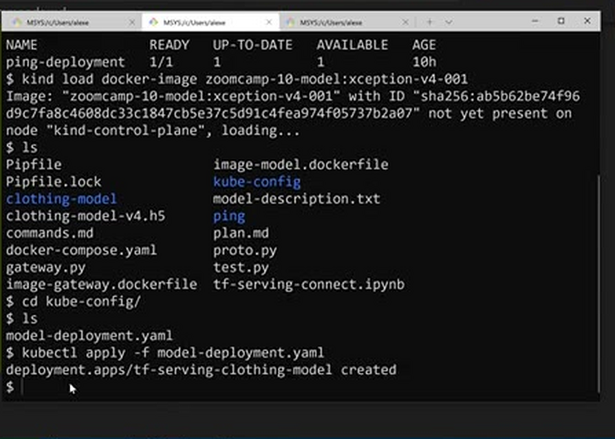
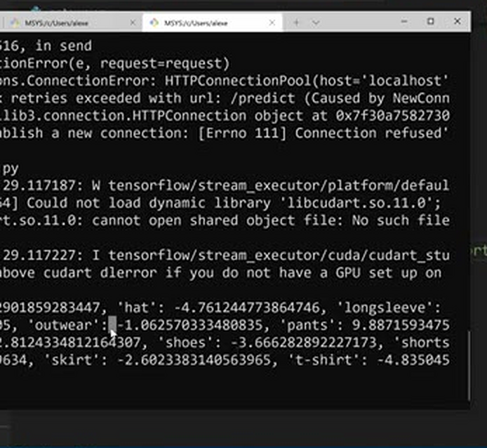
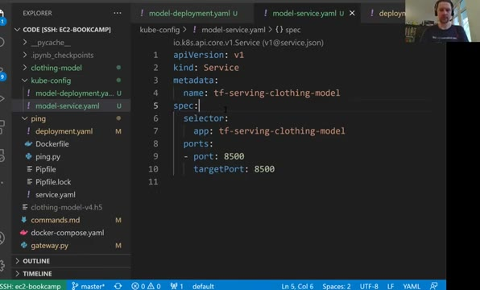
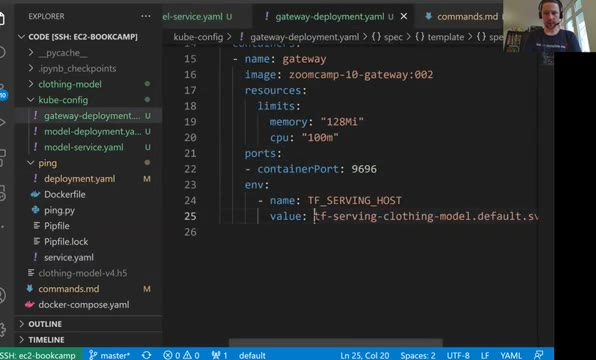
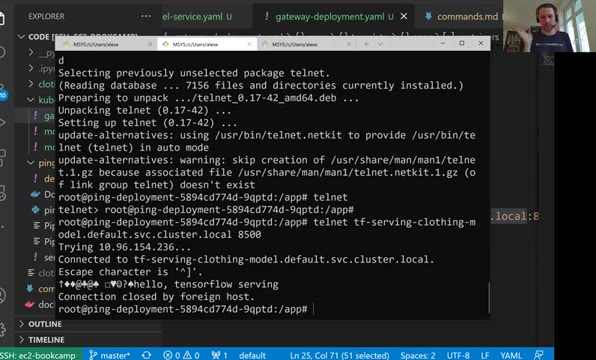
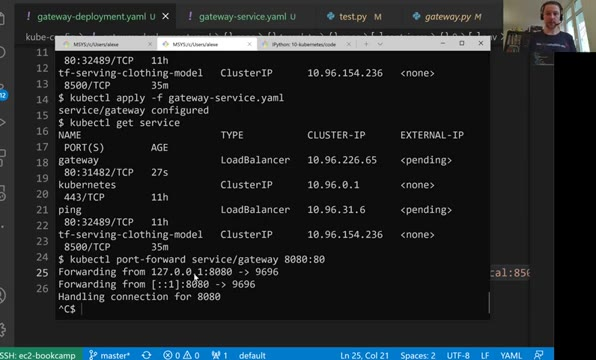

# Deploying TensorFlow models to Kubernetes

In this lesson we deploy our two services - the TF-Serving model and the
Flask gateway - to the local Kubernetes cluster we created with kind. For
each service we create a deployment (the pods) and a service (the entry
point to the pods). To keep things tidy we put the Kubernetes
configuration files in a separate folder `kube-config`.



## Deploying the TF-Serving model

First we create a deployment for the TF-Serving model,
`model-deployment.yaml`. It points to the model image we built in the
Docker Compose lesson, gives the pod some resources and exposes port 8500
- the port TF-Serving listens on for gRPC requests:

```yaml
apiVersion: apps/v1
kind: Deployment
metadata:
  name: tf-serving-clothing-model
spec:
  replicas: 1
  selector:
    matchLabels:
      app: tf-serving-clothing-model
  template:
    metadata:
      labels:
        app: tf-serving-clothing-model
    spec:
      containers:
      - name: tf-serving-clothing-model
        image: zoomcamp-10-model:xception-v4-001
        resources:
          limits:
            memory: "512Mi"
            cpu: "0.5"
        ports:
        - containerPort: 8500
```

Then we load the model image into kind and create the deployment:

```bash
kind load docker-image zoomcamp-10-model:xception-v4-001
kubectl apply -f model-deployment.yaml
```

One practical note on resources. We first gave the model one CPU, but the
pod stayed in `Pending`: this small machine doesn't have enough free CPU
for it. Lowering the limit to 0.5 CPU made it start. The ping deployment
from the previous lesson was fighting it for resources, so we also
lowered the ping pod to a tenth of a CPU - all it does is answering with
`PONG`, it doesn't need more.

Executing the command `kubectl get pod` should give us the pod with
status `Running`.

To test the model deployment directly we use port forwarding, like in
the previous lesson:

```bash
kubectl port-forward tf-serving-clothing-model-<pod-id> 8500:8500
```

Then we take `gateway.py` - in the Docker Compose lesson we already made
it capable of sending one request when run directly - and run it. It
connects to `localhost:8500` by default, so we get predictions.





## Creating the model service

Forwarding ports to pods is only for testing. For the gateway to reach the
model from inside the cluster, we create a service. The service for
TF-Serving, `model-service.yaml`, is an internal one:

```yaml
apiVersion: v1
kind: Service
metadata:
  name: tf-serving-clothing-model
spec:
  type: ClusterIP # default service type is always ClusterIP (i.e., internal service)
  selector:
    app: tf-serving-clothing-model
  ports:
  - port: 8500
    targetPort: 8500
```

`ClusterIP` is the default service type: it makes the service reachable
only from within the cluster, which is exactly what we want for the model
- the outside world talks to the gateway, not to the model.

Create the model service:

```bash
kubectl apply -f model-service.yaml
```

Check it with `kubectl get service`, and test it by forwarding to the
service instead of the pod:

```bash
kubectl port-forward service/tf-serving-clothing-model 8500:8500
```

then run `gateway.py` again for predictions.



## Deploying the gateway

Next, the deployment for the gateway, `gateway-deployment.yaml`. One more thing to fill in: the environment variable. Inside the cluster,
the gateway should no longer look for TensorFlow Serving on localhost,
but at the model service. Kubernetes gives each service a DNS name
following the convention `service-name.namespace.svc.cluster.local` -
the namespace here is `default` (namespaces are a way to put related
things in different parts of the cluster; we won't cover them in this
course), `svc` is short for service, and then the port:

```yaml
apiVersion: apps/v1
kind: Deployment
metadata:
  name: gateway
spec:
  selector:
    matchLabels:
      app: gateway
  template:
    metadata:
      labels:
        app: gateway
    spec:
      containers:
      - name: gateway
        image: zoomcamp-10-gateway:002
        resources:
          limits:
            memory: "128Mi"
            cpu: "100m"
        ports:
        - containerPort: 9696
        env: # set the environment variable for model
          - name: TF_SERVING_HOST
            value: tf-serving-clothing-model.default.svc.cluster.local:8500 # kubernetes naming convention
```



Load the gateway image into kind and create the gateway deployment:

```bash
kind load docker-image zoomcamp-10-gateway:002
kubectl apply -f gateway-deployment.yaml
```

Get the running pod id with `kubectl get pod` and test the gateway pod by
forwarding to it:

```bash
kubectl port-forward gateway-<pod-id> 9696:9696
```

then execute `test.py` - it posts an image URL to
`http://localhost:9696/predict` - for getting predictions.

Before deploying, it's worth checking that the gateway pod can actually
reach the model service under this URL. We can log into a pod and try
from there:

```bash
kubectl exec -it <pod-name> -- bash
```

The `-it` flags give us an interactive terminal on the pod, like in
Docker. From inside, we can `curl` a service by its DNS name - for the
ping service this works and answers `PONG`. But for the TF-Serving
service curl doesn't help: TF-Serving speaks gRPC, not HTTP, and replies
that GET requests are not allowed. To check that something is listening
on that port we can use `telnet` instead:

```bash
telnet tf-serving-clothing-model.default.svc.cluster.local 8500
```

Telnet connects - and even prints a greeting from TensorFlow Serving
before closing the connection. That's all we need to know: the DNS name
resolves, the port is open, and this is exactly the address the gateway
should use.



## Creating the gateway service

Finally we create the service for the gateway, `gateway-service.yaml`.
This one is an external service of type `LoadBalancer` - it is the entry
point that clients talk to:

```yaml
apiVersion: v1
kind: Service
metadata:
  name: gateway
spec:
  type: LoadBalancer # External service to communicate with client (i.e., LoadBalancer)
  selector:
    app: gateway
  ports:
  - port: 80 # port of the service
    targetPort: 9696 # port of load balancer
```

Create the gateway service:

```bash
kubectl apply -f gateway-service.yaml
```

Get the service id:

```bash
kubectl get service
```

Test the gateway service:

```bash
kubectl port-forward service/gateway 8080:80
```

and replace the url in `test.py` with port 8080 to get predictions.



On kind the external IP of the service stays `<pending>` unless MetalLB
is set up (see the previous lesson for the recipe). With MetalLB - or on
a real cluster like EKS - the service gets an external IP, and we can
send requests to it directly without port forwarding.

One thing to be aware of in production: gRPC is not usual HTTP, and load
balancing it on Kubernetes has a caveat. With the default settings,
Kubernetes fails to distribute the load evenly across the pods when
requests come through gRPC connections - some pods get much more traffic
than others. The article below describes why this happens and what to do
about it. If you deploy a system like this to production, sit down with
the people who run Kubernetes and talk this problem through with them.

## Materials

- Article about the load balancing problem in production:
  https://kubernetes.io/blog/2018/11/07/grpc-load-balancing-on-kubernetes-without-tears/

## Notes

* tensorflow serving in C++, gateway service as flask app
* gateway service: image preprocessing (i.e. resizing), prepare matrix, numpy arr, convert to protobuf, gRPC to communicate with tensorflow serving; postprocessing
* using telnet to check kubernetes pod

<table>
   <tr>
      <td>⚠️</td>
      <td>
         The notes are written by the community. <br>
         If you see an error here, please create a PR with a fix.
      </td>
   </tr>
</table>
