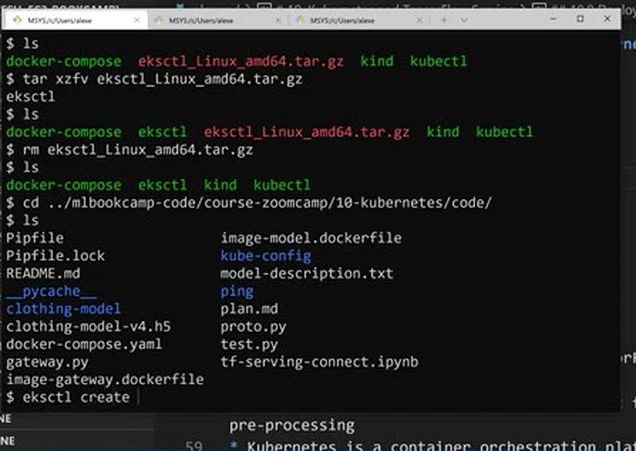
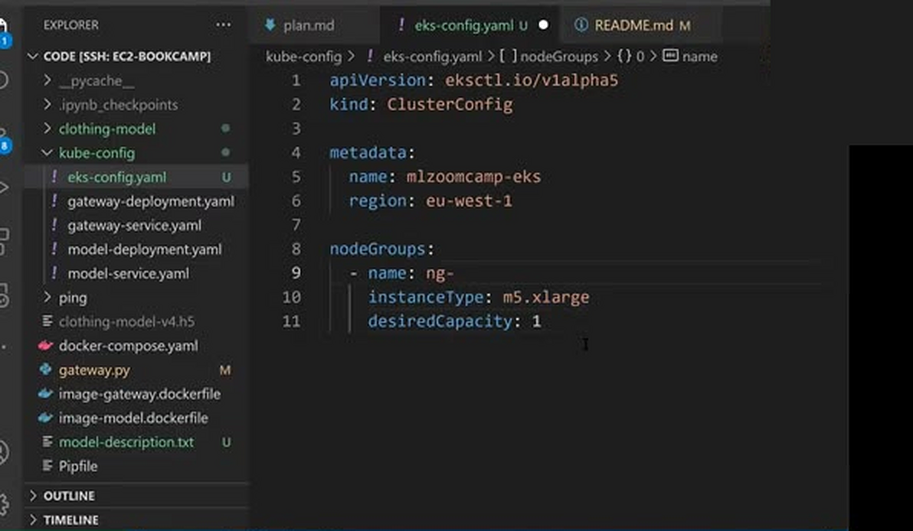
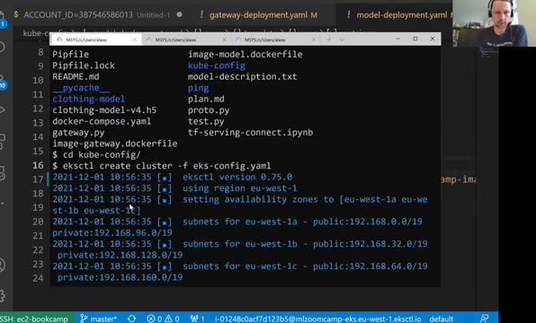
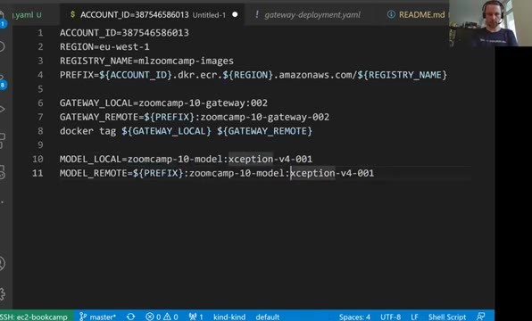
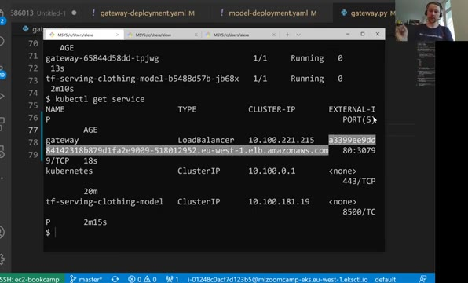
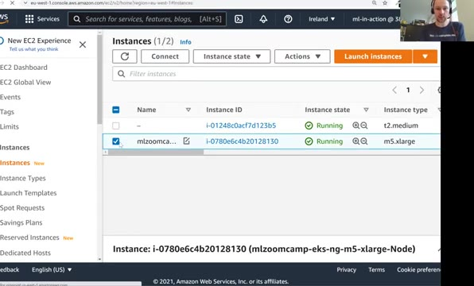

# Deploying to EKS

In this lesson we move everything from our local kind cluster to the
cloud: we create an Elastic Kubernetes Service (EKS) cluster on Amazon
using the command line, publish our Docker images to ECR, apply the same
Kubernetes configuration files to the remote cluster, and configure
kubectl to work with it.

To create the cluster and manage it on EKS we'll use a CLI tool
[eksctl](https://docs.aws.amazon.com/eks/latest/userguide/eksctl.html).
We download it from the AWS docs and unpack it into the `~/bin` directory
- the same directory where we put `docker-compose`, `kind` and `kubectl`
before, so it's on the `PATH`:



One thing to note before starting: EKS is not part of the Amazon Web
Services Free Tier. You pay for the instances EKS uses as nodes, and you
also pay for the cluster itself. Remember to delete it when you're done.

## Creating the EKS cluster

In the `kube-config` folder we create the EKS config file,
`eks-config.yaml`. We give the cluster a name and a region, and define
the node group - the machines our pods will run on. Nodes can be grouped,
and the nodes within a group all have the same instance type - for
example, we could put the TensorFlow Serving deployment on a node group
with GPU machines and the gateway on a node group with CPU machines. For
this lesson we don't use GPUs at all, so we need only one node group with
usual CPU instances. The `m5.xlarge` type gives us four CPUs and 16 GB of
RAM, and one machine of this type is enough:

```yaml
apiVersion: eksctl.io/v1alpha5
kind: ClusterConfig

metadata:
  name: mlzoomcamp-eks
  region: eu-west-1

nodeGroups:
  - name: ng-m5-xlarge
    instanceType: m5.xlarge
    desiredCapacity: 1
```



Creating the cluster takes a while - up to 15-20 minutes. Eksctl
provisions the control plane and boots the worker nodes:

```bash
eksctl create cluster -f eks-config.yaml
```

After it finishes, eksctl has also configured kubectl to talk to the new
cluster - `kubectl get nodes` shows the node coming from EKS (the local
kind node is still there, but kubectl already points to EKS).



## Publishing the images to ECR

Our Docker images live only on our machine, so far kind could pull them
from the local Docker daemon. A cluster in the cloud can't - we need to
publish the images somewhere the EKS nodes can pull from. That place is
ECR, the Amazon container registry.

First we create a repository for our images - the same process as in the
serverless module, where we created a repository for the Lambda function:

```bash
aws ecr create-repository --repository-name mlzoomcamp-images
```

Then we tag our local images with remote names and push them. In a bash
script:

```bash
# Registry URI
ACCOUNT_ID=387546586013
REGION=eu-west-1
REGISTRY_NAME=mlzoomcamp-images
PREFIX=${ACCOUNT_ID}.dkr.ecr.${REGION}.amazonaws.com/${REGISTRY_NAME}

# Tag local docker images to remote tag
GATEWAY_LOCAL=zoomcamp-10-gateway:002 # gateway service
GATEWAY_REMOTE=${PREFIX}:clothing-model-gateway-002 # notice the ':' is replaced with '-' before 002
docker tag ${GATEWAY_LOCAL} ${GATEWAY_REMOTE}

MODEL_LOCAL=zoomcamp-10-model:xception-v4-001 # tf-serving model
MODEL_REMOTE=${PREFIX}:clothing-model-xception-v4-001 # same thing ':' is replaced with '-' before xception
docker tag ${MODEL_LOCAL} ${MODEL_REMOTE}

# Login to ecr and push tagged docker images
$(aws ecr get-login --no-include-email)

# Push tagged docker images
docker push ${MODEL_REMOTE}
docker push ${GATEWAY_REMOTE}
```

ECR doesn't allow the `:` character in the tag part after the repository
name, which is why we replace it with `-`. The `get-login` command prints
a warning that there are more secure ways of logging in - this way is
simple, but check the AWS docs for the recommended one.



Finally we get the URI of these images with `echo ${MODEL_REMOTE}` and
`echo ${GATEWAY_REMOTE}`, and put them into `model-deployment.yaml` and
`gateway-deployment.yaml` respectively. For example, the model deployment
now uses the ECR image:

```yaml
spec:
  containers:
  - name: tf-serving-clothing-model
    image: 387546586013.dkr.ecr.eu-west-1.amazonaws.com/mlzoomcamp-images:zoomcamp-10-model-xception-v4-001
```

## Applying the configuration to the remote cluster

The same Kubernetes configuration files we used with kind work on EKS as
they are. We apply all of them - the deployment and the service for the
model, then the deployment and the service for the gateway:

```bash
kubectl apply -f model-deployment.yaml
kubectl apply -f model-service.yaml
kubectl apply -f gateway-deployment.yaml
kubectl apply -f gateway-service.yaml
```

Testing the deployment pods and services should give us predictions - the
gateway still reaches the model through
`tf-serving-clothing-model.default.svc.cluster.local:8500`, now on the
EKS network. We can check the model right away: port-forward the
TF-Serving service - this time the port is forwarded not from our local
kind cluster, but from the remote one - and run `gateway.py` locally. It
sends the request to a pod running in EKS and comes back with the
predictions.

Executing `kubectl get service` gives us the external address of the
gateway's load balancer. On kind this external IP was pending forever -
here we actually get a DNS name. It doesn't resolve immediately: the DNS
update needs some time to propagate through the internet.



We take this URL and put it into `test.py` as the access URL for
predictions, adding `http://` at the beginning and `/predict` at the end:

```python
url = 'http://a3399ee9dd8414231b879d1fa2e9009-518012952.eu-west-1.elb.amazonaws.com/predict'
```

Running `test.py` one more time sends the request to this URL. The load
balancer acts as the entry point to our service: it forwards the request
to the gateway pod, the gateway sends it to the internal model service,
the model service routes it to a TF-Serving pod, and the response travels
all the way back to us.

If we go to the AWS console, we can see the EKS cluster there. In the EC2
panel there are two instances: the machine we're working on, and the node
that EKS created. And in "Load Balancers" there is the load balancer that
Kubernetes created - because our gateway service has the type
`LoadBalancer`, applying the config went to AWS and created an elastic
load balancer for us.



One thing to keep in mind: this load balancer is open to everyone.
Anyone who has this DNS name can send requests to our EKS cluster.
Usually that's not what you want - you want to restrict the access, in
the same way as we did with the Lambda function in the previous session.
This is out of the scope of this course, but if you deploy this in a
company, there are people who know AWS well - talk to them about the best
way of doing it.

## Deleting the cluster

When you're done experimenting, delete the remote cluster so it stops
costing money:

```bash
eksctl delete cluster --name mlzoomcamp-eks
```

This also takes a few minutes, and it deletes the load balancer together
with the cluster. Afterwards we can check the console: the load balancer
is gone, the EC2 instance shows as terminated, and there are no clusters
in EKS.

## Notes

<table>
   <tr>
      <td>⚠️</td>
      <td>
         The notes are written by the community. <br>
         If you see an error here, please create a PR with a fix.
      </td>
   </tr>
</table>
