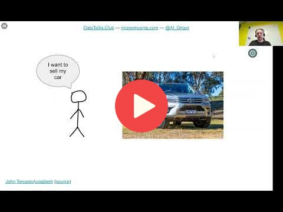

## 1.1 Introduction to Machine Learning

[Slides](https://www.slideshare.net/AlexeyGrigorev/ml-zoomcamp-11-introduction-to-machine-learning)

## Notes

The concept of ML is depicted with an example of predicting the price of a car. The ML model
learns from data, represented as some **features** such as year, mileage, among others, and the **target** variable, in this
case, the car's price, by extracting patterns from the data.

Then, the model is given new data (**without** the target) about cars and predicts their price (target). 

In summary, ML is a process of **extracting patterns from data**, which is of two types:

* features (information about the object) and 
* target (property to predict for unseen objects). 

Therefore, new feature values are presented to the model, and it makes **predictions** from the learned patterns.

<table>
   <tr>
      <td>⚠️</td>
      <td>
         The notes are written by the community.  
         If you see an error here, please create a PR with a fix.
      </td>
   </tr>
</table>

## Navigation

* [Machine Learning Zoomcamp course](../)
* [Lesson 1: Introduction to Machine Learning](./)
* Next: [ML vs Rule-Based Systems](02-ml-vs-rules.md)
