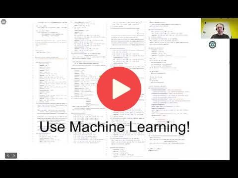

## 1.2 ML vs Rule-Based Systems

[Slides](https://www.slideshare.net/AlexeyGrigorev/ml-zoomcamp-12-ml-vs-rulebased-systems)

## Notes

The differences between ML and Rule-Based systems is explained with the example of a **spam filter**.
The traditional systems are based on a set of 
characteristics that identify an email as spam, which have some drawbacks because the spam emails
keep changing over time and the system must be upgraded with 
these adjustments, and this process is untractable due to code maintenance and other issues.
The ML systems can be trained with features and targets extracted 
from the rules of Rule-Based systems, a model is obtained, and it can be used to predict new
emails as spam or normal emails. The **predictions are probabilities**, 
and to make a decision it is necessary to define a threshold to classify emails as spam or normal ones. 

<table>
   <tr>
      <td>⚠️</td>
      <td>
         The notes are written by the community.  
         If you see an error here, please create a PR with a fix.
      </td>
   </tr>
</table>

## Navigation

* [Machine Learning Zoomcamp course](../)
* [Lesson 1: Introduction to Machine Learning](./)
* Previous: [Introduction to Machine Learning](01-what-is-ml.md)
* Next: [Supervised Machine Learning](03-supervised-ml.md)

