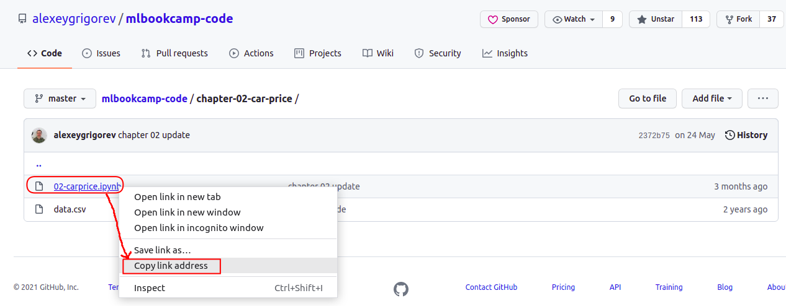
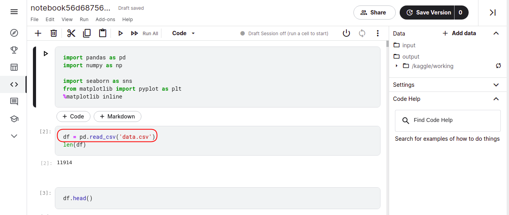

##  Setting up the Environment

In this section, we'll prepare the environment


## Ubuntu 22.04 on AWS

* [This video](https://www.youtube.com/watch?v=IXSiYkP23zo) shows a complete end-to-end environment configuration for an AWS EC2 instance
* This video was created for another course (MLOps Zoomcamp), so you'll need to adjust it slightly: clone this repo instead of the mlops one
* You can use these instructions for setting up your local Ubuntu or Ubuntu in WSL


## Conda

The easiest way to set up the environment is to use [Anaconda](https://www.anaconda.com/products/individual) or [Miniconda](https://docs.conda.io/en/latest/miniconda.html). Anaconda comes with the most commonly used libraries preinstalled in the `base` environment, Miniconda is a smaller version of Anaconda that contains only Python. 

It is a good idea to set up a dedicated environment for the course (and do not use this environment for other projects)

### 1. Download and install correct binary for your system

Follow the instructions on page for installing the correct package for your system (the site will automatically detect your operating system and suggest the correct package)

* [Anaconda](https://www.anaconda.com/products/individual)
* [Miniconda](https://docs.conda.io/en/latest/miniconda.html#latest-miniconda-installer-links)

(If you are using Windows, you can use WSL instead and follow the installation instructions for linux)


### 2. Create environment for course:

In your terminal, run this command

```bash
conda create -n ml-zoomcamp python=3.9
```

### 3. Activate the enviroment

Do this whenever you are adding new packages for the course or working on coursework

```bash
conda activate ml-zoomcamp
```

### 4. Install libraries

Installing libraries available on conda

```bash
conda install numpy pandas scikit-learn seaborn jupyter
```

Additional libraries only available on pypi:

```bash
pip install xgboost 
pip install tensorflow
```

## Cloud

Instead of running things locally, you can use online services or rent a server 

### AWS 

You can rent an instance on AWS:

* [Creating an AWS account](https://mlbookcamp.com/article/aws)
* [Renting an ec2 instance](https://mlbookcamp.com/article/aws-ec2)

### Kaggle

To use Kaggle to open and run the Jupyter notebooks provided as part of this course do the following:

*Pre-requisites - You need to have an account in Kaggle (it's free) and be logged into Kaggle*

1. Find the URL of the notebook. 
   
   
   
2. To open the notebook in Kaggle, in your web browser launch paste the URL as shown in below example. (*note the additional https://kaggle.com/kernels/welcome?src= before the URL of the notebook*)

   https://kaggle.com/kernels/welcome?src=https://github.com/alexeygrigorev/mlbookcamp-code/blob/master/chapter-02-car-price/02-carprice.ipynb
  
3. Check if the notebook uses any datafile to read data from it. If yes, note the datafile name from the code.- *look for pd.read_csv("somefilename.csv")*. 
   
   
   
4. You need to download the file into Kaggle. For this:

   a. Find the URL of the datafile in github. 
   
   
   
   b. Suppose the URL is https://github.com/alexeygrigorev/mlbookcamp-code/blob/master/chapter-02-car-price/data.csv , you need use the URL to raw file, which will look something like https://raw.githubusercontent.com/alexeygrigorev/mlbookcamp-code/master/chapter-02-car-price/data.csv
   
5. In the notebook opened in Kaggle, add a Code block with the command to download the file - !wget your-datafile-url 

   
   
This way you can start with the exercise using Kaggle


### Google Colab

To use Google Colab to open and run the Jupyter notebooks provided as part of this course do the following:

*Pre-requisites - You need to have a google account (any gmail account) and be logged into that account*

Steps for Google Colab are same as that for Kaggle, except for some changes in Step 2, as explained below.

2. To open the notebook in Google Colab, in your web browser launch paste the URL as shown in below example. (*note the https://github.com/ in the URL of the notebook is replaced by https://colab.research.google.com/github/*)

   https://colab.research.google.com/github/alexeygrigorev/mlbookcamp-code/blob/master/chapter-02-car-price/02-carprice.ipynb


## Docker

If you are comfortable using docker you can use the following guide:

Code: [Setup using Docker](./environment/README.md)

> Note: this is for advanced users of Docker only. If you know Docker and you know what you're doing,
> check this tutorials. Otherwise, go with [the suggested approach](#ubuntu-2204-on-aws)


## Navigation

* [Machine Learning Zoomcamp course](../)
* [Lesson 1: Introduction to Machine Learning](./)
* Previous lesson: [The Modelling Step (Model Selection Process)](05-model-selection.md)
* Next lesson: [Introduction to NumPy](07-numpy.md)
