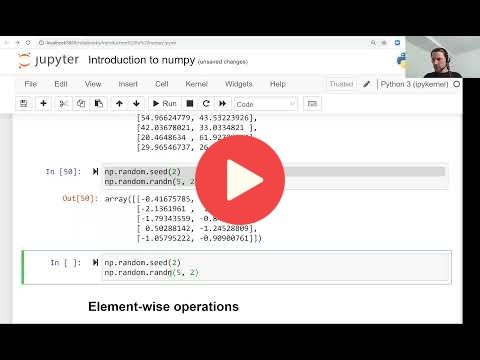

## 1.7 Introduction to NumPy

## Notes

Add notes here (PRs are welcome).

<table>
   <tr>
      <td>⚠️</td>
      <td>
         The notes are written by the community.  
         If you see an error here, please create a PR with a fix.
      </td>
   </tr>
</table>

## Links

* [Notebook from the video](notebooks/07-numpy.ipynb)
* [Notebook](https://github.com/alexeygrigorev/mlbookcamp-code/blob/master/appendix-c-numpy.ipynb)
* [Introduction to NumPy](https://mlbookcamp.com/article/numpy)

## Additional links

* [Numpy Cheat sheet](https://www.datacamp.com/community/blog/python-numpy-cheat-sheet)

## Navigation

* [Machine Learning Zoomcamp course](../)
* [Lesson 1: Introduction to Machine Learning](./)
* Previous: [Setting up the Environment](06-environment.md)
* Next: [Linear Algebra Refresher](08-linear-algebra.md)
