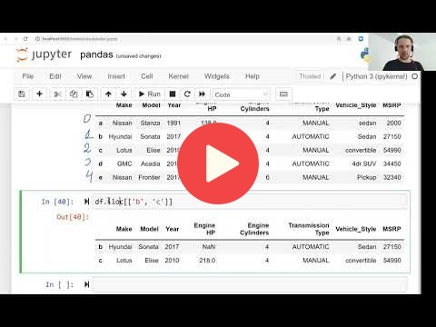

## 1.9 Introduction to Pandas

## Notes

## Links

* [Notebook from the video](notebooks/09-pandas.ipynb)
* [Notebook](https://github.com/alexeygrigorev/mlbookcamp-code/blob/master/appendix-d-pandas.ipynb)

## Additional links

* [Pandas Cheat sheet](https://www.datacamp.com/community/blog/python-pandas-cheat-sheet)

## Navigation

* [Machine Learning Zoomcamp course](../)
* [Lesson 1: Introduction to Machine Learning](./)
* Previous: [Linear Algebra Refresher](08-linear-algebra.md)
* Next: [Summary](10-summary.md)
