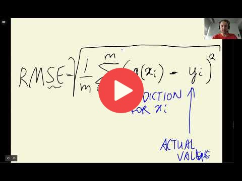

## 2.9 Root mean squared error

[Slides](https://www.slideshare.net/AlexeyGrigorev/ml-zoomcamp-2-slides)

## Notes

The RMSE is a measure of the error associated with a model for regression tasks. The video explained the RMSE formula in detail and implemented it in Python. 

The entire code of this project is available in [this jupyter notebook](https://github.com/alexeygrigorev/mlbookcamp-code/blob/master/chapter-02-car-price/02-carprice.ipynb). 

<table>
   <tr>
      <td>⚠️</td>
      <td>
         The notes are written by the community.  
         If you see an error here, please create a PR with a fix.
      </td>
   </tr>
</table>

## Navigation

* [Machine Learning Zoomcamp course](../)
* [Session 2: Machine Learning for Regression](./)
* Previous: [Baseline model for car price prediction project](08-baseline-model.md)
* Next: [Using RMSE on validation data](10-car-price-validation.md)
