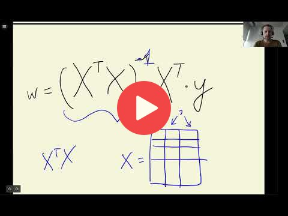

## 2.13 Regularization

[Slides](https://www.slideshare.net/AlexeyGrigorev/ml-zoomcamp-2-slides)

## Notes

If the feature matrix has duplicate columns (or columns that can be expressed as a linear combination of other columns), it will not have an inverse matrix. But, sometimes this error could be passed if certain values are slightly different
between duplicated columns. 

So, if we apply the normal equation with this feature matrix, the values associated with duplicated columns are very large, which decreases
the model performance. To solve this issue, one alternative is adding a small number to the diagonal of the feature matrix, which corresponds to regularization. 

This technique 
works because the addition of small values to the diagonal makes it less likely to have duplicated columns. The regularization value is a hyperparameter of the model. After applying 
regularization the model performance improved. 

The entire code of this project is available in [this jupyter notebook](https://github.com/alexeygrigorev/mlbookcamp-code/blob/master/chapter-02-car-price/02-carprice.ipynb).  

<table>
   <tr>
      <td>⚠️</td>
      <td>
         The notes are written by the community.  
         If you see an error here, please create a PR with a fix.
      </td>
   </tr>
</table>

## Comments
### Linear combination

I mentioned the term *linear combination* in the video, but didn't explain what it means. 
So if you're interested what it means, you can read here

* One column is a linear combination of others when you can express one column of a matrix as a sum of others columns
* The simplest example is when a column is an exact duplicate of another column
* Another example. Let's say we have 3 columns: `a`, `b`, `c`. If `c = 0.2 * a + 0.5 * b`, then `c` is a linear combination of `a` and `b`
* More formal definition: https://en.wikipedia.org/wiki/Linear_combination

## Navigation

* [Machine Learning Zoomcamp course](../)
* [Session 2: Machine Learning for Regression](./)
* Previous: [Categorical variables](12-categorical-variables.md)
* Next: [Tuning the model](14-tuning-model.md)
