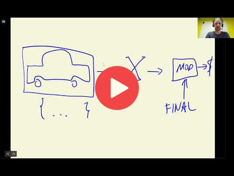

## 2.15 Using the model

[Slides](https://www.slideshare.net/AlexeyGrigorev/ml-zoomcamp-2-slides)

## Notes

Add notes from the video (PRs are welcome)

## Nagivation

* [Machine Learning Zoomcamp course](../)
* [Session 2: Machine Learning for Regression](./)
* Previous: [Tuning the model](14-tuning-model.md)
* Next: [Car price prediction project summary](16-summary.md)