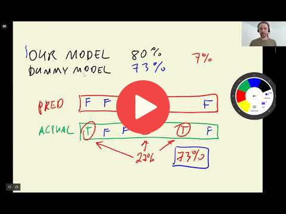

## 4.2 Accuracy and dummy model

 

[Slides](https://www.slideshare.net/AlexeyGrigorev/ml-zoomcamp-4-evaluation-metrics-for-classification)

## Notes

**Accurcy** measures the fraction of correct predictions. Specifically, it is the number of correct predictions divided by the total number of predictions. 

We can change the **decision threshold**, it should not be always 0.5. But, in this particular problem, the best decision cutoff, associated with the hightest accuracy (80%), was indeed 0.5. 

Note that if we build a **dummy model** in which the decision cutoff is 1, so the algorithm predicts that no clients will churn, the accuracy would be 73%. Thus, we can see that the improvement of the original model with respect to the dummy model is not as high as we would expect. 

Therefore, in this problem accuracy can not tell us how good is the model because the dataset is **unbalanced**, which means that there are more instances from one category than the other. This is also known as **class imbalance**. 

**Classes and methods:** 

* `np.linspace(x,y,z)` - returns a numpy array starting at x until y with a z step 
* `Counter(x)` - collection class that counts the number of instances that satisfy the x condition
* `accuracy_score(x, y)` - sklearn.metrics class for calculating the accuracy of a model, given a predicted x dataset and a target y dataset. 

The entire code of this project is available in [this jupyter notebook](https://github.com/alexeygrigorev/mlbookcamp-code/blob/master/course-zoomcamp/04-evaluation/notebook.ipynb).  

Add notes from the video (PRs are welcome)

<table>
   <tr>
      <td>⚠️</td>
      <td>
         The notes are written by the community.  
         If you see an error here, please create a PR with a fix.
      </td>
   </tr>
</table>

## Navigation

* [Machine Learning Zoomcamp course](../)
* [Session 4: Evaluation Metrics for Classification](./)
* Previous: [Evaluation metrics: session overview](01-overview.md)
* Next: [Confusion table](03-confusion-table.md)