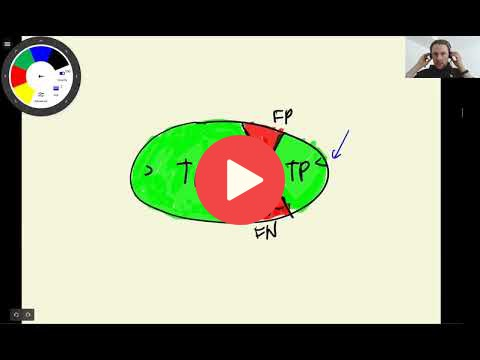

## 4.3 Confusion table

 

[Slides](https://www.slideshare.net/AlexeyGrigorev/ml-zoomcamp-4-evaluation-metrics-for-classification)

## Notes

Confusion table is a way to measure different types of errors and correct decisions that binary classifiers can made. Considering this information, it is possible evaluate the quality of the model by different strategies.

If we predict the probability of churning from a customer, we have the following scenarios:

* No churn - **Negative class**
    * Customer did not churn - **True Negative (TN)**
    * Customer churned - **False Negative (FN)**
* Churn - **Positive class**
    * Customer churned - **True Positive (TP)**
    * Customer did not churn - **False Positive (FP)**

The confusion table help us to summarize the measures explained above in a tabular format, as is shown below: 

|**Actual/Predictions**|**Negative**|**Postive**|
|:-:|---|---|
|**Negative**|TN|FP|
|**Postive**|FN|TP| 

The **accuracy** corresponds to the sum of TN and TP divided by the total of observations. 

The code of this project is available in [this jupyter notebook](https://github.com/alexeygrigorev/mlbookcamp-code/blob/master/course-zoomcamp/04-evaluation/notebook.ipynb).  

Add notes from the video (PRs are welcome)

<table>
   <tr>
      <td>⚠️</td>
      <td>
         The notes are written by the community.  
         If you see an error here, please create a PR with a fix.
      </td>
   </tr>
</table>

## Navigation

* [Machine Learning Zoomcamp course](../)
* [Session 4: Evaluation Metrics for Classification](./)
* Previous: [Accuracy and dummy model](02-accuracy.md)
* Next: [Precision and Recall](04-precision-recall.md)