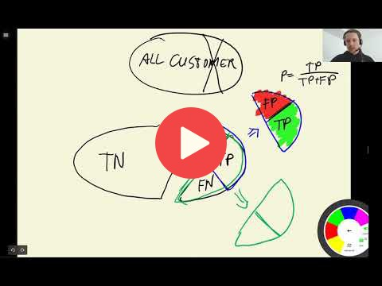

## 4.4 Precision and Recall

[Slides](https://www.slideshare.net/AlexeyGrigorev/ml-zoomcamp-4-evaluation-metrics-for-classification)

## Notes

Add notes from the video (PRs are welcome)

<table>
   <tr>
      <td>⚠️</td>
      <td>
         The notes are written by the community.  
         If you see an error here, please create a PR with a fix.
      </td>
   </tr>
</table>

## Nagivation

* [Machine Learning Zoomcamp course](../)
* [Session 4: Evaluation Metrics for Classification](./)
* Previous: [Confusion table](03-confusion-table.md)
* Next: [ROC Curves](05-roc.md)