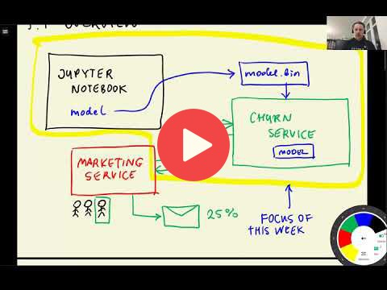

## 5.1 Intro / Session overview

 

[Slides](https://www.slideshare.net/AlexeyGrigorev/ml-zoomcamp-5-model-deployment)

## Notes

In This session we talked about the earlier model we made in chapter 3 for churn prediction.  
This chapter containes the deployment of the model. If we want to use the model to predict new values without running the code, There's a way to do this. The way to use the model in different machines without running the code, is to deploy the model in a server (run the code and make the model). After deploying the code in a machine used as server we can make some endpoints (using api's) to connect from another machine to the server and predict values.

To deploy the model in a server there are some steps:
- After training the model save it, to use it for making predictions in future (session 02-pickle).
- Make the API endpoints in order to request predictions. (session 03-flask-intro and 04-flask-deployment)
- Some other server deployment options (sessions 5 to 9)

Add notes from the video (PRs are welcome)
<table>
   <tr>
      <td>⚠️</td>
      <td>
         The notes are written by the community.  
         If you see an error here, please create a PR with a fix.
      </td>
   </tr>
</table>

## Navigation

* [Machine Learning Zoomcamp course](../)
* [Session 5: Deploying Machine Learning Models](./)
* Next: [Saving and loading the model](02-pickle.md)
