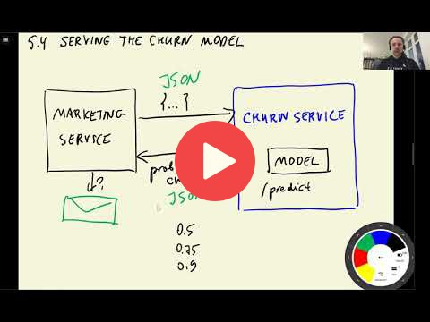

## 5.4 Serving the churn model with Flask

 

[Slides](https://www.slideshare.net/AlexeyGrigorev/ml-zoomcamp-5-model-deployment)

## Notes

Add notes from the video (PRs are welcome)

<table>
   <tr>
      <td>⚠️</td>
      <td>
         The notes are written by the community.  
         If you see an error here, please create a PR with a fix.
      </td>
   </tr>
</table>

## Nagivation

* [Machine Learning Zoomcamp course](../)
* [Session 5: Deploying Machine Learning Models](./)
* Previous: [Web services: introduction to Flask](03-flask-intro.md)
* Next: [Python virtual environment: Pipenv](05-pipenv.md)