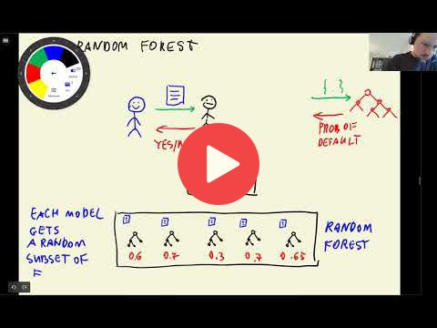

## 6.6 Ensemble learning and random forest

[Slides](https://www.slideshare.net/AlexeyGrigorev/ml-zoomcamp-6-decision-trees-and-ensemble-learning)

## Notes

Random Forest is an example of ensemble learning where each model is a decision tree and their predictions are aggregated to identify the most popular result. Random forest only select a random subset of features from the original data to make predictions.

In random forest the decision trees are trained independent to each other.

**Classes, functions, and methods**:

- `from sklearn.ensemble import RandomForestClassifier`: random forest classifier from sklearn ensemble class.
- `plt.plot(x, y)`: draw line plot for the values of y against x values.

Add notes from the video (PRs are welcome)

<table>
   <tr>
      <td>⚠️</td>
      <td>
         The notes are written by the community.  
         If you see an error here, please create a PR with a fix.
      </td>
   </tr>
</table>

## Navigation

* [Machine Learning Zoomcamp course](../)
* [Session 6: Decision Trees and Ensemble Learning](./)
* Previous: [Decision trees parameter tuning](05-decision-tree-tuning.md)
* Next: [Gradient boosting and XGBoost](07-boosting.md)
