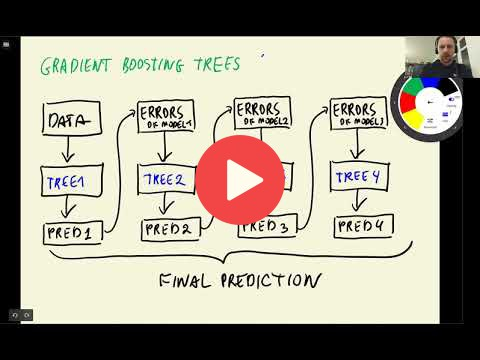

## 6.7 Gradient boosting and XGBoost

<a href="https://www.youtube.com/watch?v=xFarGClszEM&list=PL3MmuxUbc_hIhxl5Ji8t4O6lPAOpHaCLR"></a>

[Slides](https://www.slideshare.net/AlexeyGrigorev/ml-zoomcamp-6-decision-trees-and-ensemble-learning)


## Notes

Add notes from the video (PRs are welcome)


<table>
   <tr>
      <td>⚠️</td>
      <td>
         The notes are written by the community. <br>
         If you see an error here, please create a PR with a fix.
      </td>
   </tr>
</table>


## Installing XGBoost on Mac

Some students reported problems with installing XGBoost on Mac.

When you run `pip install xgboost` and when you try to `import xgboost` in a script you might get an warning or error stating that libomp has not been installed and to run `brew install libomp` in the terminal.

Be careful: this will install a version of libomp that does not work with `xgboost`!

This shows in one of two ways after attempting to run `xgb.DMatrix(X_train, label=y_train, feature_names=features)`:

- **python script:** Segmentation fault: 11
- **jupyter notebook:** Never finished running, and notebook is unresponsive until kernal restart. However confusingly it sometimes works


### Conda

If you use anaconda or miniconda, try installing xgboost with conda.

First, uninstall xgboost with pip (if you already installed it previously with pip):

```bash
pip uninstall xgboost
```

Then re-install it with conda:

```bash
conda install -c conda-forge xgboost
```

It will also install the required version of libomp.


### Without conda

If you don't use conda, you can manualy install a different version of libopm that works well with XGBoost.

The versions of libomp with this problem are 12.x.x and 13.x.x, however issue has a workaround [xgboost issue #7039](https://github.com/dmlc/xgboost/issues/7039) installing the older libomp 11 using the terminal. In the terminal run `brew list --version libomp`, to determine the current version of libomp if any. Then if you have a problematic version run `brew unlink libomp`.

To install the old version of libomp run:

```bash
brew update
wget https://raw.githubusercontent.com/chenrui333/homebrew-core/0094d1513ce9e2e85e07443b8b5930ad298aad91/Formula/libomp.rb
brew install --build-from-source ./libomp.rb
```

and then run 

```bash
brew list --version libomp
```

to check that everything worked, it should now state `libomp 11.1.0`, and your code should now be able to run.


## Navigation

* [Machine Learning Zoomcamp course](../)
* [Session 6: Decision Trees and Ensemble Learning](./)
* Previous: [Ensemble learning and random forest](06-random-forest.md)
* Next: [XGBoost parameter tuning](08-xgb-tuning.md)