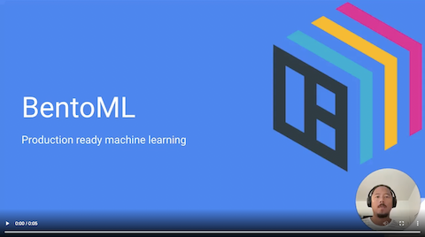

## 7.1 Introduction to Machine Learning in Production

## Notes

Add notes from the video (PRs are welcome)

<table>
   <tr>
      <td>⚠️</td>
      <td>
         The notes are written by the community.  
         If you see an error here, please create a PR with a fix.
      </td>
   </tr>
</table>

## Navigation

* [Machine Learning Zoomcamp course](../)
* [Session 7: Machine Learning in Production](./)
* Next: [Building Your Prediction Service](02-building-your-prediction-service.md)