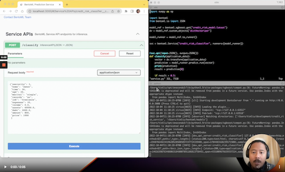

## 7.5 High Performance Serving

## Notes

Add notes from the video (PRs are welcome)

<table>
   <tr>
      <td>⚠️</td>
      <td>
         The notes are written by the community.  
         If you see an error here, please create a PR with a fix.
      </td>
   </tr>
</table>

## Navigation

* [Machine Learning Zoomcamp course](../)
* [Session 7: Machine Learning in Production](./)
* Previous: [Sending, Receiving and Validating Data](04-sending-receiving-validating-data.md)
* Next: [Bento Production Deployment](06-bento-production-deployment.md)