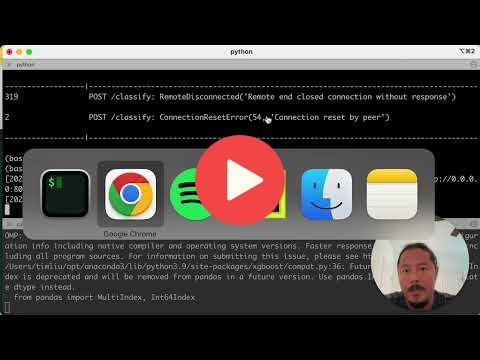

## 7.5 High-Performance Serving

<a href="https://www.youtube.com/watch?v=LjDYPWhJBrY&list=PL3MmuxUbc_hIhxl5Ji8t4O6lPAOpHaCLR"></a>
 
## Links
* [Slides](https://www.slideshare.net/TimLiu72/75-high-performance-servingpptx)
* [Short tutorial on async/await](https://zetcode.com/python/async-await/)
* [Detailed look at async/await](https://tenthousandmeters.com/blog/python-behind-the-scenes-12-how-asyncawait-works-in-python/)
* [Locust Load Testing Tool](https://locust.io/)
* [BentoML Runner Documentation](https://docs.bentoml.org/en/latest/concepts/runner.html)


## Notes

BentoML can optimize the performance on our application where the model will have to make predictions on hundreds of requests per seconds. For this we need to install locust (`pip install locust`), which is a Python open-source library for load testing.

Once the locust is installed, we'll need to create `locustfile.py` and implement user flows for testing:

```python
import numpy as np
from locust import task
from locust import between
from locust import HttpUser


# Sample data to send
sample = {"seniority": 3,
 "home": "owner",
 "time": 36,
 "age": 26,
 "marital": "single",
 "records": "no",
 "job": "freelance",
 "expenses": 35,
 "income": 0.0,
 "assets": 60000.0,
 "debt": 3000.0,
 "amount": 800,
 "price": 1000
 }

# Inherit HttpUser object from locust
class CreditRiskTestUser(HttpUser):
    """
    Usage:
        Start locust load testing client with:
            locust -H http://localhost:3000, in case if all requests failed then load client with:
            locust -H http://localhost:3000 -f locustfile.py

        Open browser at http://0.0.0.0:8089, adjust desired number of users and spawn
        rate for the load test from the Web UI and start swarming.
    """

    # create mathod with task decorator to send request
    @task
    def classify(self):
        self.client.post("/classify", json=sample) # post request in json format with the endpoint 'classify'

    wait_time = between(0.01, 2) # set random wait time between 0.01-2 secs
```

This first optimization we can implement in our application is called *async* optimization. This will make the application to process the requests in parallel and the model will make predictions simultaneously:

```python
# Define an endpoint on the BentoML service
# pass pydantic class application
@svc.api(input=JSON(pydantic_model=CreditApplication), output=JSON()) # decorate endpoint as in json format for input and output
async def classify(credit_application): # parallelized requests at endpoint level (async)
    # transform pydantic class to dict to extract key-value pairs 
    application = credit_application.dict()
    # transform data from client using dictvectorizer
    vector = dv.transform(application)
    # make predictions using 'runner.predict.run(input)' instead of 'model.predict'
    prediction = await model_runner.predict.async_run(vector) # bentoml inference level parallelization (async_run)
```

Another optimization is to take advantage of micro-batching. This is another BentoML feature where it can combine the data coming from multiple users and combine them into **one array**, and then this array will be batched into smaller batches when the model prediction is called. There are few steps we need to do to enable this functionality, the first thing we have to save the model with bentoml `signatures` feature:

```python
# Save the model batchable settings for production efficiency
bentoml.xgboost.save_model('credit_risk_model',
                            model,
                            custom_objects={'DictVectorizer': dv},
                           signatures={  # model signatures for runner inference
                               'predict': { 
                                   'batchable': True, 
                                   'batch_dim': 0 # '0' means bentoml will concatenate request arrays by first dimension
                               }
                           })
```

Running `bentoml serve --production` will make the batchable model in serving, the `--production` flag will enable more than one process for our web workers.

We can also configure the batching parameters of the runner by creating `bentoconfiguration.yaml` file:

```python
# Config file controls the attributes of the runner
runners:
  batching:
    enabled: true
    max_batch_size: 100
    max_latency_ms: 500
```

> Note: In general, we are not supposed to be running the traffic generator on same machine that is serving the application requests because that takes away the CPU from the requests server.

**Resources**:

- [Locust documentation](https://locust.io/)
- [BentoML Adaptive Batching](https://docs.bentoml.org/en/latest/guides/batching.html)
- [BentoML Runners Usage](https://docs.bentoml.org/en/latest/concepts/runner.html)

Add notes from the video (PRs are welcome)


<table>
   <tr>
      <td>⚠️</td>
      <td>
         The notes are written by the community. <br>
         If you see an error here, please create a PR with a fix.
      </td>
   </tr>
</table>

## Additional Issue Support
* Thanks for watching! Depending on your local setup, we do find issues from time to time. If you run into anything strange
we have a big community of BentoML users who would be happy to receive issue feedback: 
[BentoML slack community](https://l.bentoml.com/join-slack-mlzoomcamp). And if you're around shoot me a direct
message and say hi! 😃 

~Tim

## Navigation

* [Machine Learning Zoomcamp course](../)
* [Session 7: Production-Ready Machine Learning (Bento ML)](./)
* Previous: [Sending, Receiving and Validating Data](04-validation.md)
* Next: [Bento Production Deployment](06-production-deployment.md)