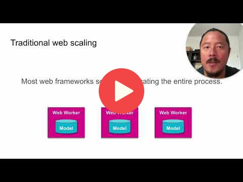

## 7.8 Summary

 
## Links
[Slides](https://www.slideshare.net/TimLiu72/mlzoomcamp-bentoml-summarypptx)

## Notes

Here's the summary of what we have gone through in the session 7:

- Building a prediction service
- Deploying our prediction service
- Sending, Receiving and Validating Data
- High performance serving
- Bento production deployment
- Advanced example: Deploying Stable Diffusion

**Link**: [BentoML GitHub page](https://github.com/bentoml/BentoML)

Add notes from the video (PRs are welcome)

<table>
   <tr>
      <td>⚠️</td>
      <td>
         The notes are written by the community.  
         If you see an error here, please create a PR with a fix.
      </td>
   </tr>
</table>

## Additional Issue Support
* Thanks for watching! Depending on your local setup, we do find issues from time to time. If you run into anything strange
we have a big community of BentoML users who would be happy to receive issue feedback: 
[BentoML slack community](https://l.bentoml.com/join-slack-mlzoomcamp). And if you're around shoot me a direct
message and say hi! 😃 

~Tim

## Navigation

* [Machine Learning Zoomcamp course](../)
* [Session 7: Production-Ready Machine Learning (Bento ML)](./)
* Previous: [(Optional) Advanced Example: Deploying Stable Diffusion Model](07-stable-diffusion.md)
* Next: [Homework](homework.md)