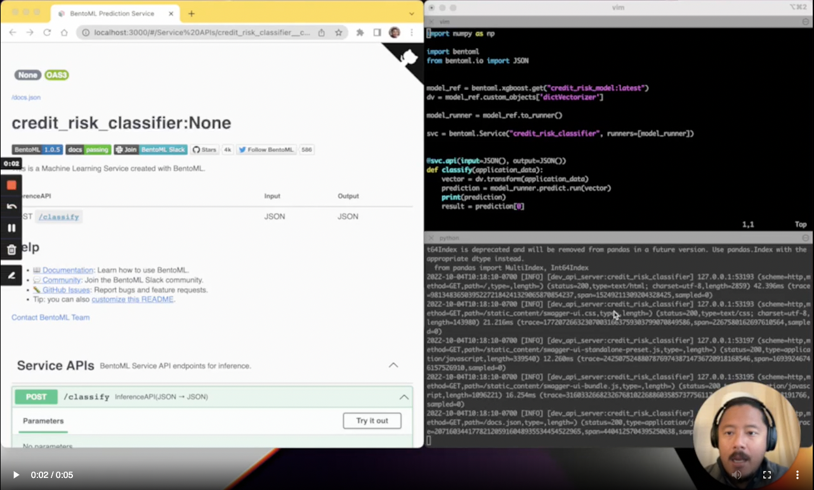

## 7.4 Sending, Receiving and Validating Data

## Notes

Add notes from the video (PRs are welcome)

<table>
   <tr>
      <td>⚠️</td>
      <td>
         The notes are written by the community.  
         If you see an error here, please create a PR with a fix.
      </td>
   </tr>
</table>

## Navigation

* [Machine Learning Zoomcamp course](../)
* [Session 7: Machine Learning in Production](./)
* Previous: [Deploying Your Prediction Service](03-deploying-your-prediction-service.md)
* Next: [High Performance Serving](05-high-performance-serving.md)