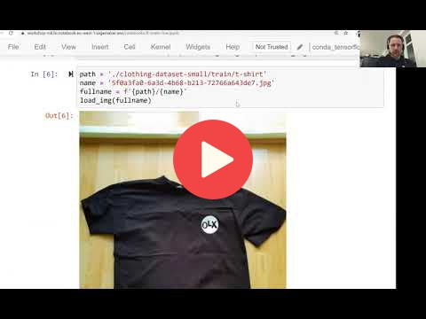

## 8.3 Pre-trained convolutional neural networks

 
[Slides](https://www.slideshare.net/AlexeyGrigorev/ml-zoomcamp-8-neural-networks-and-deep-learning-250592316)

> **Important**: If you rent a GPU from a cloud provider (such as AWS), don't forget to turn it
> off after you finish. It's not free and you might get a large bill at the end of the month. 

### Links

* [Renting a GPU with AWS SageMaker](https://livebook.manning.com/book/machine-learning-bookcamp/appendix-e/6) 

- The keras applications has different pre-trained models with different architectures. We'll use the model [Xception](https://keras.io/api/applications/xception/) which takes the input image size of `(229, 229)` and each image pixels is scaled between `-1` and `1`
- We create the instance of the pre-trained model using `model = Xception(weights='imagenet', input_shape=(299, 229, 3))`. Our model will use the weights from pre-trained imagenet and expecting the input shape (229, 229, 3) of the image
- Along with image size, the model also expects the `batch_size` which is the size of the batches of data (default 32). If one image is passed to the model, then the expected shape of the model should be (1, 229, 229, 3)
- The image data was proprcessed using `preprocess_input` function, therefore, we'll have to use this function on our data to make predictions, like so: `X = preprocess_input(X)`
- The `pred = model.predict(X)` function returns 2D array of shape `(1, 1000)`, where 1000 is the probablity of the image classes. `decode_predictions(pred)` can be used to get the class names and their probabilities in readable format.
- In order to make the pre-trained model useful specific to our case, we'll have to do some tweak, which we'll do in the coming sections.

**Classes, functions, and methods**:
- `from tensorflow.keras.applications.xception import Xception`: import the model from keras applications
- `from tensorflow.keras.application.xception import preprocess_input`: function to perform preprocessing on images
- `from tensorflow.keras.applications.xception import decode_predictions`: extract the predctions class name in the form of tuple of list
- `model.predict(X)`: function make predictions on the test images

**Links**:

- [Renting a GPU with AWS SageMaker](https://livebook.manning.com/book/machine-learning-bookcamp/appendix-e/23)
- [Keras Applications](https://keras.io/api/applications/) provide a list of pre-trained deep learning models
- [ImageNet](https://www.image-net.org/) is an image database that has 1,431,167 images of 1000 classes

## Notes

Add notes from the video (PRs are welcome)

<table>
   <tr>
      <td>⚠️</td>
      <td>
         The notes are written by the community.  
         If you see an error here, please create a PR with a fix.
      </td>
   </tr>
</table>

## Navigation

* [Machine Learning Zoomcamp course](../)
* [Session 8: Neural Networks and Deep Learning](./)
* Previous: [TensorFlow and Keras](02-tensorflow-keras.md)
* Next: [Convolutional neural networks](04-conv-neural-nets.md)
