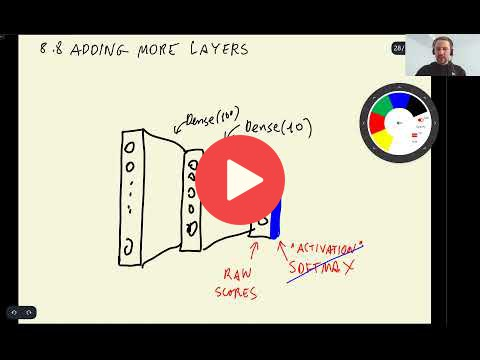

## 8.8 Adding more layers

<a href="https://www.youtube.com/watch?v=bSRRrorvAZs&list=PL3MmuxUbc_hIhxl5Ji8t4O6lPAOpHaCLR"></a>

[Slides](https://www.slideshare.net/AlexeyGrigorev/ml-zoomcamp-8-neural-networks-and-deep-learning-250592316)


It is also possible to add more layers between the `vector representation layer` and the `output layer` to perform intermediate processing of the vector representation. These layers are the same dense layers as the output but the difference is that these layers use `relu` activation function for non-linearity.

Like learning rates, we should also experiment with different values of inner layer sizes:

```python
# Function to define model by adding new dense layer
def make_model(learning_rate=0.01, size_inner=100): # default layer size is 100
    base_model = Xception(weights='imagenet',
                          include_top=False,
                          input_shape=(150,150,3))

    base_model.trainable = False
    
    #########################################
    
    inputs = keras.Input(shape=(150,150,3))
    base = base_model(inputs, training=False)
    vectors = keras.layers.GlobalAveragePooling2D()(base)
    inner = keras.layers.Dense(size_inner, activation='relu')(vectors) # activation function 'relu'
    outputs = keras.layers.Dense(10)(inner)
    model = keras.Model(inputs, outputs)
    
    #########################################
    
    optimizer = keras.optimizers.Adam(learning_rate=learning_rate)
    loss = keras.losses.CategoricalCrossentropy(from_logits=True)

    # Compile the model
    model.compile(optimizer=optimizer,
                  loss=loss,
                  metrics=['accuracy'])
    
    return model
```

Next, train the model with different sizes of inner layer:

```python
# Experiement different number of inner layer with best learning rate
# Note: We should've added the checkpoint for training but for simplicity we are skipping it
learning_rate = 0.001

scores = {}

# List of inner layer sizes
sizes = [10, 100, 1000]

for size in sizes:
    print(size)
    
    model = make_model(learning_rate=learning_rate, size_inner=size)
    history = model.fit(train_ds, epochs=10, validation_data=val_ds)
    scores[size] = history.history
    
    print()
    print()
```

Note: It may not always be possible that the model improves. Adding more layers mean introducing complexity in the model, which may not be recommended in some cases.

In the next section, we'll try different regularization technique to improve the performance with the added inner layer.

## Notes

Add notes from the video (PRs are welcome)

* softmax takes raw scores from a dense layer and transforms it into a probability
* activation functions used for output vs activation functions used for intermediate steps
* have a look at http://cs231n.stanford.edu/2017/
* sigmoid: negativ input --> zero, positive input --> straight line
* relu
* softmax

<table>
   <tr>
      <td>⚠️</td>
      <td>
         The notes are written by the community. <br>
         If you see an error here, please create a PR with a fix.
      </td>
   </tr>
</table>


## Navigation

* [Machine Learning Zoomcamp course](../)
* [Session 8: Neural Networks and Deep Learning](./)
* Previous: [Checkpointing](07-checkpointing.md)
* Next: [Regularization and dropout](09-dropout.md)
