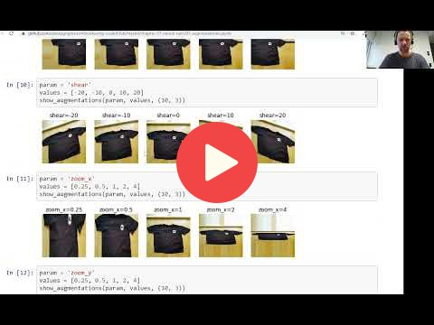

## 8.10 Data augmentation

In this video, I had a typo/bug: instead of using `val_gen` for generating images for validation,
I used `train_gen`. That's why adding augmentations didn't help in the video.

[Slides](https://www.slideshare.net/AlexeyGrigorev/ml-zoomcamp-8-neural-networks-and-deep-learning-250592316)

## Notes

Add notes from the video (PRs are welcome)

<table>
   <tr>
      <td>⚠️</td>
      <td>
         The notes are written by the community.  
         If you see an error here, please create a PR with a fix.
      </td>
   </tr>
</table>

## Navigation

* [Machine Learning Zoomcamp course](../)
* [Session 8: Neural Networks and Deep Learning](./)
* Previous: [Regularization and dropout](09-dropout.md)
* Next: [Training a larger model](11-large-model.md)