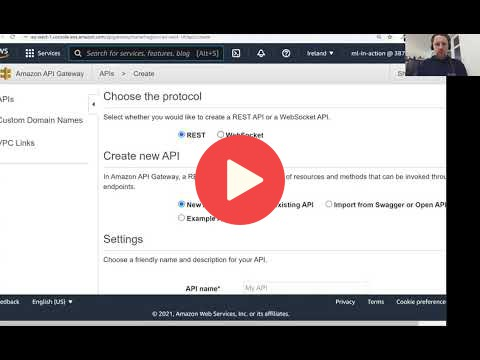

## 9.7 API Gateway: exposing the lambda function

 

## Notes

Add notes from the video (PRs are welcome)

<table>
   <tr>
      <td>⚠️</td>
      <td>
         The notes are written by the community.  
         If you see an error here, please create a PR with a fix.
      </td>
   </tr>
</table>

## Navigation

* [Machine Learning Zoomcamp course](../)
* [Session 9: Serverless Deep Learning](./)
* Previous: [Creating the lambda function](06-creating-lambda.md)
* Next: [Summary](08-summary.md)