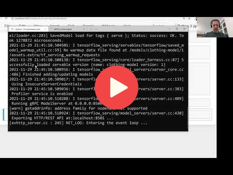

## 10.2 TensorFlow Serving

<a href="https://www.youtube.com/watch?v=deXR2fThYDw&list=PL3MmuxUbc_hIhxl5Ji8t4O6lPAOpHaCLR"></a>
 

To build the app we need to convert the keras model `HDF5` into special format called tensorflow `SavedModel`. For that we download prebuild model and saved it in the working directory:

```bash
wget https://github.com/alexeygrigorev/mlbookcamp-code/releases/download/chapter7-model/xception_v4_large_08_0.894.h5 -O clothing-model-v4.h5
```

We can look what's inside in the saved model using the utility (saved_model_cli) from tensorflow and the command `saved_model_cli show --dir model-dir-name --all`. Running the command outputs few things but we are interested in the signature, specifically the following one. For instance:

```bash
signature_def['serving_default']:
  The given SavedModel SignatureDef contains the following input(s):
    inputs['input_8'] tensor_info:
        dtype: DT_FLOAT
        shape: (-1, 299, 299, 3)
        name: serving_default_input_8:0
  The given SavedModel SignatureDef contains the following output(s):
    outputs['dense_7'] tensor_info:
        dtype: DT_FLOAT
        shape: (-1, 10)
        name: StatefulPartitionedCall:0
  Method name is: tensorflow/serving/predict
```

We can run the model (`clothing-model`) with the prebuilt docker image `tensorflow/serving:2.7.0`:

```bash
docker run -it --rm \
  -p 8500:8500 \
  -v $(pwd)/clothing-model:/models/clothing-model/1 \
  -e MODEL_NAME="clothing-model" \
  tensorflow/serving:2.7.0
```

- docker run -it --rm (to run the docker)
- -p 8500:8500 (port mapping)
- -v $(pwd)/clothing-model:/models/clothing-model/1 (volumn mapping of *absolute model directory* to *model directory inside the docker image*)
- -e MODEL_NAME="clothing-model" (set environment variable for docker image)
- tensorflow/serving:2.7.0 (name of the image to run)

Tensorflow uses specical serving called `gRPC` protocol which is optimized to use binary data format. We need to convert our prediction into `protobuf`.


## Notes

Add notes from the video (PRs are welcome)


<table>
   <tr>
      <td>⚠️</td>
      <td>
         The notes are written by the community. <br>
         If you see an error here, please create a PR with a fix.
      </td>
   </tr>
</table>


## Navigation

* [Machine Learning Zoomcamp course](../)
* [Session 10: Kubernetes and TensorFlow Serving](./)
* Previous: [Overview](01-overview.md)
* Next: [Creating a pre-processing service](03-preprocessing.md)