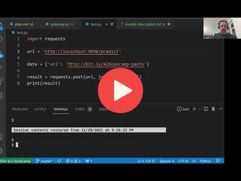

## 10.3 Creating a pre-processing service

 

## Notes

Add notes from the video (PRs are welcome)

* turn jupyter notebook into flask app
* the notebook communicates with the model deployed with tensorflow
* the notebook fetches an image, pre-processes it, turns it into protobuf, sends it to tensorflow-serving, does post-processing and finally gives a human-readable answer
* convert notebook into python script and call the script gateway
* prepare request, send request, prepare response
* you can reuse the flask app code from session 5
* two components: docker container with tensorflow serving and flask application with the gateway
* be aware of the library sizes: tensorflow 1.7 GB, tensorflow CPU ~400 MB, tensorflow serving
* turn numpy array into protobuf format
* tensorflow protobuf

<table>
   <tr>
      <td>⚠️</td>
      <td>
         The notes are written by the community.  
         If you see an error here, please create a PR with a fix.
      </td>
   </tr>
</table>

## Navigation

* [Machine Learning Zoomcamp course](../)
* [Session 10: Kubernetes and TensorFlow Serving](./)
* Previous: [TensorFlow Serving](02-tensorflow-serving.md)
* Next: [Running everything locally with Docker-compose](04-docker-compose.md)
