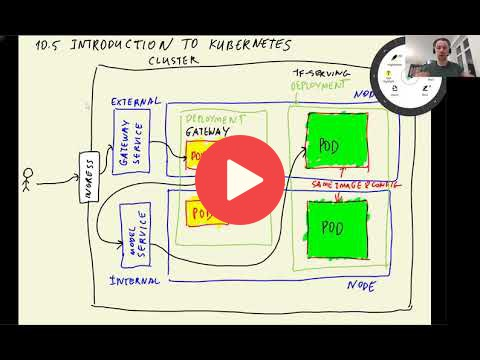

## 10.6 Deploying a simple service to Kubernetes

<a href="https://www.youtube.com/watch?v=PPUCVRIV9t8&list=PL3MmuxUbc_hIhxl5Ji8t4O6lPAOpHaCLR"></a>
 

[Slides](https://www.slideshare.net/AlexeyGrigorev/ml-zoomcamp-10-kubernetes)


## Creating a cluster with Kind

If you use WSL2 and get the following errors when creating a cluster with `kind create cluster` 

```
✗ Starting control-plane :joystick:
ERROR: failed to create cluster: failed to init node with kubeadm: command "docker exec --privileged kind-control-plane kubeadm init --skip-phases=preflight --config=/kind/kubeadm.conf --skip-token-print --v=6" failed with error: exit status 1
the solution is to change the command:
```

Specify the node image: 

```
kind create cluster --image kindest/node:v1.23.0
```

## Notes

Add notes from the video (PRs are welcome)

* kind = local kubernetes cluster https://github.com/kubernetes-sigs/kind
* kubectl = tool for interacting with kubernetes cluster https://kubernetes.io/docs/reference/kubectl/
* yaml kubernetes configuration: allocating resources (RAM, CPU), templates, port labels
* kubernetes ports/pods: requests, responses, forwarding, connection refusal

<table>
   <tr>
      <td>⚠️</td>
      <td>
         The notes are written by the community. <br>
         If you see an error here, please create a PR with a fix.
      </td>
   </tr>
</table>


## Navigation

* [Machine Learning Zoomcamp course](../)
* [Session 10: Kubernetes and TensorFlow Serving](./)
* Previous: [Introduction to Kubernetes](05-kubernetes-intro.md)
* Next: [Deploying TensorFlow models to Kubernetes](07-kubernetes-tf-serving.md)
