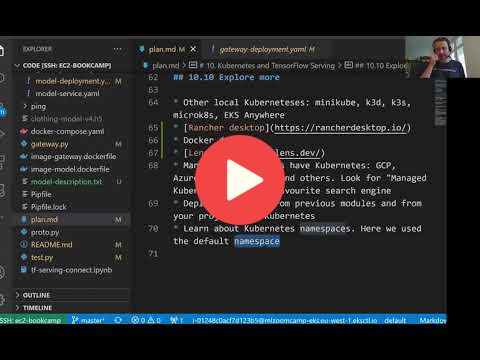

## 10.9 Summary

In the session 10 we covered the following concepts:

- TF-Serving is a system for deploying TensorFlow models
- When using TF-Serving, we need a component for pre-processing
- Kubernetes is a container orchestration platform
- To deploy something on Kubernetes, we need to specify a deployment and a service
- You can use Docker compose and Kind for local experiments

## Notes

Add notes from the video (PRs are welcome)

<table>
   <tr>
      <td>⚠️</td>
      <td>
         The notes are written by the community.  
         If you see an error here, please create a PR with a fix.
      </td>
   </tr>
</table>

## Navigation

* [Machine Learning Zoomcamp course](../)
* [Session 10: Kubernetes and TensorFlow Serving](./)
* Previous: [Deploying to EKS](08-eks.md)
* Next: [Explore more](10-explore-more.md)