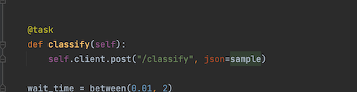

## Homework

In this homework, we will use Credit Risk Data from module 6

> Note: sometimes your answer doesn't match one of the options exactly. That's fine. 
Select the option that's closest to your solution.

The goal of this homework is to familiarize you with BentoML and 

## Question 1

* Install BentoML
* What's the version of BentoML you installed?
* Use `--version` to find out


## Question 2

* Run the notebook from module 6 and save the credit risk model with BentoML
* How big approximately is the saved BentoML model?

* 524kb
* 224kb
* 114kb
* 68kb

## Question 3

Say you have the following data that you're sending to your service:

```json
{
  "name": "Tim",
  "age": 37,
  "country": "US",
  "rating": 3.14
}
```

What would the pydantic class look like? You can name the class "Person"

## Question 4

We've prepared a model for you that you can import using:
```bash
curl -O https://s3.us-west-2.amazonaws.com/bentoml.com/mlzoomcamp/coolmodel.bentomodel
bentoml models import coolmodel.bentomodel
```

What version of scikit-learn was this model trained with?

## Question 5 

Create a bento out of this scikit-learn model. This will require installing scikit-learn like this:
```bash
pip install scikit-learn
```

Hint: The and output type for this endpoint should be NumpyNdarray()

Send this array to the bento:
[[6.4,3.5,4.5,1.2]]

You can use curl or the swagger UI. What value does it return? 

* 0
* 1
* 2
* 3

## Question 6

Add Validation to this bento by enforcing shape (-1,3)
Send this array to the bento:
[[6.4,3.5]]

What is the resulting error?

* "BentoService error handling API request: NumpyNdarray: Expecting shape \"(-1, 3)\", but \"(1, 2)\" was received."
* "BentoService error handling API request: NumpyNdarray: Expecting ndarray of shape \"(-1, 3)\", but \"(1, 2)\" was received."
* "Error handling API request: NumpyNdarray: Expecting ndarray of shape \"(-1, 3)\", but \"(1, 2)\" was received."
* "Error handling API request: NumpyNdarray: Expecting shape \"(-1, 3)\", but \"(1, 2)\" was received."


## Question 7

Ensure to serve your bento with --production for this question

Install locust using:
```bash
pip install locust
```

Use the following locust file:

Ensure that it is pointed at your bento's endpoint (In case you didn't name your endpoint "classify")



Configure 100 users with ramp time of 10 users per second. Ensure that it is working

Now download a second model with this command:
```bash
curl -O https://s3.us-west-2.amazonaws.com/bentoml.com/mlzoomcamp/coolmodel2.bentomodel
bentoml models import coolmodel2.bentomodel
```

Update your bento's runner tag and test with both models. Which model allows more traffic (more throughput) as you ramp up the traffic?
Remember to turn off and turn on your bento service between changing the model tag. Use Ctl-C to close the service. Then call bentoml serve

Test out the first model and the second model, which one performance better at higher volumes?

1. The first model
2. The second model

## Question 8

Go to this Bento deployment of Stable Diffusion: http://54.176.205.174/

Use the txt2image endpoint and update the prompt to: "A cartoon dragon with sunglasses"
- Don't change the seed, it should be 0 by default

What is the resulting image?

### #1


### #2 


### #3 


### #4


## Submit the results

* Submit your results here: https://forms.gle/jU2we8f9WeLgX3qa6
* You can submit your solution multiple times. In this case, only the last submission will be used 
* If your answer doesn't match options exactly, select the closest one


## Deadline

The deadline for submitting is **10 October 2022 (Monday), 23:00 CEST (Berlin time)**. 

After that, the form will be closed.
